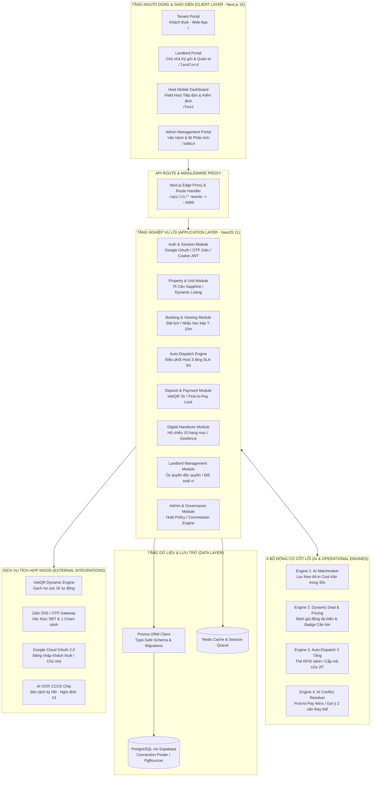
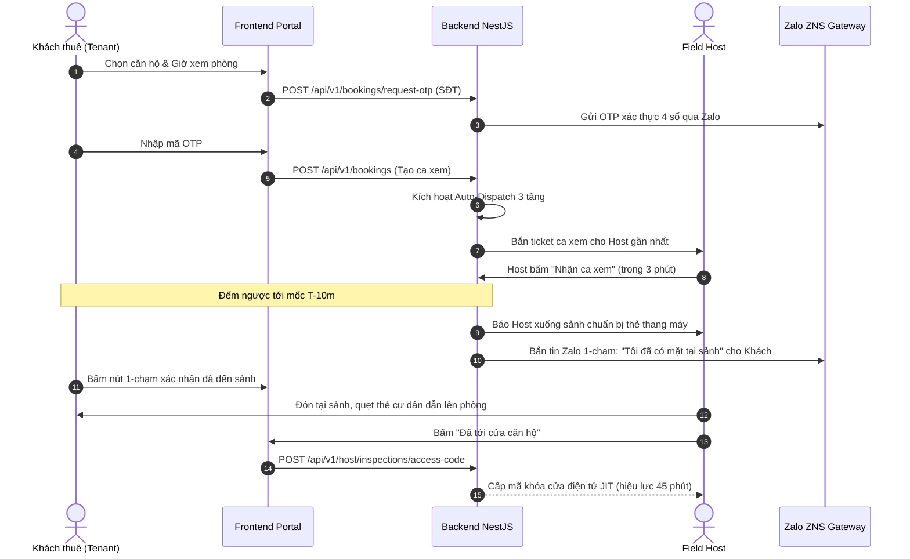
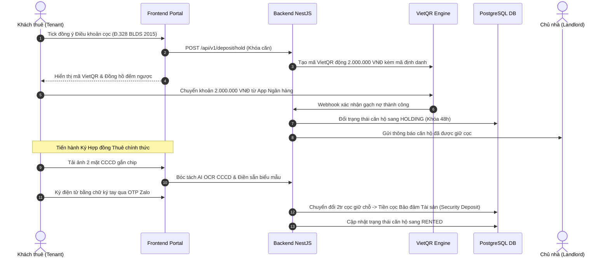
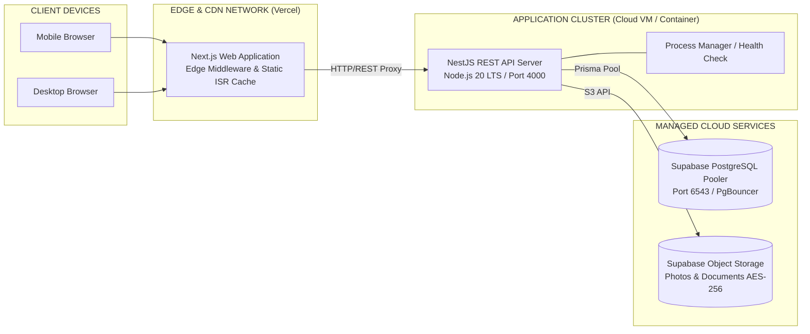

# VINSTAY AI — HỆ THỐNG KIẾN TRÚC PHẦN MỀM (ARCHITECTURE SPECIFICATION)

> **Dự án:** VinStay AI (P-010) — Hệ điều hành Cho thuê & Vận hành Căn hộ tại Vinhomes Ocean Park (Gia Lâm, Hà Nội)  
> **Phiên bản:** 2.0.0 (Chuẩn hóa Gate 2 — Đồng bộ SAD v2.0 & Thực tế Triển khai)  
> **Phạm vi thử nghiệm (Pilot):** The Sapphire 1 & The Sapphire 2 (75 căn hộ chuẩn hóa)  
> **Nguồn tham chiếu kiến trúc:** `ai-pack/sad/` (15 lát cắt chi tiết), `docs/DYNAMIC_PRICING_SPEC.md`, `AGENTS.md`

---

## 1. System Overview (Tổng quan Hệ thống)

VinStay AI là Hệ điều hành Cho thuê & Vận hành Căn hộ toàn diện, đóng vai trò nền tảng hai mặt (Two-Sided Platform) kết nối trực tiếp **Chủ nhà (Landlords)**, **Khách thuê (Tenants)** và **Đội ngũ Field Host nội khu** tại Đại đô thị Vinhomes Ocean Park.

Hệ thống được thiết kế theo nguyên tắc kiến trúc hướng nghiệp vụ (Domain-Driven Architecture), giải quyết triệt để 4 nỗi đau của Chủ nhà, 5 nỗi đau của Khách thuê và 5 điểm nghẽn vận hành của Đơn vị quản lý:

```
┌────────────────────────────────────────────────────────────────────────┐
│                   VINSTAY AI OPERATING PLATFORM                        │
├────────────────────┬────────────────────┬──────────────────────────────┤
│  CHỦ NHÀ (LANDLORD)│ KHÁCH THUÊ (TENANT)│  FIELD HOST & VẬN HÀNH       │
│  • Giảm trống phòng│  • 100% Listing thật│  • Đón sảnh qua thẻ RFID     │
│  • Ở nhà mở cửa từ xa│  • All-in Cost trọn gói│ • Nhắc hẹn kép T-10m        │
│  • Hộ chiếu bàn giao│  • Cọc VietQR an toàn│ • Thù lao linh hoạt theo ca   │
│  • Asset-light thợ ngoài│ • Thợ ngoài minh bạch│ • SLA tiếp nhận < 3 phút   │
└────────────────────┴────────────────────┴──────────────────────────────┘
```

---

## 2. High-Level Architecture (Sơ đồ Kiến trúc C4 - Container Level)

Hệ thống được triển khai theo mô hình **Monorepo Hiện đại (Turborepo / pnpm Workspaces)**, phân tách mạch lạc giữa tầng Trải nghiệm người dùng (Frontend Portals), Tầng Nghiệp vụ Lõi (Backend Services), Tầng Lưu trữ Dữ liệu (Database Layer) và Các Dịch vụ Tích hợp Bên thứ ba:



---

## 3. Subsystem Breakdown (Chi tiết Thành phần Hệ thống)

### 3.1 Frontend Web Application (`apps/web`)
* **Framework:** Next.js 15 (App Router, Turbopack, React 19, Vanilla CSS & Tailwind CSS).
* **4 Phân hệ Giao diện Độc lập (Portals):**
  1. **Tenant Portal (`/`):** Tìm kiếm căn hộ, Bảng tính chi phí All-in Cost thời gian thực, Lọc AI theo ngân sách trần, Đặt lịch xem phòng, Quét VietQR cọc giữ chỗ, Ký số Hợp đồng thuê 3 bước.
  2. **Landlord Portal (`/landlord`):** Ký gửi căn hộ ủy quyền độc quyền, Chụp ảnh và phân loại phòng, Theo dõi trạng thái ca xem, Duyệt kết quả bàn giao số, Theo dõi dòng tiền đối soát minh bạch.
  3. **Field Host Dashboard (`/host`):** Nhận ticket ca dẫn khách qua Mobile UI 1-chạm, Quét mã mở cửa tại cửa phòng (JIT Access Code), Biên bản kiểm định hiện trạng 10 hạng mục nội thất, Bảng theo dõi thù lao ca dẫn và hoa hồng chốt cọc.
  4. **Admin Portal (`/admin`):** Quản trị giỏ hàng toàn khu, Cấu hình thời hạn khóa căn `hold_hours` (12h–72h), Cấu hình động tỷ lệ hoa hồng (Dynamic Commission Engine), Báo cáo vận hành và phát hiện xung đột cọc.
* **State Management & Data Layer:** React Hooks kết hợp SWR pattern (`useLandlordQuery`), xác thực phiên thông qua HTTP-only cookies (`vs_access`, `vs_refresh`).

### 3.2 Backend Application Service (`backend`)
* **Framework:** NestJS 11 (Node.js, Express, TypeScript, kiến trúc Modular độc lập).
* **Các Modules Chức năng Chính:**
  * `AuthModule`: Quản lý danh tính, Google OAuth2 Callback, Demo Login, Quản lý Token JWT và Cookie phiên bảo mật.
  * `AccountModule`: Quản lý hồ sơ đa vai trò (Tenant, Landlord, Host, Admin), danh sách căn yêu thích, lịch sử hợp đồng.
  * `PropertyModule`: Quản trị danh mục 75 căn hộ Vinhomes Ocean Park, trạng thái vòng đời căn hộ (`available`, `holding`, `rented`, `offline`).
  * `BookingModule`: Xử lý lịch hẹn xem thực địa, điều phối mã OTP qua Zalo ZNS, kiểm soát lịch trình tiếp đón.
  * `DispatchModule`: Thuật toán phân bổ ca dẫn 3 tầng có SLA.
  * `DepositModule`: Tạo mã VietQR động định danh 2.000.000 VNĐ, quản lý cơ chế tự động giải phóng cọc khi hết hạn.
  * `HandoverModule`: Lưu trữ bằng chứng kiểm định 10 hạng mục nội thất, đối soát hiện trạng nhận/trả phòng.
  * `LandlordModule`: Quản lý Hợp đồng Ký gửi Độc quyền, xử lý ảnh căn hộ, quản lý yêu cầu thoát ký gửi (Exit Request báo trước 15 ngày).
  * `AdminModule`: API quản trị hệ thống, thiết lập chính sách vận hành, quản lý mẫu hợp đồng pháp lý.

### 3.3 Database & Storage Layer (`backend/prisma`)
* **Cơ sở dữ liệu:** PostgreSQL lưu trữ trên nền tảng Supabase, kết nối qua **Supabase Connection Pooler (PgBouncer mode, port 6543)** bảo đảm chịu tải cao và tránh cạn kiệt connection.
* **ORM:** Prisma Client với 14 bảng quan hệ chuẩn hóa:
  * `User`, `Profile`: Định danh người dùng, vai trò RBAC, thông tin CCCD gắn chip mã hóa.
  * `Unit`, `Building`: Thông tin căn hộ [Tòa - Tầng - Căn], layout, diện tích, giá thuê, phí quản lý.
  * `Consignment`, `Mandate`: Hồ sơ ký gửi độc quyền của chủ nhà kèm trạng thái pháp lý.
  * `Booking`: Lịch hẹn xem phòng, mốc thời gian T-10m, trạng thái xác thực sảnh.
  * `DepositHold`: Bản ghi khóa căn VietQR 2tr, thời điểm bắt đầu, thời điểm hết hạn (`expiresAt`).
  * `Contract`, `Inspection`, `InspectionItem`: Hợp đồng thuê điện tử và Hộ chiếu bàn giao 10 hạng mục.
  * `AuditLog`: Bản ghi kiểm toán mọi biến động trạng thái căn hộ và giao dịch tài chính.

---

## 4. Đặc tả 4 Bộ Động Cơ Cốt Lõi (4 Core Engines)

```
┌────────────────────────────────────────────────────────────────────────┐
│                        4 CORE ENGINES VINSTAY AI                       │
├────────────────────────────────────────────────────────────────────────┤
│ 1. AI MATCHMAKER           │ 2. DYNAMIC DEAL & PRICING                 │
│    • Lọc All-in Cost trần  │    • Floor Price Guardrail                │
│    • Top 3 căn trong 30s   │    • Badge "Căn hời phân khu"             │
├────────────────────────────┼───────────────────────────────────────────┤
│ 3. AUTO-DISPATCH 3 TẦNG    │ 4. FIRST-TO-PAY & CONFLICT RESOLVER       │
│    • Thẻ cư dân sảnh       │    • Khóa căn qua VietQR 2 triệu          │
│    • Cấp mã cửa JIT        │    • Gợi ý 2 căn tương đương >= 90%       │
└────────────────────────────┴───────────────────────────────────────────┘
```

### Engine 1: AI Matchmaker theo All-in Cost
* **Mục tiêu:** Loại trừ hoàn toàn tình trạng "Sốc chi phí ẩn" cho khách thuê, rút ngắn chu kỳ tìm khách từ 30 ngày xuống dưới 7 ngày.
* **Nguyên lý tính toán:**
  $$\text{All-in Cost} = \text{Tiền thuê} + (\text{Diện tích} \times \text{Đơn giá BQL}) + \text{Phí gửi xe} + \text{Điện nước EVN dự tính} + \text{Internet}$$
* **Hành vi động cơ:** Bộ lọc cứng loại trừ 100% căn hộ có All-in Cost vượt quá ngân sách trần của khách; tự động xếp hạng và trả về 3 căn hộ phù hợp nhất trong vòng 30 giây.

### Engine 2: Dynamic Deal & Pricing Engine
* **Mục tiêu:** Giảm thời gian trống phòng cho chủ nhà mà không bị môi giới ngoài ép dìm giá; tăng tính thanh khoản cho giỏ hàng.
* **Nguyên lý tính toán:**
  * **Hàng rào giá sàn (Floor Price Guardrail):** Giá chào thuê không bao giờ được phép thấp hơn 70–75% mức giá mục tiêu thị trường của phân khu.
  * **Hàm suy giảm theo số ngày trống (Days on Market - DOM):** Tự động đề xuất mức giá khuyến nghị tối ưu dòng tiền theo chu kỳ 7–14–21 ngày.
  * **Huy hiệu "Căn hời phân khu" (Dynamic Deal Badge):** Khi căn hộ có mức giá All-in tiết kiệm $\ge 10\%$ so với mức bình quân các căn cùng layout trong phân khu, hệ thống tự động gắn huy hiệu và đẩy lên vị trí hiển thị ưu tiên.

### Engine 3: Mạng lưới Auto-Dispatch 3 Tầng & Cấp mã mở cửa JIT
* **Mục tiêu:** Giải phóng chủ nhà 100% khỏi cực hình đi xa 20–30km mở cửa; xóa sổ nạn khách "bỏ bom" (no-show); tuyệt đối tuân thủ quy chế BQL Vinhomes (không dùng Lockbox).
* **Cơ chế phân bổ 3 tầng (SLA tiếp nhận 3 phút):**
  * *Tầng 1 (Local Host):* Bắn ticket trực tiếp cho Field Host đang trực tại cùng phân khu (< 200m).
  * *Tầng 2 (Open Pool):* Sau 3 phút nếu chưa nhận, ticket mở rộng cho toàn bộ Host trong bán kính 500m.
  * *Tầng 3 (Area Lead):* Sau 5 phút, chuyển tiếp khẩn cấp cho Trưởng khu vực điều phối nhân sự dự phòng.
* **Cơ chế mở cửa:** Field Host dùng thẻ cư dân nội khu đã đăng ký để quẹt thang máy dẫn khách lên tầng. Khi đứng trước cửa phòng, Host bấm nút "Xác nhận đã tới cửa" trên ứng dụng $\rightarrow$ Backend cấp mã PIN mở khóa điện tử tức thời (JIT Access Code) có hiệu lực trong 45 phút ca xem.

### Engine 4: First-to-Pay Wins & AI Conflict Resolver
* **Mục tiêu:** Bảo vệ tính độc quyền và minh bạch của giỏ hàng; xử lý triệt để xung đột giữ căn khi có khách cọc trực tuyến trong lúc đang có ca xem thực địa.
* **Nguyên tắc "First-to-Pay Wins":** Khóa căn độc quyền `holding` căn cứ 100% vào dòng tiền cọc 2.000.000 VNĐ thực tế gạch nợ qua VietQR động, không giữ chỗ bằng lời hứa xem phòng.
* **Cơ chế AI Conflict Resolver:**
  * Khi Căn X đang có ca xem thực địa nhưng bất ngờ được Khách online cọc thành công qua VietQR:
  1. Hệ thống ngay lập tức khóa căn cho người cọc trước.
  2. Bắn thông báo đẩy tức thời (Push Notification) đến màn hình Host đang đứng tại phòng.
  3. AI kích hoạt thuật toán tìm kiếm và đề xuất ngay **2 căn hộ thay thế tương đương cùng phân khu ($\ge 90\%$ độ mới/giá All-in)** kèm mã mở cửa dự phòng.
  4. Host chuyển hướng dẫn khách sang xem căn thứ 2 ngay tại chỗ, biến nguy cơ hụt căn thành cơ hội chốt cọc kép văn minh, bảo toàn 100% hoa hồng cho Host.
* **Nhãn FOMO Cam & Waitlist F2:** Căn hộ có lịch xem hiển thị nhãn *"Đang có 1 khách xem lúc [Giờ]. Nhanh tay đặt lịch dự phòng"*. Khách sau được xếp vào Hàng chờ F2. Sau 45 phút ca xem + 30 phút ân hạn (tổng 75 phút), nếu không phát sinh cọc, căn hộ tự động mở lại trạng thái `available` và AI tự động gửi thông báo Zalo mời khách F2 vào xem.

---

## 5. End-to-End Data Flows (Luồng Dữ Liệu Thực Tế)

### 5.1 Luồng Đặt lịch & Tiếp đón Thực địa (Viewing Workflow)



### 5.2 Luồng Khóa căn VietQR & Ký số Hợp đồng (Deposit & Contract Flow)



---

## 6. Security, Compliance & Governance (Bảo Mật & Tuân Thủ Pháp Lý)

| Hạng mục bảo mật | Giải pháp kỹ thuật thực thi | Căn cứ pháp lý & Chuẩn mực |
|:---|:---|:---|
| **Xác thực phiên (Session Security)** | Sử dụng cặp Cookie HTTP-Only `vs_access` (1h) và `vs_refresh` (30 ngày), cờ `SameSite=Lax`, mã hóa JWT signed bằng khóa bí mật. | OWASP Top 10 Security Standard |
| **Phân quyền truy cập (RBAC)** | Role Guards 4 cấp độ tại Backend: `tenant`, `landlord`, `host`, `admin`. Kiểm tra quyền nghiêm ngặt trước mọi thao tác dữ liệu. | Principle of Least Privilege (PoLP) |
| **Bảo vệ dữ liệu cá nhân (Data Privacy)** | Ảnh 2 mặt CCCD, số định danh cá nhân và file Hợp đồng thuê được mã hóa AES-256-GCM; chỉ giải mã khi phục vụ ký kết pháp lý. | **Nghị định 13/2023/NĐ-CP** về Bảo vệ dữ liệu cá nhân |
| **Chống gian lận & Rò rỉ thông tin** | Toàn bộ số điện thoại cá nhân của chủ nhà được mã hóa trên giao diện; ảnh căn hộ đóng watermark kỹ thuật số chống môi giới copy tin mồi. | Luật Giao dịch điện tử 2023 |
| **Mô hình Vận hành Tinh gọn (Asset-Light)** | VinStay AI và Field Host chỉ đóng vai trò giới thiệu danh bạ thợ kỹ thuật ngoài uy tín; khách và thợ tự thỏa thuận chi phí; VinStay AI không nhận thầu sửa chữa. | Giảm thiểu 100% rủi ro pháp lý & gánh nặng OpEx vận hành đêm |

---

## 7. Architectural Decision Records (ADR - Quyết định Thiết kế Trọng yếu)

### ADR 01: Lựa chọn Next.js 15 & NestJS 11 thay vì FastAPI & LangGraph
* **Bối cảnh:** Template khởi tạo ban đầu gợi ý kiến trúc Python/FastAPI/LangGraph.
* **Quyết định:** Sử dụng Monorepo TypeScript toàn diện với Next.js 15 cho Frontend và NestJS 11 cho Backend.
* **Lý do:**
  1. Chia sẻ chung 100% Type Contracts giữa Frontend và Backend, triệt tiêu lỗi không khớp dữ liệu.
  2. NestJS cung cấp cấu trúc Module, Dependency Injection và Guards chuẩn doanh nghiệp cho hệ thống sàn giao dịch nhiều vai trò.
  3. Tối ưu hóa hiệu năng render Server Component và SEO cho catalog 75 căn hộ trên Next.js.

### ADR 02: Dùng Thẻ RFID Cư dân của Field Host & Cấp mã JIT thay vì Hộp khóa Lockbox
* **Bối cảnh:** Nhiều ứng dụng thuê nhà quốc tế dùng hộp khóa cơ (Lockbox) treo tại cửa căn hộ.
* **Quyết định:** Tuyệt đối không dùng Lockbox. Toàn bộ quy trình tiếp đón do Field Host có thẻ cư dân thực hiện, mã cửa chỉ được cấp qua App khi Host đã đứng trước phòng.
* **Lý do:** Ban Quản lý Vinhomes Ocean Park nghiêm cấm treo Lockbox tại hành lang vì vi phạm quy chế PCCC và thẩm mỹ đô thị. Giải pháp Host nội khu giúp chủ nhà ở xa an tâm tuyệt đối mà không vi phạm quy chế BQL.

### ADR 03: Khóa căn qua VietQR động 2.000.000 VNĐ thay vì giữ chỗ bằng lời hứa
* **Bối cảnh:** Khách thuê thường xem nhiều căn và hứa miệng giữ chỗ dẫn đến tình trạng "giữ chỗ ảo", chủ nhà lỡ mất khách thật khác.
* **Quyết định:** Áp dụng nguyên tắc *First-to-Pay Wins*. Khách muốn khóa căn phải thanh toán 2.000.000 VNĐ qua mã VietQR động gạch nợ tự động vào tài khoản định danh nền tảng; căn hộ khóa `holding` trong thời hạn Admin cài đặt (mặc định 48h).
* **Lý do:** Tạo cam kết tài chính thực tế, triệt tiêu 100% tình trạng ôm căn ảo; số tiền này được giữ nguyên thành một phần của Tiền Cọc Bảo Đảm Tài Sản khi ký hợp đồng chính thức.

### ADR 04: Mô hình Asset-Light Handyman Referral thay vì Đội thợ cơ hữu
* **Bối cảnh:** Căn hộ cho thuê thường phát sinh hỏng hóc vặt ban đêm (điều hòa chảy nước, vòi nước rỉ...).
* **Quyết định:** Nền tảng duy trì danh bạ thợ kỹ thuật ngoài đã kiểm định tại Ocean Park để khách liên hệ trực tiếp; không ôm bộ máy thợ cơ hữu full-time.
* **Lý do:** Tránh bẫy chi phí cố định OpEx trong mùa thấp điểm, giải phóng chủ nhà khỏi các cuộc gọi lúc nửa đêm, đồng thời loại trừ rủi ro tranh chấp bảo hành dịch vụ sửa chữa cho nền tảng.

---

## 8. Deployment & Infrastructure (Hạ tầng Triển khai)



---

*Tài liệu Kiến trúc Phần mềm VinStay AI được chuẩn hóa và bảo trì liên tục bởi Nhóm Kỹ thuật P-010 phục vụ Báo cáo Nghiệm thu Gate 2 và Triển khai Thực địa tại Vinhomes Ocean Park.*
