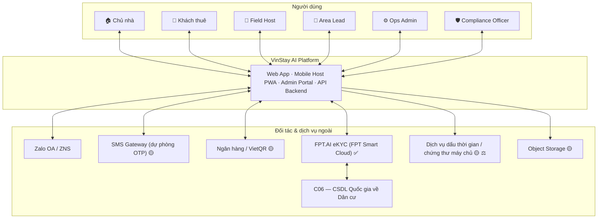

<!-- nguồn: docs/SAD_v2.md, dòng 75–115 -->
## 2. BỐI CẢNH HỆ THỐNG (C1)

**Nguyên tắc biên hệ thống (✅):** VinStay **không kết nối trực tiếp C06**. Mọi xác thực danh tính đi qua đối tác eKYC được cấp phép; vendor chịu trách nhiệm kết nối C06 và trả kết quả đã đối chiếu.

---

