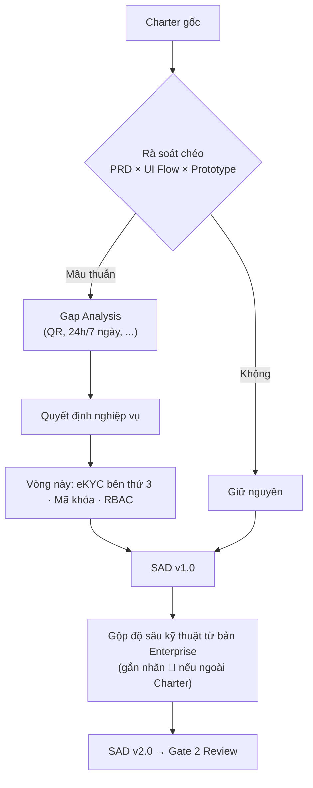

<!-- nguồn: docs/SAD_v2.md, dòng 152–196 -->
## 4. BẢNG CHỐT TÍNH NĂNG (FEATURE LOCK-IN)

| #   | Tính năng                                                              | Quyết định                                                                | Trạng thái   | Ghi chú                                                                                                          |
| --- | ---------------------------------------------------------------------- | ------------------------------------------------------------------------- | ------------ | ---------------------------------------------------------------------------------------------------------------- |
| 1   | All-in Cost Engine                                                     | Rule tất định                                                             | ✅           | §3.1                                                                                                             |
| 2   | Matchmaker Top 3                                                       | Lọc cứng + ranking nhẹ; ≤3s tính toán / ≤30s trải nghiệm                  | ✅           | §6.1                                                                                                             |
| 3   | Xác nhận lịch xem                                                      | **Bỏ QR** — Zalo 2 chiều + OTP SĐT                                        | ✅           | Gap Analysis                                                                                                     |
| 4   | Dispatcher Field Host                                                  | **Rule engine 3 tầng: 5p → 3p (≤500m) → broadcast**                       | ✅           | Bán kính Tầng 1 (≤200m) và giới hạn 1 ca/45 phút là 🔵                                                           |
| 5   | Mở cửa khi xem phòng                                                   | **Mã khóa điện tử cố định / chìa cơ tập trung**, không Lockbox, không IoT | ✅           | §8                                                                                                               |
| 6   | Giữ chỗ (holding)                                                      | **7 ngày** kể từ lúc nhận cọc                                             | ✅           | ADR-05                                                                                                           |
| 7   | Xác thực CCCD & Khuôn mặt                                              | **FPT.AI eKYC (FPT Smart Cloud) + Liveness Detection**; Zero-Storage      | ✅ ĐÃ CHỐT   | §7                                                                                                               |
| 8   | Ký thỏa thuận cọc điện tử                                              | Ký OTP, PDF có audit                                                      | ✅ ⚖️        | §10                                                                                                              |
| 9   | Hộ chiếu bàn giao số 10 hạng mục                                       | Giữ nguyên                                                                | ✅           | §3.3                                                                                                             |
| 10  | Ký gửi Độc quyền + thoát 15 ngày                                       | Chỉ hủy khi căn `available`                                               | ✅ ⚖️        | §10.4                                                                                                            |
| 11  | Khách "chưa ưng"                                                       | Host giới thiệu trực tiếp tại chỗ (app tính sẵn căn tương đương)          | ✅           | Khác với hủy lịch do căn bị cọc (dòng 20)                                                                        |
| 12  | Quản lý mã khóa cửa                                                    | Vòng đời, Vault, cấp phát có điều kiện, audit                             | ✅ (mới)     | §8                                                                                                               |
| 13  | Phân quyền RBAC                                                        | 7 vai trò, ma trận, AuthZ tập trung                                       | ✅ (mới)     | §9                                                                                                               |
| 14  | Hardware CapEx                                                         | 0 VNĐ                                                                     | ✅           |                                                                                                                  |
| 15  | Ký quỹ ba bên (Tripartite Escrow) tại tài khoản định danh của nền tảng | Mô hình dòng tiền cọc                                                     | 🔵 🟡 ⚖️     | Charter chỉ nói VietQR/ngân hàng; chính sách hoàn cọc chưa chốt. Cần xác nhận mô hình pháp lý dòng tiền (§19 #8) |
| 16  | Gói chứng cứ pháp lý (Evidence Package), lưu 10 năm                    | Manifest + hash + dấu thời gian                                           | 🔵 ⚖️        | Thời hạn lưu cần pháp chế xác nhận                                                                               |
| 17  | Redis + BullMQ (khóa, OTP, worker đếm ngược)                           | Hạ tầng                                                                   | 🔵           | Có thể thay bằng cron/pg-boss cho MVP                                                                            |
| 18  | Proxy Masked Call (tổng đài ảo)                                        | Che SĐT hai chiều khi gọi                                                 | 🔵           | Cần vendor viễn thông; sau pilot                                                                                 |
| 19  | Mã hóa cấp trường SĐT (AES-256-GCM)                                    |                                                                           | ✅ (bảo mật) | Dùng blind index                                                                                                 |
| 20  | Auto-cancel lịch trùng + Zalo gợi ý 2 căn khi căn được cọc             | Conflict Resolver                                                         | ✅           | Chỉ cho lịch bị hủy do cọc                                                                                       |
| 21  | Phát hiện Căn HOT (≥3 lịch/24h)                                        | Cờ + badge                                                                | 🔵           | Ngưỡng là tham số                                                                                                |
| 22  | Occupancy Heatmap, Financial Simulator, Maker–Checker                  | BI nâng cao                                                               | 🔵           | Pilot chỉ cần funnel + SLA                                                                                       |
| 23  | PWA offline-tolerant cho Host                                          |                                                                           | 🔵           | **Tuyệt đối không cache mã khóa** (§8)                                                                           |
| 24  | Bóc tách công tơ tự động / tích hợp EVN                                |                                                                           | ❌ Ngoài MVP | Host nhập tay                                                                                                    |
| 25  | Danh bạ thợ giới thiệu (Handyman Referral)                             |                                                                           | 🔵           | Không phải trách nhiệm nền tảng                                                                                  |

---

