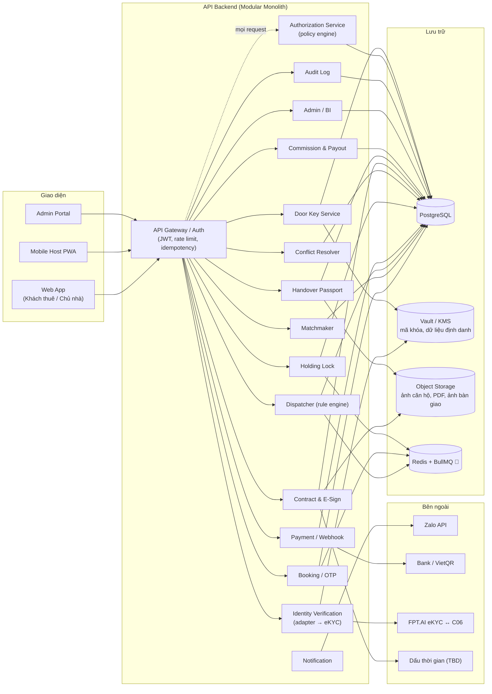

<!-- nguồn: docs/SAD_v2.md, dòng 197–295 -->
## 5. KIẾN TRÚC THÀNH PHẦN (C2 / C3)

**Kiểu triển khai (🔵 đề xuất):** Modular Monolith — các "Service" trong sơ đồ dưới là **module** trong một ứng dụng, không phải microservice. Stack đề xuất: NestJS + Prisma + PostgreSQL (Supabase); Redis/BullMQ 🔵; Object Storage 🟡; Vault/KMS 🟡.



**Ghi chú:**

- Mã khóa cửa và dữ liệu định danh **không nằm dạng plaintext trong Primary DB**; DB chỉ giữ tham chiếu (`vault_secret_ref`), ciphertext ở Vault với khóa quản lý tách biệt.
- `IdentitySvc` là adapter/orchestrator; **không** OCR/Vision trong nội bộ.
- `AuthZ` được Gateway gọi **trước mọi request** tới module nghiệp vụ (§9).

### 5.1 Cấu trúc mã nguồn (🔵 đề xuất)

```
vinstay-backend/src/
├── app.module.ts / main.ts
├── common/
│   ├── guards/            supabase-auth.guard.ts, authz.guard.ts (gọi AuthZ Service)
│   ├── decorators/        @CurrentUser(), @RequirePermission('resource:action'), @Public()
│   ├── interceptors/      idempotency, audit-logging, transform
│   └── filters/
└── modules/
    ├── iam/               Profiles, Roles, Permissions, Supabase Auth hooks
    ├── authz/             Policy engine: role + ownership + ticket state
    ├── property/          Building, Unit, trạng thái available/holding/rented/unlisted
    ├── search/            All-in Cost
    ├── matching/          [Engine 1] Matchmaker
    ├── booking/           Viewing, OTP, xác nhận qua Zalo
    ├── dispatch/          [Engine 2] Dispatcher 3 tầng + worker SLA
    ├── door-key/          Vòng đời mã khóa, reveal, rotate, revoke      (mới)
    ├── payment/           VietQR, webhook, idempotency
    ├── holding/           Khóa căn 7 ngày, hết hạn, UNC tạm 30p
    ├── conflict/          [Engine 3] Hủy lịch trùng, gợi ý căn thay thế
    ├── identity/          [Engine 4] Adapter eKYC, review queue          (thay ocr/)
    ├── contract/          Mandate, thỏa thuận cọc, hợp đồng thuê, ký, niêm phong
    ├── handover/          Hộ chiếu bàn giao, công tơ
    ├── commission/        FeeConfig, host payout
    ├── notification/      Zalo ZNS/OA, SMS dự phòng
    └── admin-bi/          Funnel, SLA, (🔵 heatmap)
```

---

