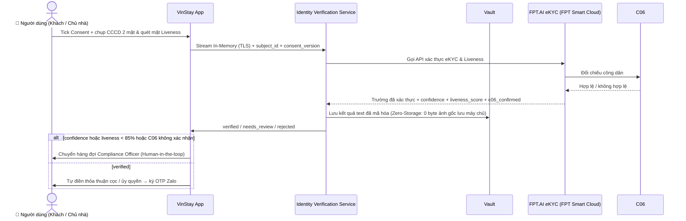

<!-- nguồn: docs/SAD_v2.md, dòng 347–426 -->
## 7. XÁC THỰC DANH TÍNH QUA ĐỐI TÁC eKYC (LIÊN KẾT C06)

### 7.1 Thay đổi so với thiết kế cũ (✅)

Trước: tự chạy OCR, tự chịu độ chính xác/tuân thủ. **Nay:** ủy thác cho đối tác eKYC được cấp phép kết nối C06 — bóc tách, đối chiếu CSDL quốc gia, kiểm tra hiệu lực. VinStay chỉ gửi yêu cầu, nhận kết quả, lưu kết quả đã mã hóa.

### 7.2 Lựa chọn Vendor — ✅ ĐÃ CHỐT: FPT.AI eKYC (FPT SMART CLOUD)

Dựa trên thẩm định pháp lý và kỹ thuật cho giai đoạn Build & Pilot, VinStay AI chính thức lựa chọn giải pháp **FPT.AI eKYC** do **FPT Smart Cloud** (Tập đoàn FPT) cung cấp:

| Tiêu chí                    | Đáp ứng của FPT.AI eKYC                                                                                                                                                                                                          | Đánh giá     |
| --------------------------- | -------------------------------------------------------------------------------------------------------------------------------------------------------------------------------------------------------------------------------- | ------------ |
| **Pháp lý & Giấy phép**     | Đơn vị công nghệ Việt Nam hàng đầu, đạt chuẩn an toàn thông tin ISO 27001; đối chiếu dữ liệu định danh hợp chuẩn; đăng ký kích hoạt trực tiếp theo tài khoản nhà phát triển mà không bị rào cản GPKD doanh nghiệp lớn ở vòng MVP | ✅ Đạt       |
| **Công nghệ Chống Giả mạo** | Tích hợp **Face Liveness Detection** (quét cử động chớp mắt, quay đầu, mỉm cười), phát hiện gian lận ảnh in lại (printed photo), video phát lại qua màn hình (screen replay) và Deepfake                                         | ✅ Vượt trội |
| **Độ chính xác & Tốc độ**   | Bóc tách OCR CCCD 2 mặt chính xác > 98%; thời gian xử lý eKYC ≤ 3–5 giây (SLA đạt chuẩn)                                                                                                                                         | ✅ Đạt       |
| **Cơ chế Zero-Storage**     | Hỗ trợ xử lý trực tiếp In-Memory (Stream); VinStay AI **không lưu trữ bất kỳ file ảnh CCCD gốc nào trên máy chủ (0 byte)**; loại trừ 100% rủi ro lộ lọt dữ liệu cá nhân theo Nghị định 13/2023/NĐ-CP và Luật BVDLCN 2025         | ✅ Đạt       |
| **Chi phí vận hành**        | Mô hình Pay-as-you-go (~1.500 – 2.000 VNĐ / lượt xác thực thành công); có gói Free Tier kiểm thử trong giai đoạn phát triển                                                                                                      | ✅ Tối ưu    |

### 7.3 Luồng



### 7.4 Hợp đồng adapter (để đổi vendor không sửa nghiệp vụ)

```typescript
interface IdentityProvider {
  startVerification(input: {
    subjectId: string;
    consentVersion: string;
    images?: Buffer[];
    sessionMode: "RELAY" | "CLIENT_SDK";
  }): Promise<{ providerRef: string; clientToken?: string }>;
  getResult(providerRef: string): Promise<{
    status: "VERIFIED" | "NEEDS_REVIEW" | "REJECTED";
    confidence: number;
    c06Confirmed: boolean;
    fields?: {
      fullName: string;
      idNumber: string;
      issueDate: string;
      permanentAddress: string;
    };
  }>;
}
```

Nếu vendor hỗ trợ SDK phía client (`CLIENT_SDK`), **ảnh không đi qua server VinStay** — ưu tiên phương án này vì giảm phạm vi dữ liệu nhạy cảm. Nếu chỉ hỗ trợ relay: không ghi đĩa, không log payload, xóa ngay sau khi gọi. Nếu vendor chưa sẵn sàng: mock cùng contract.

### 7.5 Nguyên tắc dữ liệu

- **Cơ chế Zero-Storage:** Máy chủ VinStay AI hoàn toàn không lưu trữ file ảnh CCCD gốc (0 bytes lưu trữ), chỉ xử lý luồng in-memory sang FPT.AI.
- Kết quả xác thực text lưu **mã hóa AES-256** (Vault/DB pgcrypto), không plaintext.
- Chỉ **Compliance Officer** truy cập dữ liệu xác thực đầy đủ; mỗi lần đọc ghi audit.
- Consent: hộp kiểm tách biệt trước khi mở camera/tải ảnh; lưu `consent_at`, `consent_version`. ⚖️ Nội dung consent, thời hạn lưu, đánh giá tác động, nghĩa vụ với bên xử lý (vendor) theo **Luật BVDLCN 2025 + NĐ 356/2025** — pháp chế xác nhận.
- ✅ Xác minh **chủ nhà** và **khách thuê** dùng chung `IdentitySvc` (Universal Role-Agnostic) — đã chốt áp dụng thống nhất quy chuẩn FPT.AI eKYC + ký số OTP cho cả 2 đối tượng.

---

