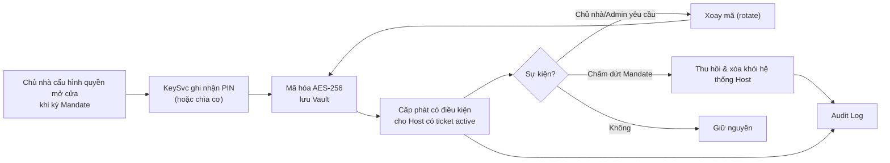
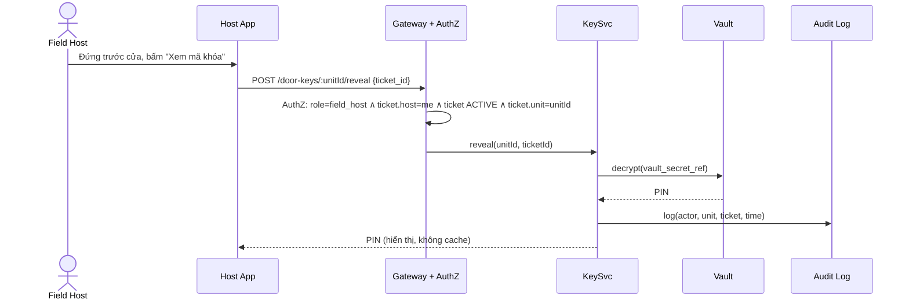

<!-- nguồn: docs/SAD_v2.md, dòng 427–485 -->
## 8. QUẢN LÝ MÃ KHÓA CỬA (DOOR KEY MANAGEMENT) ✅

### 8.1 Bối cảnh

Charter cấm Lockbox và IoT phức tạp. Dùng khóa điện tử sẵn có (mã số) hoặc chìa cơ tập trung tại quầy phân khu. **Mỗi căn có một mã PIN cố định**, không sinh ngẫu nhiên theo lượt khách, không tự hủy — ưu tiên đơn giản vận hành (ADR-03).

### 8.2 Vòng đời

### 8.3 Nguyên tắc

| Nguyên tắc            | Chi tiết                                                                                                                                                   |
| --------------------- | ---------------------------------------------------------------------------------------------------------------------------------------------------------- |
| Lưu trữ               | AES-256 trong Vault, tách khỏi Primary DB; DB chỉ giữ `vault_secret_ref`                                                                                   |
| Cấp phát có điều kiện | Host chỉ thấy mã khi có `dispatch_ticket` ở `ACCEPTED`/`CHECKED` **cho đúng căn đó**; hết ticket → mã bị ẩn. 🔵 Có thể thêm cửa sổ thời gian quanh giờ hẹn |
| Chủ nhà               | Cấu hình/thu hồi/yêu cầu xoay qua Portal nhưng **không xem lại plaintext**                                                                                 |
| Xoay mã               | Theo yêu cầu (nghi lộ, đổi Host phụ trách, chấm dứt Mandate); kiến trúc hỗ trợ sẵn, MVP không bắt buộc theo lịch (🟡 §19)                                  |
| Thu hồi               | Khi `mandate_termination_countdown` về 0: vô hiệu hóa, xóa khỏi mọi cache/app Host                                                                         |
| Hiển thị              | ≤ 2 giây sau khi ticket `accepted`; **không cache offline, không lưu localStorage/service worker**, tự ẩn khi rời màn hình/hết ticket                      |
| Audit                 | Mọi lần hiển thị ghi: ai, lúc nào, ticket nào, căn nào                                                                                                     |
| Thông báo             | 🔵 Zalo cho chủ nhà mỗi lượt mở cửa xem phòng (có thể tắt)                                                                                                 |
| Chìa cơ               | `KeySvc` quản lý trạng thái `AT_DESK` / `WITH_HOST` (đã bàn giao/đã trả), vẫn ghi log; chìa niêm phong tại quầy phân khu                                   |

### 8.4 Luồng reveal

---

