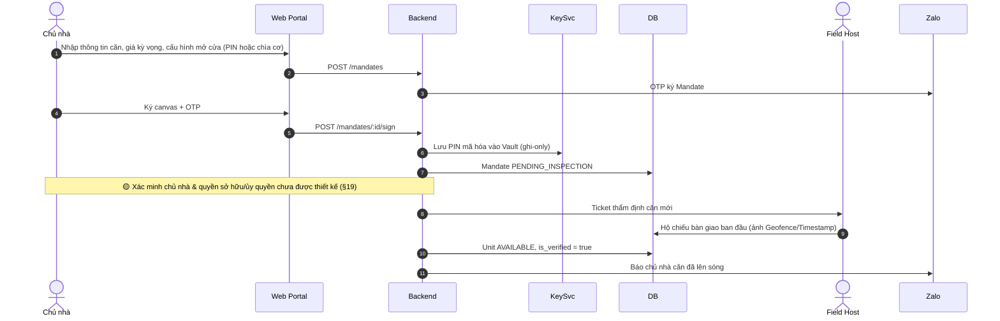
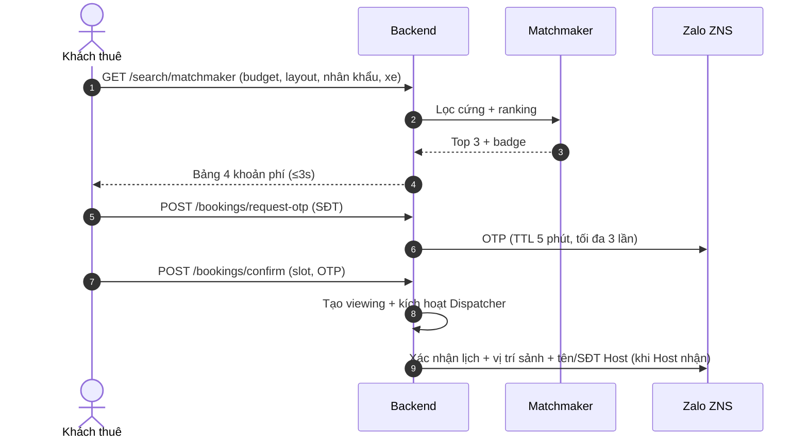
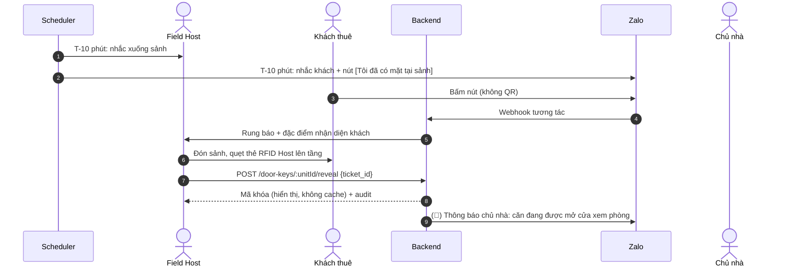
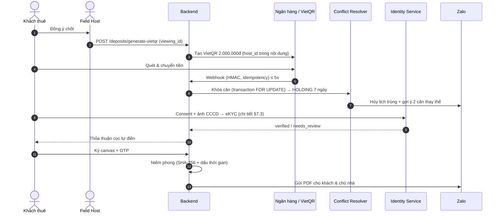

<!-- nguồn: docs/SAD_v2.md, dòng 583–712 -->
## 11. LUỒNG END-TO-END

### 11.1 Ký gửi Độc quyền & thẩm định 0đ



### 11.2 Tìm căn, khớp All-in Cost & đặt lịch



### 11.3 Điều phối, đón sảnh, mở cửa



### 11.4 Cọc VietQR, khóa 7 ngày, xác thực eKYC, ký thỏa thuận



### 11.5 Bàn giao, check-in & thanh lý

```mermaid
sequenceDiagram
    autonumber
    actor T as Khách thuê
    actor H as Field Host
    actor L as Chủ nhà
    participant API as Backend
    participant B as Ngân hàng

    Note over T,H: CHECK-IN
    H->>API: Ảnh 10 hạng mục + chỉ số công tơ (nhập tay + ảnh) — Geofence/Timestamp
    T->>API: Ký xác nhận hiện trạng ban đầu
    Note over T,H: CHECK-OUT
    H->>API: Ảnh đối soát + chỉ số cuối kỳ
    API->>API: Phân định hao mòn tự nhiên; tính công nợ điện nước
    alt Không hư hại, không nợ
        API->>L: Biên bản sạch qua Zalo
        L->>API: Duyệt hoàn cọc
        API->>B: Lệnh hoàn cọc (🟡 mô hình tài khoản)
    else Có hư hại/nợ
        API->>T: Bảng kê cấn trừ minh bạch
        API->>B: Hoàn phần còn lại
    end
```

---

