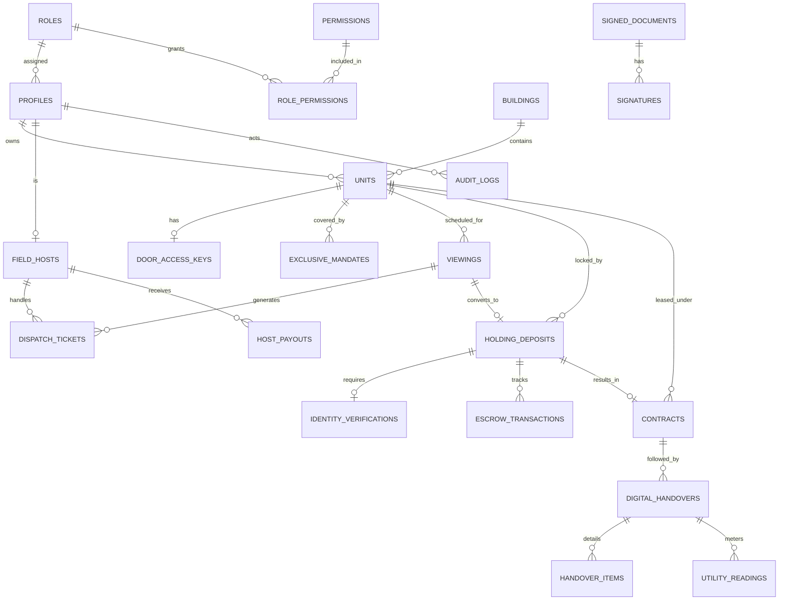

<!-- nguồn: docs/SAD_v2.md, dòng 713–965 -->
## 12. MÔ HÌNH DỮ LIỆU

### 12.1 ERD



### 12.2 Prisma schema (`prisma/schema.prisma`)

```prisma
datasource db {
  provider  = "postgresql"
  url       = env("DATABASE_URL")
  directUrl = env("DIRECT_URL")
}
generator client { provider = "prisma-client-js" }

// ===== 1. IAM & RBAC =====
model Role {
  id          String           @id @default(uuid()) @db.Uuid
  code        String           @unique @db.VarChar(30) // tenant, field_host, landlord, area_lead, ops_admin, compliance_officer
  description String?
  permissions RolePermission[]
  profiles    Profile[]
  @@map("roles")
}
model Permission {
  id       String           @id @default(uuid()) @db.Uuid
  code     String           @unique @db.VarChar(60) // "door_key:reveal", "identity:read"
  resource String           @db.VarChar(40)
  action   String           @db.VarChar(20)
  roles    RolePermission[]
  @@map("permissions")
}
model RolePermission {
  roleId       String     @map("role_id") @db.Uuid
  permissionId String     @map("permission_id") @db.Uuid
  role         Role       @relation(fields: [roleId], references: [id])
  permission   Permission @relation(fields: [permissionId], references: [id])
  @@id([roleId, permissionId])
  @@map("role_permissions")
}
// `system` là service identity, không phải Profile.
model Profile {
  id              String    @id @db.Uuid                 // = Supabase auth uid
  roleId          String    @map("role_id") @db.Uuid
  fullName        String?   @map("full_name") @db.VarChar(100)
  phoneEnc        String?   @map("phone_enc")             // AES-256-GCM, ciphertext
  phoneHash       String?   @unique @map("phone_hash") @db.VarChar(64) // HMAC-SHA256: blind index để tra cứu/unique
  email           String?   @unique @db.VarChar(100)
  isPhoneVerified Boolean   @default(false) @map("is_phone_verified")
  isActive        Boolean   @default(true) @map("is_active")
  createdAt       DateTime  @default(now()) @map("created_at") @db.Timestamptz
  updatedAt       DateTime  @updatedAt @map("updated_at") @db.Timestamptz

  role            Role      @relation(fields: [roleId], references: [id])
  ownedUnits      Unit[]    @relation("LandlordUnits")
  hostProfile     FieldHost?
  viewings        Viewing[] @relation("TenantViewings")
  identityChecks  IdentityVerification[]
  tenantContracts   Contract[] @relation("TenantContracts")
  landlordContracts Contract[] @relation("LandlordContracts")
  signatures      Signature[]
  auditActions    AuditLog[]
  @@map("profiles")
}

// ===== 2. PROPERTY =====
model Building {
  id             String   @id @default(uuid()) @db.Uuid
  buildingCode   String   @unique @map("building_code") @db.VarChar(20) // S1.01…
  zoneName       String   @map("zone_name") @db.VarChar(50)
  totalFloors    Int      @map("total_floors")
  lobbyLatitude  Decimal  @map("lobby_latitude") @db.Decimal(10, 7)
  lobbyLongitude Decimal  @map("lobby_longitude") @db.Decimal(10, 7)
  units          Unit[]
  @@map("buildings")
}
enum UnitStatus   { AVAILABLE HOLDING RENTED UNLISTED MAINTENANCE }
enum LayoutType   { STUDIO ONE_BED_PLUS TWO_BED_ONE_BATH TWO_BED_TWO_BATH THREE_BED }
enum DoorLockType { ELECTRONIC_PIN PHYSICAL_KEY }

model Unit {
  id                  String       @id @default(uuid()) @db.Uuid
  unitCode            String       @unique @map("unit_code") @db.VarChar(50)
  buildingId          String       @map("building_id") @db.Uuid
  landlordId          String       @map("landlord_id") @db.Uuid
  layoutType          LayoutType   @map("layout_type")
  carpetAreaM2        Decimal      @map("carpet_area_m2") @db.Decimal(6, 2)
  baseRentPrice       Decimal      @map("base_rent_price") @db.Decimal(12, 2)
  managementFee       Decimal      @map("management_fee") @db.Decimal(12, 2)
  parkingFeeEstimate  Decimal      @default(150000) @map("parking_fee_estimate") @db.Decimal(12, 2)
  utilityCostEstimate Decimal      @default(600000) @map("utility_cost_estimate") @db.Decimal(12, 2)
  marketAvgPrice      Decimal      @map("market_avg_price") @db.Decimal(12, 2)
  doorLockType        DoorLockType @map("door_lock_type")
  isVerified          Boolean      @default(false) @map("is_verified")
  status              UnitStatus   @default(AVAILABLE)
  isHot               Boolean      @default(false) @map("is_hot")
  createdAt           DateTime     @default(now()) @map("created_at") @db.Timestamptz
  updatedAt           DateTime     @updatedAt @map("updated_at") @db.Timestamptz

  building    Building   @relation(fields: [buildingId], references: [id])
  landlord    Profile    @relation("LandlordUnits", fields: [landlordId], references: [id])
  doorKey     DoorAccessKey?
  mandates    ExclusiveMandate[]
  viewings    Viewing[]
  deposits    HoldingDeposit[]
  contracts   Contract[]
  @@index([status, buildingId])
  @@index([baseRentPrice])
  @@map("units")
}

// ===== 3. DOOR KEY (mới) =====
enum DoorKeyStatus  { ACTIVE REVOKED }
enum PhysicalKeyState { AT_DESK WITH_HOST }

model DoorAccessKey {
  id               String            @id @default(uuid()) @db.Uuid
  unitId           String            @unique @map("unit_id") @db.Uuid
  keyType          DoorLockType      @map("key_type")
  vaultSecretRef   String?           @map("vault_secret_ref")   // tham chiếu Vault; KHÔNG lưu PIN ở DB
  physicalKeyState PhysicalKeyState? @map("physical_key_state")
  physicalKeyHolderId String?        @map("physical_key_holder_id") @db.Uuid
  status           DoorKeyStatus     @default(ACTIVE)
  issuedAt         DateTime          @default(now()) @map("issued_at") @db.Timestamptz
  lastRotatedAt    DateTime?         @map("last_rotated_at") @db.Timestamptz
  revokedAt        DateTime?         @map("revoked_at") @db.Timestamptz
  unit             Unit              @relation(fields: [unitId], references: [id])
  @@map("door_access_keys")
}

// ===== 4. TÀI LIỆU KÝ & CHỮ KÝ =====
enum DocType { MANDATE DEPOSIT_AGREEMENT LEASE HANDOVER_REPORT }

model SignedDocument {
  id            String   @id @default(uuid()) @db.Uuid
  docType       DocType  @map("doc_type")
  storageKey    String   @map("storage_key")
  sha256        String?  @db.VarChar(64)
  tsaToken      String?  @map("tsa_token")        // RFC 3161 token (🟡 TSA vendor)
  tsaTime       DateTime? @map("tsa_time") @db.Timestamptz
  sealedAt      DateTime? @map("sealed_at") @db.Timestamptz
  createdAt     DateTime @default(now()) @map("created_at") @db.Timestamptz
  signatures    Signature[]
  mandate       ExclusiveMandate?
  deposit       HoldingDeposit?
  contract      Contract?
  @@map("signed_documents")
}
model Signature {
  id            String   @id @default(uuid()) @db.Uuid
  documentId    String   @map("document_id") @db.Uuid
  signerId      String   @map("signer_id") @db.Uuid
  signerRole    String   @map("signer_role") @db.VarChar(30)
  method        String   @db.VarChar(30)          // CANVAS_ZALO_OTP | CANVAS_SMS_OTP
  signatureSvg  String?  @map("signature_svg")
  otpVerifiedAt DateTime @map("otp_verified_at") @db.Timestamptz
  ipAddress     String?  @map("ip_address") @db.VarChar(45)
  userAgent     String?  @map("user_agent")
  signedAt      DateTime @default(now()) @map("signed_at") @db.Timestamptz
  document      SignedDocument @relation(fields: [documentId], references: [id])
  signer        Profile        @relation(fields: [signerId], references: [id])
  @@map("signatures")
}

// ===== 5. MANDATE & THOÁT 15 NGÀY =====
enum MandateStatus { PENDING_INSPECTION ACTIVE EXIT_REQUESTED TERMINATED EXPIRED }

model ExclusiveMandate {
  id                     String        @id @default(uuid()) @db.Uuid
  unitId                 String        @map("unit_id") @db.Uuid
  contractNumber         String        @unique @map("contract_number") @db.VarChar(50)
  documentId             String?       @unique @map("document_id") @db.Uuid
  doorAccessConfig       Json?         @map("door_access_config") // quyền mở cửa chủ nhà cấu hình khi ký
  signedAt               DateTime?     @map("signed_at") @db.Timestamptz
  validUntil             DateTime?     @map("valid_until") @db.Timestamptz
  status                 MandateStatus @default(PENDING_INSPECTION)
  exitRequestedAt        DateTime?     @map("exit_requested_at") @db.Timestamptz
  exitEffectiveAt        DateTime?     @map("exit_effective_at") @db.Timestamptz
  unit                   Unit          @relation(fields: [unitId], references: [id])
  document               SignedDocument? @relation(fields: [documentId], references: [id])
  @@map("exclusive_mandates")
}

// ===== 6. FIELD HOST & DISPATCH =====
enum HostDutyStatus { ONLINE_AVAILABLE BUSY_VIEWING OFF_DUTY }

model FieldHost {
  id               String         @id @default(uuid()) @db.Uuid
  profileId        String         @unique @map("profile_id") @db.Uuid
  assignedZone     String         @map("assigned_zone") @db.VarChar(50)
  rfidCardNumber   String?        @map("rfid_card_number") @db.VarChar(50)
  dutyStatus       HostDutyStatus @default(OFF_DUTY) @map("duty_status")
  currentLatitude  Decimal?       @map("current_latitude") @db.Decimal(10, 7)
  currentLongitude Decimal?       @map("current_longitude") @db.Decimal(10, 7)
  rating           Decimal        @default(5.00) @db.Decimal(3, 2)
  walletBalance    Decimal        @default(0) @map("wallet_balance") @db.Decimal(12, 2)
  profile          Profile        @relation(fields: [profileId], references: [id])
  tickets          DispatchTicket[]
  attributedDeposits HoldingDeposit[]
  payouts          HostPayout[]
  @@map("field_hosts")
}

enum ViewingStatus { PENDING_CONFIRMATION CONFIRMED COMPLETED NO_SHOW CANCELLED }

model Viewing {
  id             String        @id @default(uuid()) @db.Uuid
  bookingRefCode String        @unique @map("booking_ref_code") @db.VarChar(50)
  unitId         String        @map("unit_id") @db.Uuid
  tenantId       String        @map("tenant_id") @db.Uuid
  viewingSlot    DateTime      @map("viewing_slot") @db.Timestamptz
  status         ViewingStatus @default(PENDING_CONFIRMATION)
  cancelReason   String?       @map("cancel_reason") @db.VarChar(60) // USER | AUTO_CANCELLED_DUE_TO_DEPOSIT | ...
  lobbyCheckInAt DateTime?     @map("lobby_check_in_at") @db.Timestamptz
  completedAt    DateTime?     @map("completed_at") @db.Timestamptz
  tenantRating   Int?          @map("tenant_rating")
  createdAt      DateTime      @default(now()) @map("created_at") @db.Timestamptz
  unit           Unit          @relation(fields: [unitId], references: [id])
  tenant         Profile       @relation("TenantViewings", fields: [tenantId], references: [id])
  tickets        DispatchTicket[]
  deposit        HoldingDeposit?
  @@index([viewingSlot, status])
  @@map("viewings")
}

enum TicketStatus { OFFERED ACCEPTED CHECKED COMPLETED EXPIRED ESCALATED CANCELLED }

