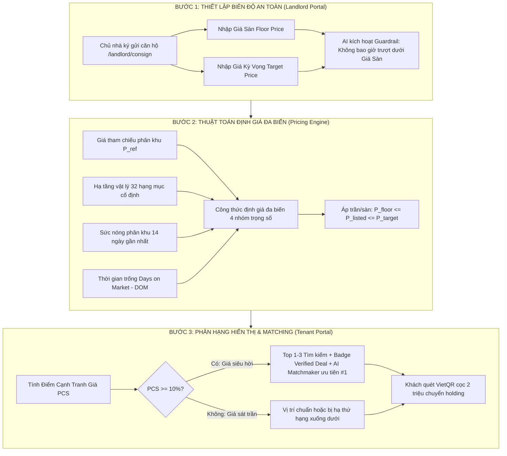

# VINSTAY AI — ĐẶC TẢ CƠ CHẾ ĐỊNH GIÁ & NIÊM YẾT ĐA BIẾN
## (Dynamic Guardrail Pricing & Search Rank Engine Specification)

> **Mã tài liệu:** `SPEC-PRICING-v1.0`  
> **Áp dụng cho:** Hệ điều hành Cho thuê & Vận hành Căn hộ Vinhomes Ocean Park (P-010 / T-010)  
> **Trạng thái:** Bản thảo kỹ thuật (Draft) — Thiết kế không xâm lấn (Non-breaking Spec)  
> **Nguyên tắc bảo vệ:** Bảo đảm 100% tương thích ngược với mã nguồn của toàn bộ thành viên trong nhóm.

---

## 1. MỤC TIÊU & ĐỘNG LỰC NGHIỆP VỤ (GOALS & MOTIVATIONS)

### 1.1. Giải quyết triệt để 2 Nỗi đau & Điểm nghẽn cốt lõi
1. **Nỗi đau số 1 của Chủ nhà (Trống phòng kéo dài & Thiệt hại kép):**
   * *Thực tế:* Chủ nhà tại Ocean Park thường neo giá quá cao trong 15–30 ngày đầu do tâm lý tiếc của, sau đó bị môi giới dìm giá cắt lỗ đột ngột, gây thiệt hại 6–12 triệu VNĐ tiền thuê mỗi tháng trong khi vẫn phải è cổ gánh nợ gốc + lãi ngân hàng và phí quản lý BQL ($9.5k/m^2$).
   * *Giải pháp VinStay AI:* Cung cấp **Biên độ giá an toàn (Safety Corridor)** với cam kết của AI: Tự động điều chỉnh linh hoạt để cắn cọc nhanh dưới 7 ngày nhưng **tuyệt đối không bao giờ trượt xuống dưới Giá sàn (Floor Price) bảo toàn vốn**.
2. **Điểm nghẽn số 1 của Đơn vị Quản lý (Rổ hàng bị "thiu" & Thanh khoản chậm):**
   * *Thực tế:* Căn hộ đăng lên sàn nếu giữ nguyên giá bất chấp ngày trống sẽ bị giảm tương tác, tỷ lệ chuyển đổi tụt dốc.
   * *Giải pháp VinStay AI:* Thuật toán tự động giảm nhẹ theo thời gian trống (Days on Market - DOM), tự cân bằng cung cầu, giữ vững tỷ lệ lấp đầy $\ge 78\%$.

---

## 2. QUY TRÌNH VẬN HÀNH KHÉP KÍN 3 BƯỚC TRÊN APP / WEB

Quy trình vận hành được thiết kế khép kín và liên thông từ lúc Chủ nhà ký gửi cho đến khi Khách thuê tìm kiếm và chốt cọc:



---

### 2.1. Bước 1: Thiết Lập Biên Độ Bảo Vệ (Guardrail Setting)

Khi chủ nhà thực hiện ký gửi căn hộ tại giao diện `/landlord/consign`:
* **Giá sàn (Floor Price - $P_{\text{floor}}$):** 
  * Mức giá tối thiểu tuyệt đối chủ nhà chấp nhận để trang trải nợ gốc/lãi vay ngân hàng và phí quản lý tòa nhà.
  * *Ví dụ:* Căn 2PN The Sapphire 2 có lãi vay 11.5 triệu/tháng + phí QL 500.000 VNĐ $\rightarrow P_{\text{floor}} = 12.000.000$ VNĐ/tháng.
* **Giá kỳ vọng (Target Price - $P_{\text{target}}$):** 
  * Mức giá mong muốn theo tâm lý chủ nhà trong điều kiện thuận lợi nhất (ví dụ: $14.500.000$ VNĐ/tháng).
* **Cam kết bất biến của AI (AI Guardrail Invariant):**
  $$\forall t, \quad P_{\text{floor}} \le P_{\text{listed}}(t) \le P_{\text{target}}$$
  *Bảo đảm pháp lý:* Thuật toán tự động kích cầu của sàn cam kết **không bao giờ được phép** đưa ra mức giá niêm yết thấp hơn $P_{\text{floor}}$.

---

### 2.2. Bước 2: Thuật Toán Định Giá Đa Biến (Multi-Factor Pricing Engine)

Hệ thống tự động tính toán giá đề xuất $P_{\text{suggested}}(t)$ vào lúc 00:00 hàng ngày theo công thức:

$$P_{\text{suggested}}(t) = P_{\text{ref}} \times \left(1 + \Delta_{\text{physical}} + \Delta_{\text{market}}\right) \times \delta_{\text{DOM}}(t)$$

Giá niêm yết chính thức $P_{\text{listed}}(t)$ được bảo vệ bởi hàm chặn:

$$P_{\text{listed}}(t) = \min\Big(P_{\text{target}}, \; \max\big(P_{\text{floor}}, \; P_{\text{suggested}}(t)\big)\Big)$$

#### Chi tiết 4 Nhóm Trọng Số Dữ Liệu:

#### Nhóm 1. Giá tham chiếu phân khu ($P_{\text{ref}}$)
* Lấy giá trung bình thực tế của các căn cùng layout (Studio, 1PN+, 2PN, 3PN) tại phân khu đó (Sapphire 1, Sapphire 2, Zenpark, Pavilion) đã khớp cọc trong 30 ngày gần nhất.

#### Nhóm 2. Hạ tầng vật lý căn hộ ($\Delta_{\text{physical}}$ - Cố định)
Tổng hợp từ dữ liệu khai báo và **Báo cáo kiểm định 32 hạng mục của Field Host**:
$$\Delta_{\text{physical}} = \Delta_{\text{floor}} + \Delta_{\text{view}} + \Delta_{\text{furniture}}$$

| Yếu tố vật lý | Tiêu chí chi tiết | Trọng số ($\Delta$) | Căn cứ thẩm định |
|---|---|:---:|---|
| **Khoảng tầng ($\Delta_{\text{floor}}$)** | • Tầng thấp ($2 - 5$)<br>• Tầng trung đẹp ($8 - 20$)<br>• Tầng cao ($21 - 30$)<br>• Tầng áp mái ($> 30$) | $-2\%$<br>$+3\%$<br>$+1\%$<br>$-3\%$ | Dữ liệu tầng thực tế từ mã căn hộ. Tầng 8–20 có thanh khoản cao nhất do tránh khói bụi và không quá cao. |
| **Hướng & Tầm view ($\Delta_{\text{view}}$)** | • View hồ nước, công viên, sông lớn, bể bơi resort<br>• View nội khu vườn hoa, quảng trường thoáng mát<br>• Ban công hướng chính Tây / Tây Bắc nắng gắt | $+5\%$<br>$0\%$<br>$-3\%$ | Hướng ban công và góc nhìn thực tế theo mặt bằng tầng BQL. |
| **Độ mới nội thất ($\Delta_{\text{furniture}}$)** | • Full đồ mới $100\%$ (mới bóc hộp, có Smart TV, máy rửa bát)<br>• Đầy đủ đồ cơ bản, chất lượng tốt ($80\% - 95\%$)<br>• Đồ cơ bản cũ, qua nhiều đời thuê ($< 75\%$) | $+6\%$<br>$0\%$<br>$-5\%$ | **Biên bản kiểm định 32 hạng mục** do Field Host thực địa xác nhận vào Hộ chiếu bàn giao số. |

#### Nhóm 3. Mùa vụ & Sức nóng phân khu ($\Delta_{\text{market}}$ - Biến thiên 14 ngày)
Đo lường bằng **Tỷ lệ hấp thụ rổ hàng ($\text{Absorption Rate}_{14\text{d}}$)** tại phân khu đó:

$$\text{Absorption Rate}_{14\text{d}} = \frac{\text{Số căn chốt cọc trong 14 ngày}}{\text{Tổng số căn niêm yết trong 14 ngày}} \times 100\%$$

* **Mùa cao điểm ($\text{Absorption} \ge 85\%$):** Dịp tháng 8–9 sinh viên VinUni nhập học, chuyên gia TechnoPark tăng tuyển dụng $\rightarrow \Delta_{\text{market}} = +4\%$.
* **Giai đoạn bình ổn ($60\% \le \text{Absorption} < 85\%$):** $\Delta_{\text{market}} = 0\%$.
* **Mùa thấp điểm ($\text{Absorption} < 60\%$):** Dịp tháng 11–12 giáp Tết hoặc mùa mưa $\rightarrow \Delta_{\text{market}} = -3\%$.

#### Nhóm 4. Biến số Thời gian trống căn hộ ($\delta_{\text{DOM}}$ - Days on Market)
Van điều áp chính giải quyết triệt để nỗi đau thiệt hại tài chính kép:

$$\delta_{\text{DOM}}(t) = 
\begin{cases} 
1.00 & \text{khi } 0 \le \text{DOM} \le 7 \text{ ngày} \quad (\text{Thử nghiệm mức giá tốt tiệm cận } P_{\text{target}}) \\
0.96 & \text{khi } 8 \le \text{DOM} \le 15 \text{ ngày} \quad (\text{Giảm nhẹ } 4\% \text{ để kích hoạt nhu cầu}) \\
0.93 & \text{khi } 16 \le \text{DOM} \le 20 \text{ ngày} \quad (\text{Giảm } 7\% \text{ mở rộng phễu khách}) \\
\frac{P_{\text{floor}}}{P_{\text{ref}} \times (1 + \Delta_{\text{physical}} + \Delta_{\text{market}})} & \text{khi } \text{DOM} > 20 \text{ ngày} \quad (\text{Chạm thẳng Giá sàn } P_{\text{floor}} \text{ để cắt lỗ ngay})
\end{cases}$$

---

### 2.3. Bước 3: Cơ Chế Phân Hạng Hiển Thị (Search Rank & Matching)

Hệ thống tính toán **Điểm cạnh tranh giá (Price Competitiveness Score - PCS)** cho từng căn:

$$PCS = \frac{P_{\text{ref}} - P_{\text{listed}}}{P_{\text{ref}}} \times 100\%$$

| Phân hạng PCS | Điều kiện giá niêm yết | Thứ hạng hiển thị danh mục | Quyền lợi truyền thông & AI Matchmaker |
|---|---|:---:|---|
| **Hạng 1: Siêu Hời (Super Deal)** | $PCS \ge 10\%$<br>*(Rẻ hơn thị trường $\ge 10\%$)* | **Top 1 – 3 trên cùng** của phân khu | • Gắn huy hiệu vàng: **`Verified Deal — Tiết kiệm X triệu/năm`**.<br>• **AI Matchmaker tự động đề xuất ở vị trí #1** cho khách tìm phòng theo ngân sách trần All-in.<br>• Bắn thông báo Zalo cho khách đang lưu bộ lọc tìm phòng tương tự. |
| **Hạng 2: Cạnh Tranh (Good Deal)** | $3\% \le PCS < 10\%$ | Vị trí ưu tiên theo thứ tự tìm kiếm | • Gắn nhãn xanh: **`Giá Tốt Trong Tuần`**.<br>• Xuất hiện trong Top 5 đề xuất của AI Chatbot. |
| **Hạng 3: Tiêu Chuẩn (Standard)** | $0\% \le PCS < 3\%$ | Hiển thị theo thứ tự mặc định | • Hiển thị đầy đủ thông tin chuẩn, ảnh verified 100%. |
| **Hạng 4: Neo Giá Cao (Premium / High)** | $PCS < 0\%$<br>*(Giá cao hơn mức trung bình phân khu)* | **Bị đẩy xuống cuối trang** | • Căn hộ vẫn xuất hiện (không bị xóa), nhưng ưu tiên nhường chỗ cho các căn có tính thanh khoản cao hơn.<br>• AI chỉ ghép căn khi khách có yêu cầu bắt buộc (ví dụ: *"Chỉ thuê tầng 15 view hồ, chấp nhận giá cao"*). |

---

## 3. THIẾT KẾ CƠ SỞ DỮ LIỆU & HƯỚNG DẪN TÍCH HỢP TƯƠNG THÍCH NGƯỢC

Để bảo đảm **0% rủi ro cho các thành viên khác trong nhóm**, mọi trường mở rộng đều được thiết kế theo chuẩn **Optional Fields (`?`)** và **Graceful Fallback**:

### 3.1. Mở rộng TypeScript Interfaces (`apps/web/src/lib/mock/types.ts`)
```typescript
// Mở rộng không xâm lấn (Non-breaking Extension)
export interface UnitPricingGuardrail {
  floorPrice?: number;             // Giá sàn bảo toàn vốn (VNĐ/tháng)
  targetPrice?: number;            // Giá kỳ vọng tối đa (VNĐ/tháng)
  currentListedPrice?: number;     // Giá niêm yết hiện hành sau khi áp dụng DOM
  daysOnMarket?: number;           // Số ngày niêm yết chưa có cọc
  priceScore?: number;             // Điểm PCS (-50 đến +50)
  dealBadge?: "super_deal" | "good_deal" | "standard" | "premium";
}

// Bổ sung vào Unit và Consignment dưới dạng tùy chọn:
export interface Unit extends UnitPricingGuardrail {
  // Toàn bộ các trường cũ của bạn Nam giữ nguyên 100%
  id: string;
  code: string;
  rent: number;
  marketAvg: number;
  // ...
}
```

### 3.2. Hàm Tính Toán Giá Động & Fallback Mẫu (`apps/web/src/lib/mock/cost.ts`)
```typescript
/**
 * Tính toán giá niêm yết động và điểm cạnh tranh giá (Non-breaking Helper)
 */
export function evaluateDynamicPrice(unit: Unit, now: number = Date.now()) {
  const refPrice = unit.marketAvg || unit.rent;
  const floor = unit.floorPrice ?? Math.round(unit.rent * 0.9);   // Fallback: 90% giá gốc
  const target = unit.targetPrice ?? Math.round(unit.rent * 1.1); // Fallback: 110% giá gốc
  const dom = unit.daysOnMarket ?? 0;

  // 1. Hệ số DOM
  let domFactor = 1.0;
  if (dom > 20) {
    // Chạm thẳng giá sàn cắt lỗ
    return {
      listedPrice: floor,
      pcs: Math.round(((refPrice - floor) / refPrice) * 100),
      badge: "super_deal" as const,
    };
  } else if (dom >= 16) {
    domFactor = 0.93;
  } else if (dom >= 8) {
    domFactor = 0.96;
  }

  // 2. Tính giá đề xuất
  const rawSuggested = Math.round(unit.rent * domFactor);
  
  // 3. Áp chặn biên độ an toàn bất biến
  const listedPrice = Math.min(target, Math.max(floor, rawSuggested));
  
  // 4. Tính điểm cạnh tranh giá PCS
  const pcs = Math.round(((refPrice - listedPrice) / refPrice) * 100);
  
  let badge: "super_deal" | "good_deal" | "standard" | "premium" = "standard";
  if (pcs >= 10) badge = "super_deal";
  else if (pcs >= 3) badge = "good_deal";
  else if (pcs < 0) badge = "premium";

  return { listedPrice, pcs, badge };
}
```

---

## 4. KỊCH BẢN THỰC TẾ & MÔ PHỎNG DÒNG TIỀN (CASE STUDY)

### Tình huống thực tế: Căn hộ 2PN The Sapphire 2 (Tòa S2.09, Căn 1204)
* **Thông số căn:** 2PN, 55m², tầng 12 đẹp ($+3\%$), view nội khu thoáng ($0\%$), nội thất mới 90% ($0\%$).
* **Giá tham chiếu thị trường phân khu:** $P_{\text{ref}} = 10.500.000$ VNĐ/tháng.
* **Chủ nhà thiết lập:**
  * **Giá sàn bảo toàn vốn ($P_{\text{floor}}$):** $9.000.000$ VNĐ (bằng đúng nợ lãi ngân hàng 8.5M + phí QL 500k).
  * **Giá kỳ vọng ($P_{\text{target}}$):** $11.500.000$ VNĐ.

```
Mốc thời gian (DOM)          Giá Niêm Yết            PCS (%)      Phân Hạng & Quyền Lợi Hiển Thị
──────────────────────────────────────────────────────────────────────────────────────────────────
Ngày 1 - 7 (Thử nghiệm)      10.800.000 VNĐ          -2.8%        Hạng Standard (Khách tìm căn đẹp)
Ngày 8 - 15 (Kích cầu 4%)    10.370.000 VNĐ          +1.2%        Hạng Good Deal (Giá tốt trong tuần)
Ngày 16 - 20 (Tăng tốc)       9.800.000 VNĐ          +6.6%        Hạng Good Deal (Tiệm cận Top 3)
Ngày 21+ (Cắt lỗ trống)       9.000.000 VNĐ (Sàn)    +14.3%       Hạng Super Deal (Top 1 tìm kiếm + 
                                                                  Badge "Căn hời tiết kiệm 18M/năm")
```

👉 **Kết quả đối soát tài chính của Chủ nhà:**
* Nếu giữ khư khư giá 11.5 triệu, căn phòng bị trống 45 ngày $\rightarrow$ Mất trắng $15.750.000$ VNĐ tiền thuê trong khi vẫn phải trả $13.500.000$ VNĐ tiền nợ ngân hàng.
* Khi dùng cơ chế VinStay AI, căn được chốt cọc ở ngày thứ 22 với giá 9.000.000 VNĐ $\rightarrow$ Chủ nhà thu dòng tiền an toàn cả năm $108.000.000$ VNĐ, bảo toàn trọn vẹn vốn và không bị âm dòng tiền!

---

## 5. KẾT LUẬN & ĐỀ XUẤT TRIỂN KHAI CHO TEAM
1. **Tính độc lập:** Tài liệu này hoàn toàn mang tính chất đặc tả kiến trúc (Spec), không can thiệp hay làm gãy bất kỳ dòng code nào đang chạy của bạn Nam (`apps/web`) hay bạn Lan (`backend`).
2. **Giá trị thẩm định Gate G2:** Là minh chứng thuyết phục Hội đồng Đánh giá AI20K về khả năng ứng dụng AI vào bài toán kinh doanh bất động sản thực tế.
3. **Kế hoạch triển khai mã nguồn:** Sẽ chỉ tích hợp vào code khi nhóm họp và thống nhất thời điểm (dự kiến trong Sprint Gate 2 hoặc Gate 3).
