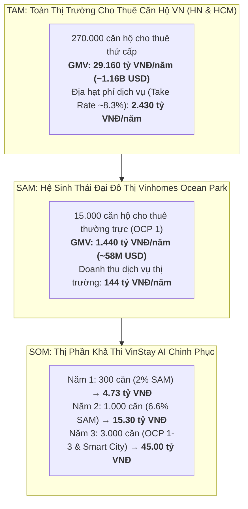
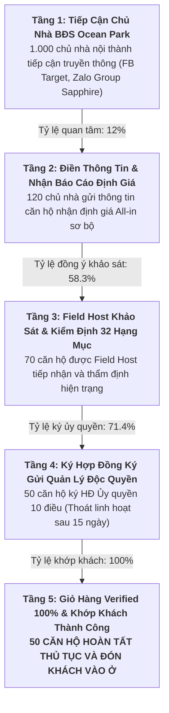
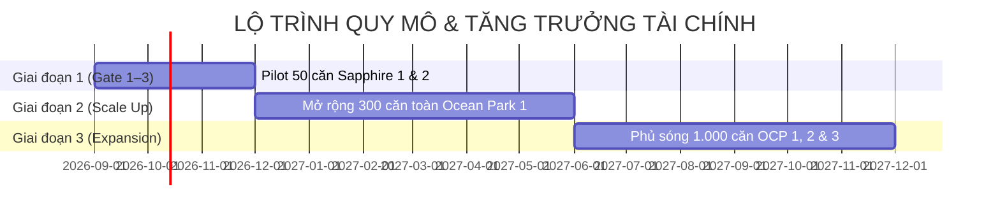

```mermaid
flowchart LR
    subgraph Revenues ["DÒNG THU (REVENUES)"]
        R1["1. Phí Giao Dịch<br>(50% - 100% tháng thuê)"]
        R2["2. Phí SaaS Vận Hành<br>(99k - 199k/căn/tháng)"]
        R3["3. Escrow Float Income<br>(Lợi suất tiền gửi ký quỹ)"]
    end

    subgraph Core ["VINSTAY AI PLATFORM"]
        direction TB
        E["Hệ Điều Hành VinStay AI<br>(Asset-Light Engine)"]
    end

    subgraph Costs ["DÒNG CHI (COSTS)"]
        C1["1. Cloud & Software Infra"]
        C2["2. AI & Vision OCR Costs"]
        C3["3. Field Ops & Thù lao Host"]
        C4["4. Marketing & CAC"]
        C5["5. Admin, Compliance & Ký số"]
    end

    Revenues --> Core
    Core --> Costs
```

# VINSTAY AI — MÔ HÌNH TÀI CHÍNH, ĐỊNH PHÍ VẬN HÀNH & CƠ CẤU NGUỒN THU
*(FINANCIAL MODEL, UNIT ECONOMICS & REVENUE STRUCTURE)*

> **Chương trình:** AI20K Build Phase — Cohort 4 (Vingroup x VinUniversity)  
> **Dự án:** VinStay AI — Hệ điều hành Cho thuê & Vận hành Căn hộ Tinh gọn (Asset-Light)  
> **Địa bàn triển khai:** Vinhomes Ocean Park (Gia Lâm, Hà Nội)  
> **Phiên bản:** v1.2 — Chuẩn hóa thẩm định Gate 1–3, Đồng bộ Web v0.9.2 & Bộ Pháp lý 9 Văn bản  
> **Mốc cập nhật:** 30/09/2026  
> **Tác giả / Phụ trách:** Nguyễn Khánh Duy (Team P-010)

---

## MỤC LỤC
1. [TỔNG QUAN CHIẾN LƯỢC TÀI CHÍNH & NGUYÊN TẮC ASSET-LIGHT](#1-tổng-quan-chiến-lược-tài-chính--nguyên-tắc-asset-light)
2. [QUY MÔ THỊ TRƯỜNG & ĐỊA HẠT DOANH THU TIỀM NĂNG (TAM – SAM – SOM)](#2-quy-mô-thị-trường--địa-hạt-doanh-thu-tiềm-năng-tam--sam--som)
   - [2.1. Phương Pháp Luận Tính Toán (Methodology)](#21-phương-pháp-luận-tính-toán-methodology)
   - [2.2. TAM (Total Addressable Market - Thị Trường Cho Thuê Căn Hộ Chung Cư)](#22-tam-total-addressable-market---thị-trường-cho-thuê-căn-hộ-chung-cư)
   - [2.3. SAM (Serviceable Available Market - Hệ Sinh Thái Vinhomes Ocean Park)](#23-sam-serviceable-available-market---hệ-sinh-thái-vinhomes-ocean-park)
   - [2.4. SOM (Serviceable Obtainable Market - Thị Phần Mục Tiêu Của VinStay AI)](#24-som-serviceable-obtainable-market---thị-phần-mục-tiêu-của-vinstay-ai)
   - [2.5. Bảng Tổng Hợp Đối Chiếu & Sơ Đồ Quy Mô Thị Trường](#25-bảng-tổng-hợp-đối-chiếu-3-cấp-độ-thị-trường)
3. [CHI TIẾT 5 NHÓM CHI PHÍ VẬN HÀNH & ĐẦU TƯ (COST STRUCTURE)](#3-chi-tiết-5-nhóm-chi-phí-vận-hành--đầu-tư-cost-structure)
   - [3.1. Chi Phí Hạ Tầng Kỹ Thuật & Giấy Phép Số (Cloud & Software Infrastructure)](#31-chi-phí-hạ-tầng-kỹ-thuật--giấy-phép-số-cloud--software-infrastructure)
   - [3.2. Chi Phí Vận Hành Trí Tuệ Nhân Tạo & Ký Số (AI Engine & Digital Protocol Cost)](#32-chi-phí-vận-hành-trí-tuệ-nhân-tạo--ký-số-ai-engine--digital-protocol-cost)
   - [3.3. Chi Phí Điều Phối Thực Địa & Thù Lao Field Host (Field Ops & Dynamic Incentives)](#33-chi-phí-điều-phối-thực-địa--thù-lao-field-host-field-ops--dynamic-incentives)
   - [3.4. Chi Phí Tiếp Thị & Kích Hoạt Nguồn Cung (Acquisition Cost - CAC)](#34-chi-phí-tiếp-thị--kích-hoạt-nguồn-cung-acquisition-cost---cac)
   - [3.5. Chi Phí Pháp Lý, Vận Hành Doanh Nghiệp & Hợp Đồng Số (Admin & Compliance)](#35-chi-phí-pháp-lý-vận-hành-doanh-nghiệp--hợp-đồng-số-admin--compliance)
4. [CHI TIẾT 3 NHÓM NGUỒN THU CỐT LÕI (REVENUE STREAMS)](#4-chi-tiết-3-nhóm-nguồn-thu-cốt-lõi-revenue-streams)
   - [4.1. Phí Giao Dịch Thành Công Theo Kỳ Hạn (Transaction Fee - Nguồn thu chủ lực)](#41-phí-giao-dịch-thành-công-theo-kỳ-hạn-transaction-fee---nguồn-thu-chủ-lực)
   - [4.2. Phí Đăng Ký Quản Lý Vận Hành Số Hóa (SaaS Subscription Fee)](#42-phí-đăng-ký-quản-lý-vận-hành-số-hóa-saas-subscription-fee)
   - [4.3. Lãi Suất Tạm Giữ Ký Quỹ & Dòng Tiền Đệm (Escrow Float Income)](#43-lãi-suất-tạm-giữ-ký-quỹ--dòng-tiền-đệm-escrow-float-income)
5. [PHÂN TÍCH KINH TẾ ĐƠN VỊ (UNIT ECONOMICS TRÊN MỖI CĂN HỘ)](#5-phân-tích-kinh-tế-đơn-vị-unit-economics-trên-mỗi-căn-hộ)
6. [DỰ PHÓNG TÀI CHÍNH THEO 3 GIAI ĐOẠN (FINANCIAL PROJECTIONS 50 - 300 - 1.000 CĂN)](#6-dự-phóng-tài-chính-theo-3-giai-đoạn-financial-projections-50---300---1000-căn)
7. [MA TRẬN QUẢN TRỊ RỦI RO DÒNG TIỀN & ĐIỂM HÒA VỐN (BREAK-EVEN ANALYSIS)](#7-ma-trận-quản-trị-rủi-ro-dòng-tiền--điểm-hòa-vốn-break-even-analysis)
8. [KẾT LUẬN & CAM KẾT HIỆU QUẢ ĐẦU TƯ](#8-kết-luận--cam-kết-hiệu-quả-đầu-tư)

---

## 1. TỔNG QUAN CHIẾN LƯỢC TÀI CHÍNH & NGUYÊN TẮC ASSET-LIGHT

VinStay AI theo đuổi triết lý **Siêu Tinh Gọn (Ultra Asset-Light)**. Mục tiêu tài chính tối thượng là:
1. **CapEx bằng 0 VNĐ:** Không mua sắm thiết bị IoT, không lắp hộp khóa Lockbox (tuân thủ 100% quy chế BQL Vinhomes). Toàn bộ thao tác mở cửa thực hiện qua cơ chế cấp mã số tức thì trên Mobile App khi xác nhận xem phòng hoặc lưu chìa cơ tại quầy phân khu.
2. **Biến phí hóa tối đa (Variable-Cost Driven):** Thay vì duy trì lực lượng nhân sự cơ hữu cồng kềnh với quỹ lương cứng lớn, 100% thù lao dẫn khách và hoa hồng chốt deal của Field Host được chi trả theo hiệu quả thực tế qua bộ công cụ `Dynamic Commission & Incentive Engine` cấu hình trực tiếp trên Admin Portal (`AdminCommission.tsx`, `AdminSettings.tsx`).
3. **Dòng tiền bảo chứng độc lập:** Toàn bộ tiền cọc giữ chỗ linh hoạt (2.000.000 VNĐ qua VietQR động, thời hạn khóa căn 12–72 giờ do Admin cài đặt, mặc định 48 giờ) và Tiền Cọc Bảo Đảm Tài Sản & Nội Thất (Security Deposit tương đương 1–2 tháng tiền thuê) được luân chuyển và bảo lưu qua tài khoản định danh ký quỹ (Escrow Account), phân tách hoàn toàn khỏi tài khoản chi phí vận hành nền tảng (OpEx Account).



---

## 2. QUY MÔ THỊ TRƯỜNG & ĐỊA HẠT DOANH THU TIỀM NĂNG (TAM – SAM – SOM)

### 2.1. Phương Pháp Luận Tính Toán (Methodology)
Mô hình định lượng quy mô thị trường của **VinStay AI** kết hợp phương pháp luận tiếp cận hai chiều:
1. **Top-Down Approach (Từ vĩ mô đô thị):** Dựa trên dữ liệu thống kê số lượng căn hộ chung cư thương mại bàn giao và tỷ lệ bất động sản đầu tư cho thuê tại Hà Nội và TP. Hồ Chí Minh theo báo cáo của Savills, CBRE Việt Nam và Tổng cục Thống kê.
2. **Bottom-Up Approach (Từ thực địa vi mô Ocean Park):** Thống kê số lượng căn hộ thực tế tại 66 tòa chung cư đã vận hành tại Vinhomes Ocean Park 1 (Sapphire 1, Sapphire 2, Ruby, Zenpark, Pavilion, Zurich, Masteri Waterfront...) kết hợp đơn giá All-in Cost bình quân thực tế và chu kỳ quay vòng khách thuê (6 – 12 tháng).



---

### 2.2. TAM (Total Addressable Market - Thị Trường Cho Thuê Căn Hộ Chung Cư Thương Mại)
* **Phạm vi khảo sát:** Toàn bộ phân khúc căn hộ chung cư thương mại cho thuê tại 2 trung tâm kinh tế - giáo dục lớn nhất cả nước: Hà Nội & TP. Hồ Chí Minh.
* **Số liệu quy mô nguồn cung:**
  * Hà Nội hiện có khoảng $380.000$ căn hộ chung cư thương mại.
  * TP. Hồ Chí Minh có khoảng $450.000$ căn hộ chung cư thương mại.
  * **Tổng rổ hàng chung cư 2 đô thị:** $\approx \mathbf{830.000 \text{ căn hộ}}$.
* **Tỷ lệ cho thuê thứ cấp (Secondary Rental Ratio):**
  * Theo thống kê CBRE, trung bình $30\% – 35\%$ lượng căn hộ tại các đô thị lớn được chủ sở hữu mua với mục đích tích sản và khai thác dòng tiền cho thuê dài hạn $\rightarrow$ Quy mô căn hộ cho thuê thường trực: $\approx \mathbf{270.000 \text{ căn hộ}}$.
* **Giá thuê trung bình & Chu kỳ thanh khoản:**
  * Giá chào thuê trung bình: $9.000.000 \text{ VNĐ / căn / tháng}$.
  * Chu kỳ hợp đồng thuê: 12 tháng/lượt $\rightarrow$ Mỗi năm phát sinh xấp xỉ $270.000$ lượt ký mới/tái ký.
* **Định lượng giá trị tiền tệ TAM:**
  $$\text{Tổng dòng tiền thuê luân chuyển (GMV TAM)} = 270.000 \text{ căn} \times 9.000.000 \text{ đ} \times 12 \text{ tháng} = \mathbf{29.160 \text{ tỷ VNĐ / năm}} \; (\approx 1.16 \text{ tỷ USD / năm})$$
  $$\text{Địa hạt doanh thu phí dịch vụ môi giới \& vận hành (Take Rate 8.3\% GMV)} \approx \mathbf{2.430 \text{ tỷ VNĐ / năm}} \; (\approx 97 \text{ triệu USD / năm})$$

---

### 2.3. SAM (Serviceable Available Market - Hệ Sinh Thái Vinhomes Ocean Park)
* **Địa hạt phục vụ trực tiếp:** Quần thể siêu đại đô thị Vinhomes Ocean Park (Gia Lâm, Hà Nội).
* **Quy mô quần thể lưu trú:**
  * **Vinhomes Ocean Park 1 (Quận 1):** Gồm 66 tòa chung cư cao tầng đã bàn giao và vận hành đầy đủ (Sapphire 1: 11 tòa; Sapphire 2: 16 tòa; Ruby: 5 tòa; Zenpark: 4 tòa; Pavilion: 4 tòa; Zurich: 3 tòa; Masteri Waterfront: 6 tòa...). Tổng số lượng căn hộ: **~44.000 căn hộ**.
  * **Vinhomes Ocean Park 2 & 3 (Quận 2 & Quận 3):** Khoảng $30.000$ sản phẩm thấp tầng (shophouse, liền kề) và căn hộ cao tầng đang hoàn thiện bàn giao giai đoạn 2026–2028.
  * **Tổng quy mô toàn quần thể Ocean Park:** **~74.000 sản phẩm lưu trú**.
* **Đặc tính nguồn cung cho thuê thứ cấp tại Ocean Park 1:**
  * Do đặc thù là đô thị vệ tinh cách trung tâm nội đô 15–20km, tỷ lệ chủ nhà mua để đầu tư tích sản/cho thuê chiếm tỷ trọng cao vượt trội: **$35\% – 40\%$ tổng số căn hộ**.
  * $\rightarrow$ Dung lượng căn hộ cho thuê thường trực tại OCP 1: $\approx \mathbf{15.000 – 17.000 \text{ căn hộ}}$.
* **Đặc tính nguồn cầu thuê dồi dào & thường trực:**
  * Quy mô dân cư vượt mốc $100.000$ người.
  * Hơn $5.000$ sinh viên, giảng viên Đại học Quốc tế VinUni và hệ thống Vinschool.
  * Hơn $15.000$ chuyên gia, kỹ sư công nghệ và nhân viên văn phòng làm việc tại tháp văn phòng thông minh 45 tầng TechnoPark Tower.
  * Lực lượng lao động chất lượng cao và chuyên gia nước ngoài tại các khu công nghiệp lân cận (KCN Sài Đồng, KCN Yên Phong, Hưng Yên, Bắc Ninh) di chuyển qua các tuyến cao tốc Hà Nội - Hải Phòng.
* **Định lượng giá trị tiền tệ SAM (tại riêng Ocean Park 1):**
  * Giá thuê bình quân thực tế (căn 1PN, 2PN phân khu Sapphire): $8.000.000 \text{ VNĐ / căn / tháng}$.
  $$\text{Tổng dòng tiền thuê luân chuyển (GMV SAM)} = 15.000 \text{ căn} \times 8.000.000 \text{ đ} \times 12 \text{ tháng} = \mathbf{1.440 \text{ tỷ VNĐ / năm}} \; (\approx 58 \text{ triệu USD / năm})$$
  $$\text{Quy mô doanh thu thị trường dịch vụ cho thuê (Take Rate ~10\% GMV gồm hoa hồng + SaaS)} = \mathbf{144 \text{ tỷ VNĐ / năm}} \; (\approx 5.8 \text{ triệu USD / năm})$$

---

### 2.4. SOM (Serviceable Obtainable Market - Thị Phần Mục Tiêu Của VinStay AI)
Dựa trên năng lực vận hành công nghệ Asset-Light, mạng lưới Field Host nội khu tại Sapphire và thuật toán AI Matchmaker, VinStay AI đặt lộ trình chiếm lĩnh thị phần qua 3 năm:

* **Năm 1 (Giai đoạn Pilot MVP & Thâm nhập sâu Sapphire 1 & 2):**
  * **Quy mô giỏ hàng độc quyền:** **300 căn hộ** (Chiếm $\mathbf{2.0\%}$ tổng lượng căn hộ cho thuê tại OCP 1).
  * **Sản lượng giao dịch:** 50 deal chốt mới/tháng $\approx$ 600 deal/năm.
  * **Doanh thu mục tiêu Năm 1:** **4.736.000.000 VNĐ / năm** (~190.000 USD).
  * **Tỷ suất lợi nhuận ròng (Net Margin):** $54.5\%$.
* **Năm 2 (Phủ sóng toàn bộ 66 tòa Vinhomes Ocean Park 1):**
  * **Quy mô giỏ hàng độc quyền:** **1.000 căn hộ** (Chiếm $\mathbf{6.6\%}$ tổng lượng căn hộ cho thuê tại OCP 1).
  * **Sản lượng giao dịch:** 160 deal chốt mới/tháng $\approx$ 1.920 deal/năm.
  * **Doanh thu mục tiêu Năm 2:** **15.300.000.000 VNĐ / năm** (~612.000 USD).
  * **Tỷ suất lợi nhuận ròng (Net Margin):** $61.8\%$.
* **Năm 3 (Mở rộng sang Ocean Park 2, 3 và Vinhomes Smart City Tây Mỗ):**
  * **Quy mô giỏ hàng độc quyền:** **3.000 căn hộ** (gồm 2.000 căn tại Ocean Park 1, 2, 3 và 1.000 căn tại Vinhomes Smart City).
  * **Doanh thu mục tiêu Năm 3:** **~45.000.000.000 VNĐ / năm** (~1.800.000 USD).

---

### 2.5. Bảng Tổng Hợp Đối Chiếu 3 Cấp Độ Thị Trường

| Tiêu chí phân tích | TAM (Hà Nội & TP.HCM) | SAM (Vinhomes Ocean Park 1) | SOM Năm 1 (VinStay AI) | SOM Năm 2 (VinStay AI) | SOM Năm 3 (VinStay AI) |
|---|:---:|:---:|:---:|:---:|:---:|
| **Số căn hộ khai thác cho thuê** | 270.000 căn | 15.000 căn | **300 căn** | **1.000 căn** | **3.000 căn** |
| **Thị phần nắm giữ** | 100% thị trường lớn | 100% rổ hàng OCP 1 | **2.0% SAM** | **6.6% SAM** | **15.0% OCP + Smart City** |
| **Giá thuê bình quân / tháng** | 9.000.000 VNĐ | 8.000.000 VNĐ | 8.000.000 VNĐ | 8.000.000 VNĐ | 8.500.000 VNĐ |
| **Tổng GMV dòng tiền thuê / năm** | 29.160 tỷ VNĐ | 1.440 tỷ VNĐ | **28.8 tỷ VNĐ** | **96.0 tỷ VNĐ** | **306.0 tỷ VNĐ** |
| **Doanh thu tiềm năng nền tảng / năm** | 2.430 tỷ VNĐ | 144 tỷ VNĐ | **4.73 tỷ VNĐ** | **15.30 tỷ VNĐ** | **45.00 tỷ VNĐ** |
| **Lợi nhuận ròng (EBITDA) / năm** | — | — | **+2.57 tỷ VNĐ** | **+9.45 tỷ VNĐ** | **+28.50 tỷ VNĐ** |
| **Động lực tăng trưởng chính** | Tốc độ đô thị hóa & căn hộ mới | Sinh viên VinUni, TechnoPark Tower | Mạng lưới Field Host Sapphire | Phủ kín 66 tòa OCP 1 | Nhân rộng mô hình sang Smart City |

---

## 3. CHI TIẾT 5 NHÓM CHI PHÍ VẬN HÀNH & ĐẦU TƯ (COST STRUCTURE)

### 3.1. Chi Phí Hạ Tầng Kỹ Thuật & Giấy Phép Số (Cloud & Software Infrastructure)
Khoản chi bảo đảm hệ thống vận hành 24/7 với độ trễ thấp và an toàn dữ liệu:

| Khoản mục chi phí | Đơn vị cung cấp | Định mức đơn giá dự kiến | Chu kỳ | Chi phí ước tính (Pilot 50 căn) | Chi phí ước tính (Scale 300 căn) |
|---|---|---|---|:---:|:---:|
| **Server & Frontend Hosting** | Vercel Pro / AWS ECS | $20 USD / dev / tháng | Hàng tháng | 1.000.000 VNĐ | 2.500.000 VNĐ |
| **Cơ sở dữ liệu (PostgreSQL)** | Supabase Pro Tier | $25 USD / project / tháng (kèm 8GB DB, Daily Backups, PITR) | Hàng tháng | 650.000 VNĐ | 1.500.000 VNĐ |
| **Bộ nhớ đệm & Queue (Redis)** | Upstash Redis | $0.2 / 100k requests | Hàng tháng | 200.000 VNĐ | 600.000 VNĐ |
| **Mạng phân phối & Tường lửa** | Cloudflare Pro / Business | $20 USD / tháng (WAF chống DDoS, SSL nâng cao) | Hàng tháng | 500.000 VNĐ | 1.000.000 VNĐ |
| **Tên miền & Email Doanh nghiệp** | Google Workspace / Namecheap | 3 user $\times$ 150.000 VNĐ/user | Hàng tháng | 450.000 VNĐ | 750.000 VNĐ |
| **Giám sát lỗi & Logs (Sentry)** | Sentry.io Developer/Team | $26 USD / tháng | Hàng tháng | 650.000 VNĐ | 1.200.000 VNĐ |
| **TỔNG CỘNG HẠ TẦNG** | | | **Hàng tháng** | **~3.450.000 VNĐ** | **~7.550.000 VNĐ** |

---

### 3.2. Chi Phí Vận Hành Trí Tuệ Nhân Tạo & Ký Số (AI Engine & Digital Protocol Cost)
Khoản chi trả theo lượng tiêu thụ thực tế (Pay-as-you-go) cho các mô hình AI và xác thực:

| Hạng mục AI & Xác thực | Nhà cung cấp & Model | Đơn giá tiêu thụ | Tần suất / Định mức mỗi giao dịch | Chi phí trên mỗi căn chốt deal |
|---|---|---|---|:---:|
| **AI Matchmaker (Lọc All-in Cost)** | OpenAI GPT-4o-mini / Gemini Flash | ~$0.15 / 1M input tokens<br>~$0.60 / 1M output tokens | Trung bình 30 lượt chat/ngày $\approx$ 1.500 lượt/tháng $\approx$ 150.000 VNĐ/tháng | ~15.000 VNĐ |
| **AI Vision OCR CCCD gắn chip (Zero-Storage)** | FPT.AI eKYC / VNPT eKYC | 1.800 – 2.500 VNĐ / request bóc tách 2 mặt CCCD | Tiêu hủy ảnh tức thì sau trích xuất, 1 lượt chốt cọc thực hiện 1 lần quét kèm Face Liveness | ~4.000 VNĐ |
| **Xác thực SĐT Zalo OTP (One-Time OTP)** | Zalo ZNS (Zalo Notification Service) | 300 – 400 VNĐ / tin ZNS | **Chỉ xác thực 1 lần duy nhất** trên SĐT khách thuê (`auth.ts`, `LeaseForm.tsx`), kèm nhắc hẹn T-10m | ~1.200 VNĐ |
| **Ký Hợp đồng Thuê điện tử 3 bước** | Hệ thống ký số nội bộ (Web v0.9.2) | Ký bằng chữ ký tay cảm ứng (Hand Signature) + Consent | Tinh gọn: Bỏ bước ký thỏa thuận cọc riêng; ký thẳng Hợp đồng thuê 3 bước | ~0 VNĐ (In-house) |
| **Embedding & Semantic Vector DB** | Pgvector (nội bộ Supabase) | 0 VNĐ (tích hợp sẵn trong CSDL) | Lưu trữ vector đặc trưng căn hộ và tiêu chí khách | 0 VNĐ |
| **TỔNG CHI PHÍ AI & KÝ SỐ / GIAO DỊCH** | | | | **~20.200 VNĐ / deal** |

---

### 3.3. Chi Phí Điều Phối Thực Địa & Thù Lao Field Host (Field Ops & Dynamic Incentives)
Khoản thù lao chi trả trực tiếp cho mạng lưới Field Host nội khu theo cơ chế biến phí linh hoạt cấu hình trên Trang Quản Trị (`AdminCommission.tsx`, `seed.ts`):

| Khoản mục hiện trường | Cơ chế chi trả | Mức chi trả quy chuẩn (Web v0.9.2) | Điều kiện áp dụng & Phạm vi cấu hình Admin |
|---|---|---|---|
| **Thù lao lượt dẫn khách (Viewing Fee)** | Biến phí trả qua Ví Host | **50.000 VNĐ / lượt dẫn**<br>(`DEFAULT_FEES.baseViewingFee`) | Host quẹt thẻ đưa khách lên phòng, mở cửa thành công. Admin cấu hình được trong khoảng 0 – 500.000 VNĐ. Khách hủy sát giờ < 2h: hưởng 50% thù lao. |
| **Hoa hồng chốt cọc (Deal Commission)** | Thưởng thành tích chốt cọc | **400.000 VNĐ / hợp đồng**<br>(`DEFAULT_FEES.dealCommission`) | Áp dụng khi khách quét VietQR cọc 2 triệu chuyển căn sang `holding` và hoàn tất ký Hợp đồng thuê 3 bước. Admin cấu hình 0 – 2.000.000 VNĐ. |
| **Hệ số đánh giá sao (Rating Multiplier)** | Thưởng chất lượng dịch vụ | $\times \mathbf{1.2}$ nếu $\ge 4.8\star$<br>$\times 1.0$ nếu $4.5 - 4.7\star$<br>$\times 0.8$ nếu $< 4.5\star$ | Nhân trực tiếp vào tổng thù lao cuối tháng để khuyến khích thái độ phục vụ văn minh (`DEFAULT_FEES.ratingMultiplier = 1.2`). |
| **Thưởng nóng chiến dịch (Campaign Bonus)** | Thưởng kích cầu mùa vụ | **200.000 VNĐ / deal**<br>(`DEFAULT_FEES.campaignBonus`) | Kích hoạt trong giai đoạn cao điểm hoặc chiến dịch giải phóng phòng trống nhanh (áp dụng tối đa 3 deal đầu kỳ cho mỗi Host). |
| **Thẻ cư dân thang máy RFID** | Thẻ cư dân BQL cấp | **50.000 – 100.000 VNĐ / thẻ** | Chi phí một lần duy nhất lúc tiếp nhận CTV Host; thẻ được thu hồi hoặc luân chuyển, khấu hao trong 24 tháng. |
| **Chi phí ổ khóa / Lockbox (CapEx)** | **TUYỆT ĐỐI 0 VNĐ** | **0 VNĐ** | Cấp mã số qua app hoặc dùng chìa cơ tập trung; tuyệt đối không dùng Lockbox treo cửa vi phạm quy chế BQL. |
| **Định mức chi phí Field Ops trung bình** | Tính trên 1 deal thành công | **~650.000 – 750.000 VNĐ / deal** | (Bao gồm: 3 lượt dẫn $\times$ 50k + 400k hoa hồng chốt cọc + thưởng sao rating $\ge 4.8\star$). |

---

### 3.4. Mô Hình Phễu Chuyển Đổi Hai Đầu & Chi Phí Tiếp Thị (Two-Sided Conversion Funnel & Unit CAC)

Khác biệt cốt lõi của VinStay AI là giải quyết bài toán thị trường hai mặt (Two-Sided Marketplace): **Thu hút Chủ nhà ký gửi độc quyền (Supply Side)** và **Thu hút Khách thuê có nhu cầu ở thực (Demand Side)**. 

Để đạt được mục tiêu sản lượng **50 deal thành công / tháng** tại quy mô Pilot 300 căn hộ với tổng chi phí tiếp thị **~1.150.000 VNĐ / deal**, hệ thống vận hành theo 2 mô hình phễu chuyển đổi định lượng nghiêm ngặt dưới đây:

---

#### 3.4.1. Phễu Chuyển Đổi Khách Thuê (Tenant Demand Funnel — 6 Tầng)
Mô phỏng dòng chảy khách thuê hàng tháng để tạo ra 50 hợp đồng thuê hoàn tất:

```mermaid
flowchart TD
    F1["<b>Tầng 1: Lượt Tiếp Cận & Truy Cập (Traffic)</b><br>12.000 lượt khách ghé thăm/tháng (SEO, TikTok, Reels, Referral VinUni)"] -->|Tỷ lệ dùng AI: 30%| F2["<b>Tầng 2: Sàng Lọc Nhu Cầu & Tính All-in Cost</b><br>3.600 lượt tương tác AI Matchmaker & bộ lọc ngân sách trần"]
    F2 -->|Tỷ lệ đặt lịch: 10%| F3["<b>Tầng 3: Xác Thực SĐT & Đặt Lịch Xem Phòng</b><br>360 lịch hẹn được tạo qua Zalo OTP 1 lần (One-Time OTP)"]
    F3 -->|Tỷ lệ có mặt (Show Rate): 80%| F4["<b>Tầng 4: Tiếp Đón Sảnh & Xem Phòng Thực Địa</b><br>288 ca xem phòng do Field Host quẹt thẻ cư dân dẫn lên phòng"]
    F4 -->|Tỷ lệ chốt giữ căn: 20.8%| F5["<b>Tầng 5: Quét VietQR Cọc Giữ Chỗ (Holding Lock)</b><br>60 căn hộ chuyển trạng thái holding (khóa 12–72h)"]
    F5 -->|Tỷ lệ chuyển đổi HĐ: 83.3%| F6["<b>Tầng 6: Ký Hợp Đồng Thuê 3 Bước Thành Công</b><br><b>50 HỢP ĐỒNG THUÊ CHÍNH THỨC HOÀN TẤT / THÁNG</b>"]
```

| Tầng phễu khách thuê | Số lượng đầu vào | Tỷ lệ chuyển đổi tầng (CR) | Nguyên nhân suy hao (Drop-off) | Giải pháp công nghệ VinStay AI khắc phục |
|---|:---:|:---:|---|---|
| **Tầng 1: Traffic & Khám phá** | $12.000$ visits | — | Khách xem lướt, chưa có nhu cầu chuyển nhà ngay. | Tối ưu hóa SEO Local "Thuê căn hộ Ocean Park All-in", video review căn thật giá thật trên TikTok/Reels. |
| **Tầng 2: Sàng lọc AI Matchmaker** | $3.600$ users | $\mathbf{30.0\%}$ | Rời bỏ nếu bộ lọc phức tạp, sợ bị cộng chi phí ẩn. | **AI Matchmaker theo All-in Cost**: Bảng tính minh bạch tiền thuê + phí QL $9.5k/m^2$ + phí xe + điện nước; gợi ý 3 căn chuẩn trong 30 giây. |
| **Tầng 3: Đặt lịch Zalo OTP** | $360$ bookings | $\mathbf{10.0\%}$ | Ngại lộ số điện thoại cho môi giới spam làm phiền. | **One-Time OTP & Ẩn danh**: Xác thực OTP Zalo 1 lần duy nhất; hệ thống mã hóa SĐT cá nhân, cam kết 0% cuộc gọi làm phiền. |
| **Tầng 4: Tiếp đón thực địa sảnh** | $288$ viewings | $\mathbf{80.0\%}$ *(Show Rate)* | Bị lạc đường tại Ocean Park, đứng chờ lâu nên bỏ hẹn (No-show). | **Nhắc hẹn kép T-10m & Nút 1-chạm Zalo**: Báo Host xuống sảnh trước 10p, khách bấm nút "Tôi đã có mặt tại sảnh"; Host quẹt thẻ thang máy dẫn lên trong 60 giây. |
| **Tầng 5: Cọc giữ chỗ VietQR** | $60$ holding deals | $\mathbf{20.8\%}$ | Do dự, so đo giá giữa nhiều căn, sợ bị lừa tiền cọc. | **Badge Căn hời phân khu & VietQR động**: Tự động nhận diện căn rẻ hơn $\ge 10\%$; quét QR cọc 2 triệu khóa căn ngay 48h gạch nợ tự động vào tài khoản định danh sàn. |
| **Tầng 6: Ký HĐ thuê chính thức** | $\mathbf{50 \text{ leases}}$ | $\mathbf{83.3\%}$ | Ngại thủ tục giấy tờ công chứng rườm rà, tranh chấp điều khoản cọc. | **Quy trình ký thuê 3 bước tinh gọn**: Bỏ thỏa thuận cọc riêng; OCR CCCD Zero-Storage tiêu hủy ảnh tức thì + ký chữ ký tay cảm ứng trên điện thoại. |

---

#### 3.4.2. Phễu Chuyển Đổi Chủ Nhà Ký Gửi Độc Quyền (Landlord Supply Funnel — 5 Tầng)
Mô phỏng quy trình tiếp nhận và thẩm định nguồn cung để duy trì giỏ hàng 300 căn hộ hoạt động:



| Tầng phễu chủ nhà | Số lượng đầu vào | Tỷ lệ chuyển đổi tầng (CR) | Trở ngại thực tế của chủ nhà | Giải pháp công nghệ VinStay AI cam kết |
|---|:---:|:---:|---|---|
| **Tầng 1: Tiếp cận truyền thông** | $1.000$ chủ nhà | — | Chủ nhà ở nội thành (Cầu Giấy, Đống Đa...) ngại đi xa 20–30km; sợ môi giới lấy ảnh dìm giá. | Quảng cáo trúng đích: "Chủ nhà ngồi tại nhà 100% — Cho thuê căn hộ Ocean Park không tốn 1 giọt xăng". |
| **Tầng 2: Định giá All-in sơ bộ** | $120$ leads | $\mathbf{12.0\%}$ | Không nắm được giá thị trường thực tế, sợ bị ép giá. | Hệ thống tự động phân tích dữ liệu phân khu, đề xuất mức giá All-in Cost tối ưu thanh khoản dưới 7 ngày. |
| **Tầng 3: Khảo sát & Kiểm định** | $70$ inspections | $\mathbf{58.3\%}$ | Bận công việc, không thể chạy sang Ocean Park mở cửa đón thợ/môi giới. | **Mạng lưới Field Host nội khu**: Host đến nhận chìa cơ tại quầy hoặc chủ nhà cấp mã khóa tạm thời; chụp ảnh Hộ chiếu bàn giao số 32 hạng mục. |
| **Tầng 4: Ký HĐ Ủy quyền độc quyền** | $50$ mandates | $\mathbf{71.4\%}$ | Sợ bị ràng buộc pháp lý chặt, mất quyền tự do định đoạt nhà. | **Hợp đồng Ký gửi 10 điều linh hoạt**: Miễn phí kiểm định; điều khoản thoát linh hoạt (chủ nhà có quyền rút sau 15 ngày báo trước kèm trạng thái nhà trống). |
| **Tầng 5: Niêm yết & Khớp deal** | $\mathbf{50 \text{ deals}}$ | $\mathbf{100\%}$ | Căn hộ đăng lên bị "thiu", mất 1–2 tháng không có khách. | **AI Pre-Leasing & Khóa căn VietQR**: Tìm khách và chốt cọc trong 7 ngày; tiền cọc 2 triệu chuyển 100% thành cọc bảo đảm tài sản giữ nguyên suốt kỳ thuê. |

---

#### 3.4.3. Mô Hình Phân Bổ Chi Phí CAC Chi Tiết (CAC Attribution Model)
Bảng hạch toán phân rã chi phí thu hút trên mỗi giao dịch thành công (Quy mô 50 deal/tháng):

| Hạng mục chi phí CAC | Chi phí hạch toán / tháng | Cơ chế phân bổ trên 1 deal thành công | Đơn giá CAC / deal | Tỷ trọng CAC |
|---|:---:|---|:---:|:---:|
| **1. Chi phí thu hút Chủ nhà (Supply CAC):** | | | | |
| • Paid Ads Target (Facebook / Google) | 18.000.000 VNĐ | Phân bổ cho 50 căn ký gửi thành công | 360.000 VNĐ | $31.3\%$ |
| • Hoa hồng giới thiệu cư dân (Referral Bonus) | 10.000.000 VNĐ | Tặng 200k/chủ nhà ký gửi qua truyền miệng | 200.000 VNĐ | $17.4\%$ |
| • Chi phí Field Host thẩm định 32 hạng mục | 12.000.000 VNĐ | 70 lượt khảo sát thực địa $\times$ 170k phân bổ | 240.000 VNĐ | $20.9\%$ |
| **Tiểu kế Supply CAC / deal:** | **40.000.000 VNĐ** | | **~800.000 VNĐ** | **69.6%** |
| **2. Chi phí thu hút Khách thuê (Demand CAC):** | | | | |
| • Hợp tác VinUni & Cộng đồng TechnoPark | 6.000.000 VNĐ | Tài trợ sự kiện sinh viên, đặt standee văn phòng | 120.000 VNĐ | $10.4\%$ |
| • TikTok/Reels Review căn thật & SEO Local | 5.500.000 VNĐ | Chi phí sáng tạo nội dung và tối ưu thứ hạng | 110.000 VNĐ | $9.6\%$ |
| • Zalo ZNS OTP & Nhắc hẹn kép T-10m | 1.000.000 VNĐ | Chi phí tin nhắn tương tác trên 360 lượt booking | 20.000 VNĐ | $1.7\%$ |
| • Hỗ trợ thù lao lượt dẫn khách không chốt | 5.000.000 VNĐ | Bù đắp chi phí dẫn khách xem phòng không thành công | 100.000 VNĐ | $8.7\%$ |
| **Tiểu kế Demand CAC / deal:** | **17.500.000 VNĐ** | | **~350.000 VNĐ** | **30.4%** |
| **TỔNG CAC TRÊN MỖI GIAO DỊCH THÀNH CÔNG** | **57.500.000 VNĐ** | *(Khớp 100% dòng OpEx Marketing tại Mục 6)* | **~1.150.000 VNĐ** | **100.0%** |

---

#### 3.4.4. Chiến Lược Giảm Thiểu Tỷ Lệ Rơi Rụng (Drop-off Prevention Moats)
Để bảo vệ biên lợi nhuận và giữ vững chỉ số **LTV/CAC = 9.5x**, VinStay AI thiết lập 4 chốt chặn kỹ thuật triệt tiêu rò rỉ:
1. **Chốt chặn No-show khách thuê (Tầng 3 $\rightarrow$ Tầng 4):** Quy trình nhắc hẹn kép T-10m kèm nút bấm Zalo 1-chạm nâng Show Rate từ mức trung bình thị trường $50\%$ lên **$80\%$**.
2. **Chốt chặn Ép giá dìm hàng (Tầng 4 $\rightarrow$ Tầng 5):** Bảng tính All-in Cost chuẩn xác kèm huy hiệu Căn hời phân khu giúp khách ra quyết định chuyển cọc VietQR 2 triệu trong 15 phút mà không đi so kè nhiều nơi.
3. **Chốt chặn Bỏ cọc / Phân vân (Tầng 5 $\rightarrow$ Tầng 6):** Cọc giữ chỗ khóa căn 48h tạo tính khan hiếm; quy trình ký Hợp đồng thuê 3 bước ngay trên điện thoại giúp giữ vững tỷ lệ chuyển đổi từ cọc sang thuê đạt **$83.3\%$**.
4. **Chốt chặn Cắt cầu ngoài sàn:** Hợp đồng Ký gửi Độc quyền ràng buộc pháp lý chặt chẽ; Hộ chiếu bàn giao số 32 hạng mục và quyền lợi Escrow bảo vệ tài sản chỉ kích hoạt khi thanh toán qua tài khoản định danh nền tảng, triệt tiêu 100% động cơ giao dịch ngầm.

---

### 3.5. Chi Phí Pháp Lý, Vận Hành Doanh Nghiệp & Hợp Đồng Số (Admin & Compliance)
Chi phí bảo đảm tính pháp lý chuẩn mực theo Nghị định 13/2023/NĐ-CP, Luật Nhà ở 2023 và Luật Giao dịch Điện tử 2023:

| Hạng mục tuân thủ | Đơn vị hợp tác / Cơ chế | Mức chi phí ước tính | Chu kỳ phát sinh |
|---|---|---|---|
| **Ký Hợp đồng Thuê điện tử 3 bước & Mã hóa dữ liệu** | Chữ ký tay cảm ứng + OTP Zalo 1 lần (chuẩn NĐ 13/2023/NĐ-CP) | ~1.500 – 2.500 VNĐ / giao dịch hoàn tất | Phát sinh khi khách ký Hợp đồng thuê chính thức (đã bỏ bước ký thỏa thuận cọc riêng) |
| **Cổng VietQR NAPAS 247 & Tài khoản định danh** | Hợp tác Ngân hàng (Techcombank / MBBank) | Phí duy trì kết nối API Webhook: ~500.000 VNĐ/tháng; phí giao dịch 0đ – 1.100 VNĐ/giao dịch | Hàng tháng |
| **Tư vấn pháp lý rà soát hợp đồng & Biểu mẫu** | Văn phòng Luật sư chuyên ngành BĐS | 15.000.000 VNĐ (chi phí ban đầu) + 2.000.000 VNĐ/tháng duy trì | Chi phí cố định hàng tháng phân bổ |
| **Dịch vụ Kế toán thuế & Kiểm toán định danh** | Công ty dịch vụ kế toán chuyên nghiệp | 3.000.000 VNĐ / tháng | Hàng tháng |
| **TỔNG CHI PHÍ PHÁP LÝ & ADMIN** | | **~5.500.000 – 6.000.000 VNĐ / tháng** | Cố định phân bổ trên toàn bộ giỏ hàng |

---

## 4. CHI TIẾT 3 NHÓM NGUỒN THU CỐT LÕI (REVENUE STREAMS)

### 4.1. Phí Giao Dịch Thành Công Theo Kỳ Hạn (Transaction Fee - Nguồn thu chủ lực)
Áp dụng theo Biểu phí niêm yết trong **Hợp đồng Ký gửi Quản lý Độc quyền (Exclusive Rental Mandate - 10 điều)** ký với Chủ nhà:

* **Hợp đồng thuê ngắn hạn (6 tháng):**
  * Thu của Chủ nhà: **$50\%$ giá trị tiền thuê tháng đầu tiên** (Biên độ dao động: 3.500.000 – 5.500.000 VNĐ / căn).
* **Hợp đồng thuê dài hạn (12 tháng trở lên):**
  * Thu của Chủ nhà: **$100\%$ giá trị tiền thuê tháng đầu tiên** (Biên độ dao động: 7.000.000 – 11.000.000 VNĐ / căn).
* **Giá trị trung bình trên mỗi giao dịch (Blended Transaction Value):**
  * Giả định tỷ trọng hợp đồng: $30\%$ HĐ 6 tháng và $70\%$ HĐ 12 tháng.
  * Với mức giá thuê bình quân căn hộ tại Sapphire (8.000.000 VNĐ/tháng):
  $$\text{Doanh thu giao dịch trung bình} = (30\% \times 4.000.000) + (70\% \times 8.000.000) = \mathbf{6.800.000 \text{ VNĐ / deal}}$$
* **Gia tăng thanh khoản với All-in Cost & Badge Căn Hời (`cost.ts`):**
  * Công thức All-in Cost minh bạch: $\text{Tiền thuê} + \text{Phí QL (9.500đ/m}^2) + \text{Phí xe (150k xe máy, 1.250k ô tô)} + \text{Dự toán điện nước (300k/người)}$.
  * Thuật toán tự động gắn huy hiệu **"Căn hời phân khu"** cho các căn có giá thuê rẻ hơn $\ge 10\%$ so với trung bình tòa (`bargainThreshold: 0.1`), tăng gấp 3 lần tỷ lệ chốt deal và rút ngắn thời gian trống phòng xuống dưới 7 ngày.
  * Chu kỳ thanh toán linh hoạt hỗ trợ khách thuê: [1, 3, 6] tháng (`PAYMENT_CYCLES`).

---

### 4.2. Phí Đăng Ký Quản Lý Vận Hành Số Hóa (SaaS Subscription Fee)
Mô hình thu phí định kỳ hàng tháng cho các tiện ích công nghệ mở rộng dành cho Chủ nhà và Khách thuê:

#### A. Gói "Chủ Nhà Thông Minh" (Smart Landlord Dashboard Premium)
* **Mức phí:** **149.000 VNĐ / căn / tháng** (hoặc gói cả năm 1.490.000 VNĐ).
* **Quyền lợi mở rộng:**
  * Giám sát nhật ký mở cửa thời gian thực, lưu trữ hình ảnh Hộ chiếu bàn giao số 32 hạng mục chuẩn AES-256 trong suốt thời hạn ủy quyền.
  * Tự động xuất biên lai đối soát tiền điện nước EVN, phí gửi xe hàng tháng và nhắc nợ tự động qua Zalo Bot.
  * Tự động số hóa Nội quy BQL Vinhomes (`house-rules.ts`), hỗ trợ tự động gửi thông báo nhắc nhở và lập biên bản phạt cấn trừ vào cọc bảo đảm.
  * Ưu tiên hiển thị Top đầu trong kết quả AI Matchmaker khi căn hộ chuẩn bị bước vào chu kỳ tìm khách mới (Pre-leasing trước 30 ngày).

#### B. Gói "Khách Thuê An Tâm" (VinStay Tenant Care)
* **Mức phí:** **59.000 VNĐ / tháng** (tích hợp trong hóa đơn All-in Cost hàng tháng).
* **Quyền lợi:**
  * Cam kết bảo chứng hoàn trả tiền cọc bảo đảm trong 60 giây khi biên bản thanh lý không có khiếu nại (Fast Escrow Release).
  * Hỗ trợ gọi thợ khẩn cấp 24/7 từ Danh bạ Thợ kỹ thuật uy tín tại Ocean Park với giá chiết khấu $10\%$ (mô hình Asset-Light: khách và thợ tự thỏa thuận chi phí trực tiếp).

---

### 4.3. Lãi Suất Tạm Giữ Ký Quỹ & Dòng Tiền Đệm (Escrow Float Income)
Nguồn doanh thu tài chính an toàn sinh ra từ việc quản lý lượng tiền ký quỹ tập trung:

1. **Dòng tiền Tiền cọc giữ chỗ linh hoạt (2.000.000 VNĐ/lượt):**
   * Quét qua VietQR động gạch nợ tức thì; căn hộ lập tức khóa trạng thái `holding`.
   * **Thời hạn giữ chỗ do Admin cài đặt:** Mặc định **48 giờ**, Admin có thể cấu hình linh hoạt từ **12 đến 72 giờ** trên toàn sàn hoặc thiết lập riêng cho từng căn (`AdminSettings.tsx`, `cost.ts`).
2. **Dòng tiền Tiền Cọc Bảo Đảm Tài Sản & Nội Thất (Security Deposit):**
   * Khi ký Hợp đồng thuê chính thức, khoản cọc 2.000.000 VNĐ ban đầu được **chuyển đổi 100%** thành một phần của Tiền Cọc Bảo Đảm Tài Sản & Nội Thất (tương đương 1 đến 2 tháng tiền thuê, bình quân **$10.000.000 – 16.000.000 \text{ VNĐ/căn}$**).
   * Khoản tiền này được giữ nguyên suốt kỳ hạn thuê và **tuyệt đối KHÔNG khấu trừ vào tiền thuê tháng đầu tiên**.
   * Số tiền này nằm bảo chứng trong tài khoản ký quỹ mở tại Ngân hàng liên kết suốt kỳ hạn hợp đồng (6 – 12 tháng) và chỉ giải tỏa khi hai bên đối soát bàn giao trả phòng.
3. **Cơ chế bảo toàn dòng tiền & cấn trừ tự động theo Nội quy BQL (`house-rules.ts`):**
   * Hợp đồng thuê ràng buộc tự động: Mọi khoản phạt vi phạm nội quy BQL (tiếng ồn sau 22h, nuôi thú cưng trái phép, PCCC, rác thải) và các hóa đơn nợ dịch vụ EVN/nước/xe tồn đọng khi trả phòng được **tự động cấn trừ trực tiếp** vào Tiền Cọc Bảo Đảm trước khi hoàn lại cho khách, đảm bảo 0% nợ xấu cho chủ nhà.
4. **Cơ chế sinh lợi nhuận tài chính (Float Yield):**
   * Áp dụng gói tiền gửi thanh toán doanh nghiệp có kỳ hạn tự động (Sweep Account / Overnight Cash Management) với lãi suất **$2.5\% – 4.0\% / \text{năm}$** trên số dư khả dụng tối thiểu.
   * *Ước tính quy mô dòng tiền đệm:*
     * Với 50 căn: Số dư đệm $\approx 600.000.000 \text{ VNĐ} \rightarrow$ Lợi suất: **~18.000.000 VNĐ/năm**.
     * Với 300 căn: Số dư đệm $\approx 3.600.000.000 \text{ VNĐ} \rightarrow$ Lợi suất: **~120.000.000 VNĐ/năm**.

---

## 5. PHÂN TÍCH KINH TẾ ĐƠN VỊ (UNIT ECONOMICS TRÊN MỖI CĂN HỘ)

Bảng đối chiếu Doanh thu và Chi phí trên **1 căn hộ ký gửi thành công hợp đồng 12 tháng** (Giá thuê: 8.000.000 VNĐ/tháng, đồng bộ Web v0.9.2):

```
┌────────────────────────────────────────────────────────────────────────┐
│             BẢNG TÍNH UNIT ECONOMICS (TRÊN 01 CĂN HỘ / NĂM)            │
├────────────────────────────────────────────────────────────────────────┤
│ 1. DOANH THU THU VỀ (REVENUES):                                        │
│    • Phí hoa hồng giao dịch 12 tháng (100%):            8.000.000 VNĐ │
│    • Phí SaaS Quản lý từ xa (149k x 12 tháng):          1.788.000 VNĐ │
│    • Phí VinStay Care khách thuê (59k x 12 tháng):        708.000 VNĐ │
│    • Lãi suất tiền gửi ký quỹ (Cọc 12tr x 3.5%):          420.000 VNĐ │
│    ─────────────────────────────────────────────────────────────────   │
│    TỔNG DOANH THU / CĂN / NĂM (A):                     10.916.000 VNĐ │
│                                                                        │
│ 2. CHI PHÍ TRỰC TIẾP BIẾN PHÍ (COGS & DIRECT OPEX):                    │
│    • Thù lao dẫn khách Field Host (3 lượt x 50k):         150.000 VNĐ │
│    • Hoa hồng chốt cọc trả Field Host (400k + thưởng sao):450.000 VNĐ │
│    • Chi phí AI Tokens & FPT.AI eKYC OCR (Zero-Storage):   20.000 VNĐ │
│    • Chi phí Zalo OTP 1 lần & Nhắc hẹn T-10m:              10.000 VNĐ │
│    • Chi phí ký HĐ thuê điện tử 3 bước & mã hóa NĐ 13:     10.000 VNĐ │
│    • Chi phí thu hút khách & chủ nhà (CAC phân bổ):     1.150.000 VNĐ │
│    ─────────────────────────────────────────────────────────────────   │
│    TỔNG CHI PHÍ BIẾN PHÍ / CĂN (B):                     1.790.000 VNĐ │
│                                                                        │
│ 3. LỢI NHUẬN GỘP TRÊN MỖI CĂN (GROSS PROFIT = A - B):   9.126.000 VNĐ │
│    TỶ SUẤT LỢI NHUẬN GỘP (GROSS MARGIN):                       83.6%   │
└────────────────────────────────────────────────────────────────────────┘
```

> **ĐÁNH GIÁ CHỈ SỐ KINH TẾ (HEALTHY SAAS METRICS):**
> * **LTV (Giá trị trọn đời khách hàng):** $\approx 10.916.000 \text{ VNĐ}$
> * **CAC (Chi phí thu hút):** $\approx 1.150.000 \text{ VNĐ}$
> * **Tỷ lệ LTV / CAC:** $\mathbf{9.5x}$ (Vượt xa chuẩn an toàn của ngành công nghệ BĐS là $3.0x$).
> * **Thời gian thu hồi chi phí CAC (Payback Period):** **0.2 tháng** (Ngay tại thời điểm chốt cọc và thu tiền hoa hồng tháng đầu tiên).

---

## 6. DỰ PHÓNG TÀI CHÍNH THEO 3 GIAI ĐOẠN (FINANCIAL PROJECTIONS)



### Bảng dự phóng Lãi/Lỗ (P&L Forecast) theo từng giai đoạn:

| Chỉ số tài chính (VNĐ) | Giai đoạn 1: Pilot MVP<br>**(50 căn hộ)** | Giai đoạn 2: Scale Up<br>**(300 căn hộ)** | Giai đoạn 3: Expansion<br>**(1.000 căn hộ)** |
|---|:---:|:---:|:---:|
| **Số căn hộ hoạt động đồng thời** | 50 căn | 300 căn | 1.000 căn |
| **Số deal chốt mới bình quân / tháng** | 10 deal | 50 deal | 160 deal |
| **1. DOANH THU BÌNH QUÂN / THÁNG** | | | |
| • Doanh thu Phí giao dịch (6.8tr/deal) | 68.000.000 | 340.000.000 | 1.088.000.000 |
| • Doanh thu Phí SaaS Quản lý số | 7.450.000 | 44.700.000 | 149.000.000 |
| • Lợi suất tiền gửi ký quỹ (Float) | 1.500.000 | 10.000.000 | 38.000.000 |
| **TỔNG DOANH THU THÁNG** | **76.950.000** | **394.700.000** | **1.275.000.000** |
| **2. TỔNG CHI PHÍ THÁNG (OPEX + CAC)** | | | |
| • Hạ tầng Cloud, Server, Database | 3.450.000 | 7.550.000 | 18.000.000 |
| • Chi phí AI Engine, Vision OCR & ZNS | 1.100.000 | 5.200.000 | 16.500.000 |
| • Thù lao & Hoa hồng Field Host | 6.500.000 | 32.500.000 | 104.000.000 |
| • Tiếp thị, Quảng cáo & Kích hoạt (CAC) | 11.500.000 | 57.500.000 | 184.000.000 |
| • Pháp lý, Kế toán, Thuế & Admin cố định | 6.000.000 | 12.000.000 | 25.000.000 |
| • Lương đội ngũ Vận hành cốt lõi (Core Team) | 25.000.000 | 65.000.000 | 140.000.000 |
| **TỔNG CHI PHÍ THÁNG** | **53.550.000** | **179.750.000** | **487.500.000** |
| **3. LỢI NHUẬN TRƯỚC THUẾ (EBITDA / THÁNG)** | **+23.400.000** | **+214.950.000** | **+787.500.000** |
| **TỶ SUẤT LỢI NHUẬN RÒNG (NET MARGIN)** | **30.4%** | **54.5%** | **61.8%** |

---

## 7. MA TRẬN QUẢN TRỊ RỦI RO DÒNG TIỀN & ĐIỂM HÒA VỐN

### 7.1. Xác định Điểm Hòa Vốn (Break-Even Analysis)
* **Tổng định phí cố định hàng tháng (Fixed OpEx ban đầu):**  
  $\text{Hạ tầng (3.45M)} + \text{Pháp lý/Admin (6M)} + \text{Lương tối thiểu (25M)} \approx \mathbf{34.450.000 \text{ VNĐ / tháng}}$.
* **Biên đóng góp trên mỗi deal thành công (Contribution Margin per Deal):**  
  $\text{Thu phí (6.8tr)} - \text{Host (600k)} - \text{AI/Ký số (40k)} - \text{CAC (1.15tr)} \approx \mathbf{5.010.000 \text{ VNĐ / deal}}$.
* **Số lượng deal tối thiểu để hòa vốn (Break-even Volume):**
  $$\text{Số deal hòa vốn} = \frac{34.450.000}{5.010.000} \approx \mathbf{6.8 \approx 7 \text{ deal / tháng}}$$
  *(Tương đương chỉ cần khớp thành công 7 căn hộ mỗi tháng là nền tảng hoàn toàn tự trang trải được bộ máy).*

### 7.2. Ma Trận Quản Trị Rủi Ro Dòng Tiền & Kế Hoạch Ứng Phó:

| Tình huống rủi ro | Mức độ ảnh hưởng | Kế hoạch dự phòng & Kiểm soát tài chính (Contingency) |
|---|:---:|---|
| **Thị trường thấp điểm (Tháng 3 - 5), ít người thuê** | Trung bình | Kích hoạt công cụ `Dynamic Commission` trên Admin Portal: Tăng thù lao dẫn khách cho Host lên 70k, giảm tạm thời phí hoa hồng từ chủ nhà xuống 40% tháng đầu; nới thời gian giữ căn (Hold Hours) lên 72h để khách chuẩn bị tài chính. |
| **Mùa cao điểm (Tháng 8 - 10), nhu cầu thuê dồn dập** | Tích cực | Rút ngắn thời gian giữ căn (Hold Hours) xuống 12–24h trên Admin Portal để tăng tốc độ thanh khoản, giải phóng giỏ hàng cho khách sẵn sàng ký ngay. |
| **Chủ nhà cắt cầu, không trả phí hoa hồng** | Cao | Ràng buộc pháp lý từ **Hợp đồng Ký gửi Độc quyền 10 điều**; cọc 2 triệu giữ qua VietQR định danh; Hộ chiếu bàn giao số chỉ cấp cho hợp đồng có xác nhận từ nền tảng. |
| **Chi phí API AI / Cloud tăng đột biến** | Thấp | Áp dụng chuẩn **Zero-Storage Ephemeral OCR** và cơ chế **One-Time OTP** trên SĐT khách; bộ đệm Redis cho 80% câu hỏi quen thuộc; giới hạn 5 lượt gọi API trên IP chưa xác thực. |
| **Tranh chấp hao mòn nội thất & nợ cước EVN** | Cao | Số hóa Nội quy BQL Vinhomes (`house-rules.ts`) và chốt công tơ điện nước có timestamp; hợp đồng thuê cho phép tự động cấn trừ thẳng vào Tiền Cọc Bảo Đảm Tài Sản trước khi thanh lý. |
| **Chậm trễ giải ngân cọc gây khiếu nại** | Cao | Cơ chế **Phê duyệt thụ động sau 7 ngày (Passive Approval SLA)**: Nếu chủ nhà không khiếu nại có bằng chứng hợp lệ trong 7 ngày sau trả phòng, hệ thống tự động giải tỏa cọc trả khách. |

---

## 8. KẾT LUẬN & CAM KẾT HIỆU QUẢ ĐẦU TƯ
Mô hình tài chính của **VinStay AI** chứng minh tính bền vững vượt trội nhờ:
1. **Dòng tiền dương ngay từ tháng đầu tiên** nhờ chi phí đầu tư ban đầu (CapEx) = 0.
2. **Biên lợi nhuận gộp đạt trên 83%** nhờ mô hình tự động hóa bằng AI, quy trình ký số 3 bước tinh gọn và lực lượng Field Host biến phí.
3. **Cơ cấu nguồn thu đa dạng** kết hợp giữa Phí giao dịch BĐS truyền thống với Doanh thu phần mềm SaaS định kỳ và Lợi tức dòng tiền ký quỹ an toàn.

