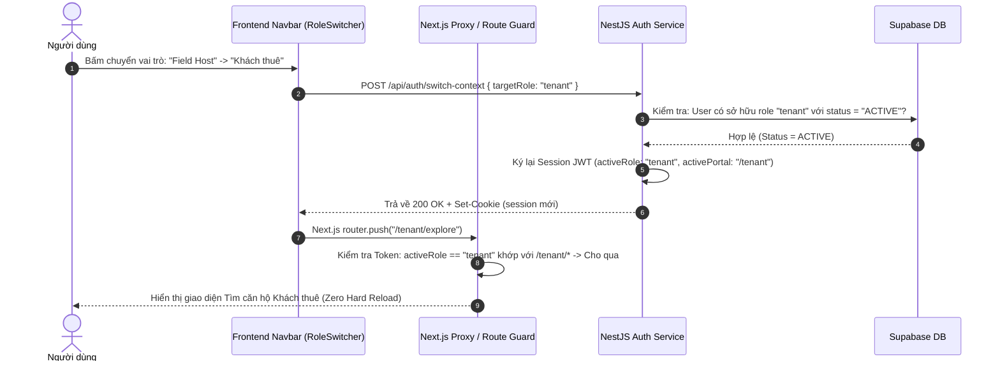

# VINSTAY AI — HỆ THỐNG PHÂN QUYỀN ĐA VAI TRÒ & NGUYÊN LÝ CHUYỂN ĐỔI NGỮ CẢNH
## (Multi-Role Context Switcher & Dynamic RBAC Operational Specification)

> **Mã tài liệu:** `SPEC-IAM-001`  
> **Phiên bản:** `v1.0 (Draft for Gate 3 Roadmap)`  
> **Trạng thái:** Bản thiết kế kiến trúc nội bộ (Lưu trữ cục bộ, chưa commit/push)  
> **Hệ thống áp dụng:** VinStay AI — Vinhomes Ocean Park (The Sapphire 1 & 2)

---

## 1. TỔNG QUAN & BỐI CẢNH NGHIỆP VỤ

### 1.1. Vấn đề thực tế (Problem Statement)
Trong mô hình vận hành ban đầu (Gate 2), mỗi tài khoản người dùng (`Profile`) được gắn cứng 1-1 với một mã vai trò (`roleId`). Khi một người dùng đăng nhập bằng Google hoặc số điện thoại:
1. Nếu tài khoản đã định danh là **Khách thuê** (`tenant`), khi họ muốn tham gia mạng lưới **Field Host** nội khu để kiếm thêm thu nhập hoặc muốn **Ký gửi căn hộ** của mình làm Chủ nhà (`landlord`), hệ thống sẽ trả về lỗi `wrong_portal` (truy cập sai cổng) và từ chối điều hướng.
2. Để chuyển đổi vai trò, người dùng buộc phải đăng xuất, tạo hoặc đăng nhập bằng một email/số điện thoại khác. Điều này gây đứt gãy nghiêm trọng trải nghiệm người dùng, vi phạm nguyên lý tinh gọn của Super-App và làm tăng tỷ lệ rời bỏ nền tảng.

### 1.2. Mục tiêu kiến trúc (Architectural Goals)
1. **Định danh duy nhất (Single Identity)**: Một người dùng chỉ cần duy nhất 1 tài khoản (1 số điện thoại xác thực OTP Zalo / 1 Google Account) nhưng có thể sở hữu đồng thời nhiều vai trò khác nhau (`Tenant`, `Field Host`, `Landlord`).
2. **Chuyển đổi giao diện tức thì (Zero-Friction Context Switching)**: Chuyển đổi giữa các chế độ làm việc trong thời gian dưới 300ms, không tải lại trang cứng (no hard reload), không bắt nhập lại mật khẩu.
3. **Phòng ngừa xung đột lợi ích & Gian lận (Anti-Fraud & Conflict of Interest)**: Ngăn chặn triệt để hành vi "vừa đá bóng vừa thổi còi" (ví dụ: Field Host tự nhận ticket dẫn căn hộ mà chính mình đang tìm thuê để trục lợi thù lao tiếp đón).
4. **Bảo vệ ranh giới dữ liệu nhạy cảm (Zero Trust & Least Privilege)**: Rào chắn nghiêm ngặt mã khóa điện tử mở cửa, bảo mật số điện thoại thật của chủ nhà chống cắt cầu, mã hóa CCCD cá nhân theo Nghị định 13/2023/NĐ-CP.

---

## 2. KIẾN TRÚC MÔ HÌNH DỮ LIỆU (DATABASE SCHEMA MIGRATION)

Chuyển đổi từ mô hình quan hệ 1-1 sang mô hình 1-N (One-to-Many / Many-to-Many with Metadata):

```
┌────────────────────────────────────────────────────────┐
│                        Profile                         │
│  - id: UUID (PK, mapped from Auth UID)                 │
│  - fullName: String                                    │
│  - phoneHash: String (Unique)                          │
│  - phoneEnc: String (AES-256-GCM)                      │
│  - email: String                                       │
│  - activeRoleCode: String (Vai trò hiện hành)          │
└──────────────────────────┬─────────────────────────────┘
                           │ 1
                           │
                           │ N
┌──────────────────────────▼─────────────────────────────┐
│                      ProfileRole                       │
│  - profileId: UUID (FK -> Profile.id)                  │
│  - roleCode: String (FK -> Role.code)                  │
│  - status: ACTIVE | SUSPENDED | PENDING_VERIFICATION   │
│  - isPrimary: Boolean                                  │
│  - verifiedAt: Timestamp                               │
│  - verifiedBy: UUID (Ops Admin ID)                     │
└──────────────────────────┬─────────────────────────────┘
                           │
             ┌─────────────┼─────────────┐
             │ 1           │ 1           │ 1
             ▼             ▼             ▼
┌──────────────────┐ ┌─────────────┐ ┌──────────────────┐
│  TenantProfile   │ │  HostProfile│ │ LandlordProfile  │
│ - budgetMaxAllIn │ │ - zone      │ │ - bankAccount    │
│ - preferredZones │ │ - rfidCard  │ │ - bankName       │
│ - viewHistory    │ │ - dutyStatus│ │ - taxCode        │
│ - cccdEncrypted  │ │ - wallet    │ │ - mandateSignedAt│
└──────────────────┘ └─────────────┘ └──────────────────┘
```

### 2.1. Định nghĩa Prisma Schema chi tiết

```prisma
// Vai trò hệ thống
enum SystemRoleCode {
  tenant
  landlord
  field_host
  area_lead
  ops_admin
  compliance_officer
}

enum RoleMembershipStatus {
  PENDING_VERIFICATION // Đang chờ duyệt (đặc biệt với Host và Landlord)
  ACTIVE               // Đang hoạt động bình thường
  SUSPENDED            // Tạm khóa do vi phạm SLA hoặc tranh chấp
  REVOKED              // Thu hồi vĩnh viễn
}

// Bảng liên kết đa vai trò
model ProfileRole {
  id          String               @id @default(uuid()) @db.Uuid
  profileId   String               @map("profile_id") @db.Uuid
  roleCode    SystemRoleCode       @map("role_code")
  status      RoleMembershipStatus @default(ACTIVE)
  isPrimary   Boolean              @default(false) @map("is_primary")
  grantedAt   DateTime             @default(now()) @map("granted_at")
  verifiedAt  DateTime?            @map("verified_at")
  verifiedBy  String?              @map("verified_by") @db.Uuid

  profile     Profile              @relation(fields: [profileId], references: [id], onDelete: Cascade)

  @@unique([profileId, roleCode])
  @@index([profileId, status])
  @@map("profile_roles")
}
```

---

## 3. NGUYÊN LÝ VẬN HÀNH & CƠ CHẾ CHUYỂN ĐỔI NGỮ CẢNH (CONTEXT SWITCHING)

### 3.1. Cấu trúc Token & Session State
Hệ thống sử dụng cơ chế Token động chứa thông tin vai trò hiện hành (`activeRole`):

```json
{
  "sub": "a1b2c3d4-e5f6-7890-abcd-ef1234567890",
  "email": "nam.vinstay@gmail.com",
  "fullName": "Nguyễn Hoàng Nam",
  "availableRoles": [
    { "role": "tenant", "status": "ACTIVE" },
    { "role": "field_host", "status": "ACTIVE", "zone": "Sapphire 1" },
    { "role": "landlord", "status": "ACTIVE", "unitsCount": 1 }
  ],
  "activeRole": "field_host",
  "activePortal": "/host",
  "sessionNonce": "s_9876543210",
  "iat": 1791038400,
  "exp": 1791124800
}
```

### 3.2. Quy trình Chuyển đổi Ngữ cảnh (Sequence Flow)



### 3.3. Xử lý điều hướng thông minh (Smart Route Redirection)
Khi người dùng đang ở vai trò `tenant`, nhưng bấm vào một link dẫn tới trang Host (ví dụ: `/host/tickets/TK-102` được đồng nghiệp gửi qua Zalo):
* **Hành vi cũ (Gate 2)**: Quăng lỗi 403 `wrong_portal`.
* **Hành vi mới (Context-Aware)**:
  1. Middleware kiểm tra: User có quyền `field_host` trong danh sách `availableRoles` không?
  2. **Nếu CÓ**: Hệ thống tự động kích hoạt **Modal Chuyển Ngữ Cảnh Nhanh**:
     > *"Bạn đang mở liên kết tác vụ của Field Host. Bạn có muốn chuyển sang giao diện Field Host để tiếp nhận ticket này không?"*  
     > `[Chuyển và Tiếp tục]` | `[Hủy bỏ]`
  3. **Nếu KHÔNG**: Báo lỗi phân quyền tiêu chuẩn: *"Tài khoản của bạn chưa được cấp quyền Field Host nội khu"*.

---

## 4. MA TRẬN PHÂN QUYỀN CHI TIẾT (FINE-GRAINED RBAC MATRIX)

| Tài nguyên (Resource) | Hành động (Action) | Tenant | Landlord | Field Host | Ops Admin | Rào chắn bảo mật & Điều kiện ràng buộc (Guardrails) |
| :--- | :--- | :---: | :---: | :---: | :---: | :--- |
| **All-in Cost** | `calc:all_in` | ✅ | ✅ | ✅ | ✅ | Công khai 100% không ẩn phí. |
| **Mã mở cửa điện tử** | `door_lock:reveal` | ⛔ | ✅ | ⚠️ **Có điều kiện** | ⚠️ **Cấp cứu** | **Quy tắc Host**: Chỉ xem được khi: (1) Đã nhận ticket ca xem, (2) Đã bấm có mặt tại sảnh/phòng trong khung giờ $T \pm 15$ phút, (3) GPS Geofence $\le 30m$ từ sảnh tòa. Tự động thu hồi mã ngay khi ca xem kết thúc hoặc cọc thành công. |
| **SĐT thật của Chủ nhà** | `identity:read_phone` | ⛔ | ✅ (Chính mình) | ⛔ | ⚠️ **Có lý do** | Mã hóa AES-256. Khách và Host chỉ giao tiếp qua Tổng đài ảo / Zalo ZNS để triệt tiêu 100% nguy cơ cắt cầu. |
| **Đặt lịch xem phòng** | `viewing:book` | ✅ | ⛔ | ⛔ | ✅ (Tạo hộ) | Khách bắt buộc xác thực Zalo OTP trước khi tạo lịch. |
| **Nhận ticket điều phối** | `dispatch:accept` | ⛔ | ⛔ | ✅ | ✅ (Override) | Host phải bật trạng thái `ONLINE_AVAILABLE` và có định vị trong bán kính 500m. |
| **VietQR Cọc giữ chỗ** | `deposit:generate` | ✅ | ⛔ | ⛔ | ✅ | VietQR động 2.000.000 VNĐ khóa căn theo thời hạn Admin cài đặt. |
| **Hợp đồng thuê & CCCD** | `lease:e_sign` | ✅ | ✅ | ⛔ (Chỉ xem mẫu) | ✅ (Duyệt) | OCR CCCD gắn chip tự động, ký số OTP, mã hóa theo Nghị định 13/2023/NĐ-CP. |
| **Hộ chiếu bàn giao số** | `passport:inspect` | ✅ (Ký nhận) | ✅ (Đối soát) | ✅ (Chụp ảnh) | ✅ | Host chụp 10 hạng mục nội thất nhúng Timestamp + GPS Geofence tại căn hộ. |
| **Biểu phí & Đơn giá** | `config:write` | ⛔ | ⛔ | ⛔ | ✅ | Đơn giá điện nước EVN, phí BQL/m2, hoa hồng Host chỉ Admin được đổi. |

---

## 5. CƠ CHẾ CHỐNG GIAN LẬN & XUNG ĐỘT LỢI ÍCH (ANTI-FRAUD LOGIC)

Khi một tài khoản người dùng sở hữu đồng thời nhiều vai trò, hệ thống kích hoạt **3 Bất Biến Kiểm Soát Xung Đột (Conflict Invariants)**:

### 5.1. Bất biến 1: Chống tự dẫn xem phòng để trục lợi (Anti Self-Viewing)
* **Kịch bản rủi ro**: Field Host A dùng vai trò Khách thuê tạo lịch xem phòng căn hộ S1.02, sau đó dùng vai trò Field Host để nhận chính ticket này nhằm nhận 50.000 VNĐ thù lao lượt dẫn của nền tảng.
* **Quy tắc chặn của AI Auto-Dispatch**:
  $$\text{EligibleHosts} = \{ H \in \text{OnlineHosts} \mid H.\text{profileId} \neq \text{ViewingTicket}.\text{tenantProfileId} \}$$
  Nếu phát hiện `ticket.tenantProfileId == candidateHost.profileId`, thuật toán loại trừ 100% ứng viên này khỏi danh sách phân bổ ticket.

### 5.2. Bất biến 2: Chống xung đột môi giới căn hộ của chính mình (Anti Self-Dealing)
* **Kịch bản rủi ro**: Chủ nhà B đồng thời là Field Host B tự nhận dẫn khách vào căn hộ của chính mình để vừa hưởng quyền lợi chủ nhà, vừa ăn hoa hồng thù lao dẫn phòng từ quỹ vận hành của VinStay AI.
* **Quy tắc giải quyết**:
  * Nếu Host dẫn khách vào căn hộ do chính mình sở hữu: Hệ thống vẫn cho phép tiếp đón để tối đa hóa tỷ lệ chốt cọc, nhưng **chuyển đổi thù lao dẫn phòng sang dạng "Chủ nhà tự tiếp đón" (Phí tiếp đón = 0 VNĐ, không trừ quỹ nền tảng)**.

### 5.3. Bất biến 3: Nhật ký kiểm toán bảo mật bất biến (Security Audit Trail)
Mọi thao tác chuyển đổi vai trò (`switch-context`) hoặc truy xuất dữ liệu nhạy cảm (xem mã cửa, mở hợp đồng) đều được ghi nhận vào bảng `SecurityAuditLog`:
* `timestamp`: Thời gian chuẩn xác đến mili-giây.
* `profileId`: Định danh người dùng thực hiện.
* `sourceRole`: Vai trò trước khi chuyển.
* `targetRole`: Vai trò sau khi chuyển.
* `ipAddress` & `userAgent`: Thiết bị và địa chỉ mạng.
* `actionPayload`: Tham số và tài nguyên liên quan.

---

## 6. LẬP TRÌNH THỰC HIỆN FRONTEND & BACKEND (IMPLEMENTATION BLUEPRINT)

### 6.1. Component Giao diện: `RoleSwitcher.tsx`
Vị trí tích hợp: Góc trên bên phải thanh Navbar (`apps/web/src/components/layout/RoleSwitcher.tsx`).
* Hiển thị Badge định danh vai trò hiện tại với màu sắc chuẩn nhận diện:
  * 🟢 **Khách thuê**: Badge Xanh Ngọc (`Emerald-500`)
  * 🟣 **Chủ nhà**: Badge Tím Violet (`Purple-600`)
  * 🟠 **Field Host**: Badge Cam Hổ Phách (`Amber-500`)
  * 🔴 **Quản trị viên**: Badge Đỏ Ruby (`Rose-600`)
* Dropdown 1-chạm hiển thị danh sách các vai trò đang có hiệu lực.
* Gọi API chuyển đổi và cập nhật Zustand store / React Context mượt mà.

### 6.2. Backend Guard: `RoleAndContextGuard.ts`
Vị trí tích hợp: `backend/src/auth/guards/role-and-context.guard.ts`.
* Kiểm tra song song 2 lớp:
  1. `User.hasRole(requiredRole)`: Tài khoản có được cấp quyền này trong CSDL hay không?
  2. `Session.activeRole == requiredRole`: Phiên làm việc hiện tại có đang kích hoạt đúng vai trò này không? (Tránh trường hợp đang ở giao diện Khách thuê nhưng lén gọi API của Admin).

---

## 7. LỘ TRÌNH TRIỂN KHAI THEO TỪNG CỘT MỐC (ROADMAP)

1. **Gate 2 (Hiện tại - Chốt bài nộp 04/10)**:
   * Giữ nguyên cơ chế 4 tài khoản Demo riêng biệt (`khachthue.demo`, `host.oceanpark`, `chunha.oceanpark`, `admin`) với mật khẩu đồng bộ 1-chạm để đảm bảo độ ổn định 100% trong buổi thẩm định và quay video demo.
2. **Gate 3 (Triển khai tính năng)**:
   * Chạy Prisma Migration thêm bảng `ProfileRole`.
   * Cập nhật NestJS Auth Controller (`/api/auth/switch-context`).
   * Tích hợp Component `RoleSwitcher` trên giao diện người dùng.
   * Kích hoạt bộ lọc chống gian lận trong thuật toán AI Auto-Dispatch.

---
*Tài liệu này được biên soạn bởi Đội ngũ Kiến trúc Hệ thống VinStay AI (P-010). Mọi chỉnh sửa chỉ được thực hiện cục bộ và cần phê duyệt trước khi hòa vào nhánh chính.*
