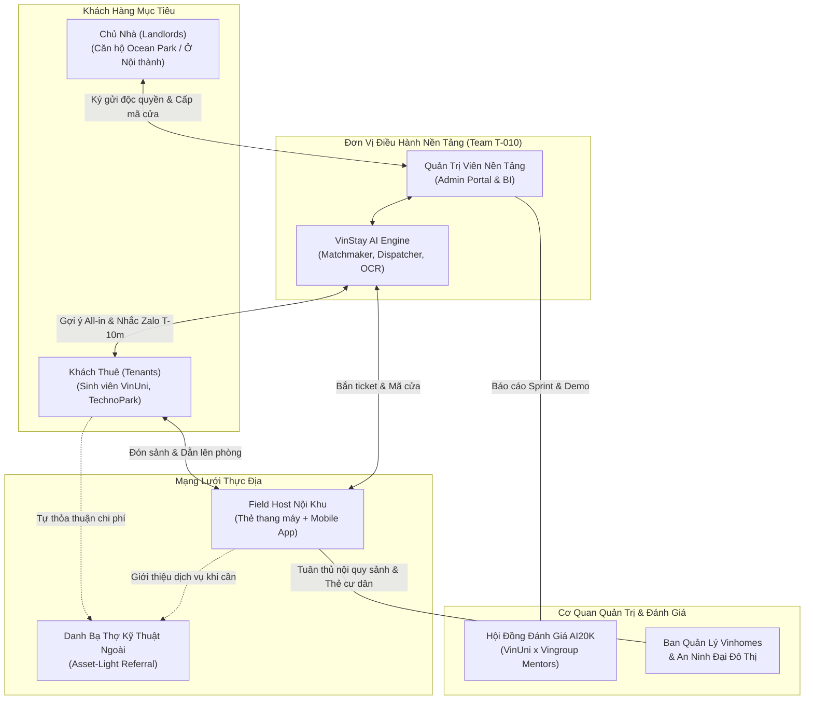
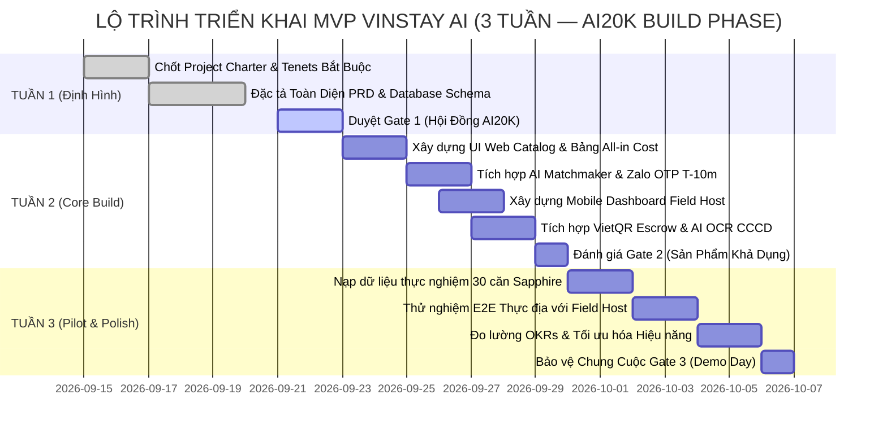

# VINSTAY AI — PROJECT CHARTER (BẢN HIẾN CHƯƠNG DỰ ÁN)

> **LA BÀN ĐỊNH HƯỚNG CHIẾN LƯỢC CHO TOÀN BỘ VÒNG ĐỜI DỰ ÁN**  
> **Chương trình:** AI20K Build Phase — Cohort 4 (Vingroup x VinUniversity)  
> **Đơn vị thực hiện:** Team T-010 | **Giai đoạn:** Tuần 1 — Định hình & Khóa mục tiêu trước khi gõ dòng code đầu tiên  
> **Địa bàn triển khai thử nghiệm:** Vinhomes Ocean Park (Gia Lâm, Hà Nội) — Trọng tâm Phân khu The Sapphire 1 & Sapphire 2 (30–50 căn hộ)

---

## 1. MỤC TIÊU SMART (SMART OBJECTIVES)

```
┌─────────────────────────────────────────────────────────────────────────────────────────┐
│                                   MỤC TIÊU SMART TỔNG THỂ                              │
│                                                                                         │
│ Xây dựng và triển khai thành công MVP "VinStay AI" — Hệ điều hành Cho thuê & Vận hành   │
│ Căn hộ Tinh gọn (Asset-Light) tại Vinhomes Ocean Park trong vòng 03 tuần (Gate 1–3),   │
│ số hóa 100% chặng đầu vòng đời thuê: Minh bạch 100% giá All-in Cost & hình ảnh thực tế, │
│ khớp căn tối ưu trong 30 giây bằng AI và cam kết Chủ nhà hoàn toàn không mất công vận hành.│
└─────────────────────────────────────────────────────────────────────────────────────────┘
```

### Chi tiết hóa theo 5 tiêu chí SMART:

1. **S — Specific (Tính Cụ Thể):**
   * **Giải quyết bài toán gì?**  
     * **Đối với Chủ nhà:** Cam kết **Chủ nhà không phải mất công sức vận hành gì hết** (ở nhà 100%, không phải chạy xe 20–30km mở cửa, không bị môi giới làm phiền, không lo tranh chấp hư hao cọc vì có Hộ chiếu bàn giao số, không bị réo gọi lúc nửa đêm nhờ Danh bạ thợ ngoài uy tín).
     * **Đối với Khách thuê:** Xóa bỏ 100% ma trận tin ảo/tráo căn; minh bạch 100% chi phí hàng tháng qua bảng tính All-in Cost; tìm căn nhanh trong 30 giây bằng AI Matchmaker; xóa bỏ trở ngại lạc đường, chờ đợi vạ vật tại sảnh khi đi xem phòng; bảo vệ 100% tiền cọc và thông tin cá nhân CCCD gắn chip.
   * **Dành cho ai?**
     * **Chủ nhà (Landlord):** Các chủ sở hữu căn hộ tại Vinhomes Ocean Park (đa phần cư trú tại các quận nội thành Hà Nội: Cầu Giấy, Đống Đa, Ba Đình, Thanh Xuân...).
     * **Khách thuê mục tiêu (Tenant):** Sinh viên Đại học VinUni, nhân sự khối văn phòng tòa nhà công nghệ TechnoPark Tower, chuyên gia nước ngoài và các gia đình trẻ văn minh.
     * **Lực lượng thực thi:** Đội ngũ Field Host nội khu (Sale/CTV thường trú tại phân khu có sẵn thẻ cư dân thang máy).

2. **M — Measurable (Tính Đo Lường Được):**
   * Tỷ lệ Chủ nhà không mất công vận hành: **100% Chủ nhà ở nhà** (0 km di chuyển, 0 phút tiếp khách/mở cửa).
   * Thời gian tìm và khớp căn tối ưu bằng AI: **$\le 30$ giây** (Top 3 căn All-in Cost chuẩn).
   * Tỷ lệ minh bạch thông tin & hình ảnh (Listing Verified 100%): **0% tin ảo, 0% ảnh 3D**.
   * Tỷ lệ minh bạch chi phí: **0% chi phí ẩn** (công khai trọn gói 4 khoản phí).
   * Tỷ lệ khách bỏ bom (No-show): giảm từ $30\% \rightarrow \le 5\%$.
   * Tỷ lệ tranh chấp trừ cọc nội thất khi thanh lý: **0%** (nhờ Hộ chiếu bàn giao số 10 hạng mục).
   * Chi phí đầu tư phần cứng mới (Hardware CapEx): **0 VNĐ**.

3. **A — Achievable (Tính Khả Thi):**
   * Tận dụng tối đa hạ tầng sẵn có tại Ocean Park: Thẻ cư dân RFID của Field Host để quẹt thang máy, mã số khóa điện tử sẵn có của căn hộ hoặc chìa cơ tập trung tại phân khu; không phụ thuộc vào việc lắp đặt thiết bị IoT hay API phần cứng bên thứ ba.
   * Tự động hóa các khâu cốt lõi bằng AI Engine tinh gọn: AI Matchmaker lọc Top 3 căn trong 30 giây, AI Vision OCR bóc tách CCCD trong 5 giây, Webhook VietQR tự động gạch nợ trong 10 giây.

4. **R — Relevant (Tính Thích Hợp & Chiến Lược):**
   * Hoàn toàn đồng nhất với sứ mệnh kiến tạo chuẩn sống văn minh, an toàn và thông minh của Tập đoàn Vingroup tại các đại đô thị Vinhomes; bảo vệ tỷ suất sinh lời cho nhà đầu tư BĐS và an ninh sảnh cư dân.

5. **T — Time-bound (Tính Thời Hạn):**
   * Hoàn thành toàn bộ MVP và kiểm chứng thực nghiệm trong **03 tuần** theo lộ trình AI20K Build Phase (Tuần 1: Charter & PRD $\rightarrow$ Tuần 2: Core Build & Gate 2 $\rightarrow$ Tuần 3: E2E Testing, Pilot & Gate 3).

---

## 2. PHẠM VI DỰ ÁN (IN-SCOPE & KIÊN QUYẾT OUT-OF-SCOPE)

> **NGUYÊN TẮC VÀNG CHỐNG "SCOPE CREEP":**  
> Mọi tính năng nằm ngoài bảng dưới đây đều bị loại bỏ ngay lập tức để bảo đảm nguồn lực và tiến độ bàn giao sản phẩm chạy thực tế.

```
┌────────────────────────────────────────┬────────────────────────────────────────┐
│         IN-SCOPE (SẼ LÀM 100%)         │   OUT-OF-SCOPE (KIÊN QUYẾT KHÔNG LÀM)  │
├────────────────────────────────────────┼────────────────────────────────────────┤
│ 1. Bảng tính All-in Cost thời gian thực │ 1. TUYỆT ĐỐI KHÔNG dùng Hộp khóa Lockbox│
│    (Giá thuê + Phí QL + Xe + Điện nước) │    treo cửa (BQL cấm, mất an toàn).   │
│ 2. Thuật toán Dynamic Deal & Huy hiệu   │ 2. TUYỆT ĐỐI KHÔNG dán mã QR ở sảnh tòa│
│    "Căn hời phân khu" (tiết kiệm >=10%) │    (Vi phạm quy chế BQL; thay bằng Zalo)│
│ 3. AI Matchmaker gợi ý 3 căn trong 30s │ 3. TUYỆT ĐỐI KHÔNG làm Tổng thầu Bảo trì│
│ 4. Đặt lịch OTP & Nhắc hẹn kép T-10m   │    hay ôm đội thợ cơ hữu (Asset-light) │
│ 5. Mobile Host Dashboard & Cấp mã cửa  │ 4. TUYỆT ĐỐI KHÔNG can thiệp phần cứng │
│    điện tử qua app khi tới cửa căn hộ   │    ổ khóa thông minh IoT phức tạp.     │
│ 6. Khóa căn 24h qua VietQR động (2M)   │ 5. TUYỆT ĐỐI KHÔNG khấu trừ cọc 2 triệu│
│ 7. AI OCR CCCD & Ký Thỏa thuận cọc số   │    vào tiền thuê tháng đầu tiên.       │
│    bảo mật theo Nghị định 13/2023/NĐ-CP│ 6. TUYỆT ĐỐI KHÔNG phát triển sàn môi  │
│ 8. Hộ chiếu bàn giao số (10 hạng mục)  │    giới tự do mở; KHÔNG dàn trải ngoài │
│ 9. Danh bạ Kỹ thuật ngoài uy tín       │    Vinhomes Ocean Park.                 │
│ 10. HĐ Ký gửi Quản lý Độc quyền        │ 7. KHÔNG tích hợp cổng thẻ Visa/Master │
│     (Thoát ủy quyền 15 ngày nhà trống) │    quốc tế trong giai đoạn MVP.        │
│ 11. Admin Portal: Cấu hình biến phí     │                                        │
│     linh hoạt & Dashboard BI thời gian thực│                                    │
└────────────────────────────────────────┴────────────────────────────────────────┘
```

---

## 3. CHỈ SỐ ĐO LƯỜNG THÀNH CÔNG (SUCCESS METRICS & SCORECARD)

Các chỉ số thành công được định lượng hóa chi tiết, gắn với mục tiêu chứng minh hiệu quả kinh tế và vận hành của đề án:

| Trụ cột đo lường | Chỉ số thành công cốt lõi (KPI) | Hiện trạng truyền thống | Mục tiêu VinStay AI (Pilot MVP) | Phương thức đo lường / Nguồn dữ liệu |
| :--- | :--- | :--- | :--- | :--- |
| **Hiệu Quả Chủ Nhà** | **Công sức vận hành của Chủ nhà** | 20 – 30 km đi lại, trực mở cửa, xử lý sự cố | **0 công sức / 0 km** (Chủ nhà ở nhà 100%) | Log kích hoạt mã cửa điện tử trên Mobile Host |
| | **Tỷ lệ tranh chấp cọc & hư hao** | 40% – 50% số hợp đồng | **0% tranh chấp** | Biên bản đối soát Hộ chiếu bàn giao số (Digital Passport) lúc thanh lý |
| | **Tỷ lệ nợ đọng điện nước EVN** | Thường xuyên tồn đọng 1–2 kỳ | **0% nợ đọng** | Chốt ảnh công tơ điện nước có timestamp trước khi hoàn cọc bảo đảm |
| **Trải Nghiệm Khách Thuê** | **Thời gian tìm & khớp căn tối ưu** | 7 – 14 ngày chat hỏi nhiều môi giới | **$\le 30$ giây** | Log thời gian phản hồi AI Matchmaker Top 3 căn |
| | **Tỷ lệ tin ảo / sai lệch hiện trạng** | 60% – 70% trên MXH | **0% tin ảo** (100% căn thật, ảnh thật) | Đối soát Listing định danh [Tòa-Tầng-Căn] |
| | **Độ lệch chi phí All-in Cost** | Đội 20% – 30% chi phí ẩn | **100% minh bạch (0% sai lệch)** | Đối soát hóa đơn thực tế tháng đầu vs Bảng tính All-in Cost công khai |
| | **Tỷ lệ bỏ bom hẹn xem (No-show)** | 25% – 35% ca hẹn | **$\le 5\%$** | Tỷ lệ khách bấm xác nhận có mặt qua Zalo T-10m |
| | **Thời gian đưa khách lên phòng** | Chờ đợi 15 – 30 phút ở sảnh | **$\le 60$ giây** | Host quẹt thẻ cư dân thang máy đưa lên phòng |
| **Vận Hành Nền Tảng** | **Tỷ lệ cắt cầu (Platform Leakage)** | 30% – 40% số giao dịch | **0%** | Ràng buộc HĐ Độc quyền & Cọc giữ chỗ 24h tự động gạch nợ qua VietQR |
| | **SLA Điều phối Field Host** | Không xác định / Tự do | **$\le 3$ phút** tiếp nhận ticket | Log tiếp nhận trên hệ thống Auto-Dispatch 3 tầng |
| | **Chi phí phần cứng bổ sung (CapEx)** | 500.000 – 2.000.000 đ/căn | **0 VNĐ** | Báo cáo tài chính CapEx của dự án |
| | **Tốc độ xử lý AI Engine** | Xử lý thủ công 1 – 2 ngày | AI Match $\le 30$s; OCR $\le 5$s; QR $\le 10$s | Log thời gian phản hồi của hệ thống |

---

## 4. BẢN ĐỒ CÁC BÊN LIÊN QUAN (STAKEHOLDER MAP & GOVERNANCE)



### Chi tiết Phân Quyền, Kênh Tương Tác & Kỳ Vọng của Stakeholders:

| Nhóm Stakeholder | Đại diện cụ thể | Ai cấp quyền? | Ai trực tiếp sử dụng? | Kênh tương tác chính | Giá trị nhận được & Kỳ vọng cốt lõi |
| :--- | :--- | :--- | :--- | :--- | :--- |
| **1. Chủ Nhà (Landlord)** | Chủ sở hữu căn hộ Ocean Park đang ở nội thành Hà Nội. | Cấp quyền ủy quyền cho VinStay AI quản lý độc quyền rổ hàng & mã cửa. | Sử dụng Web/Mobile Dashboard theo dõi lịch xem và nhận cọc. | Zalo OA/Bot thông báo tự động, Masked Call bảo mật, SMS OTP. | Lấp đầy căn trống dưới 7 ngày; ở nhà 100% không tốn xăng xe mở cửa; an tâm tuyệt đối về nội thất nhờ Hộ chiếu bàn giao số. |
| **2. Khách Thuê (Tenant)** | Sinh viên VinUni, nhân sự TechnoPark, gia đình trẻ. | Cấp quyền chia sẻ thông tin CCCD (theo Nghị định 13) để làm thỏa thuận cọc. | Sử dụng Web App tìm phòng, Zalo Mini App nhận nhắc hẹn. | Giao diện Web Responsive, Zalo tương tác 1-chạm, Cổng VietQR. | Tìm được căn thật giá thật trong 30 giây; không lo chi phí ẩn; xem phòng đúng giờ có Host đón tận sảnh; cọc an toàn 100%. |
| **3. Field Host (Sale nội khu)** | Nhân sự/CTV thường trú tại Sapphire 1 & 2 có sẵn thẻ cư dân. | Được Admin cấp quyền tài khoản Host để nhận ticket xem phòng. | Sử dụng Mobile Host Dashboard để nhận việc, đón khách và nhận mã cửa. | App PWA/Mobile Push Notification, Zalo nội bộ phân khu. | Tăng thu nhập với biến phí linh hoạt (Ticket fee + Hoa hồng chốt); không bị khách bỏ bom; không mất công quản lý chìa khóa cồng kềnh. |
| **4. Ban Quản Trị (Team T-010)** | Đội ngũ sáng lập & vận hành VinStay AI. | Nắm toàn quyền quản trị cấu hình hệ thống và rổ hàng. | Sử dụng Admin Portal để chỉnh biến phí, theo dõi SLA và báo cáo BI. | Dashboard Admin, Slack/Telegram nội bộ, Database Console. | Giữ mô hình siêu tinh gọn (Asset-Light); dòng tiền an toàn; zero rủi ro pháp lý sửa chữa; kiểm soát tuyệt đối chất lượng dịch vụ. |
| **5. Ban Quản Lý (BQL) & Cư dân** | Ban Quản lý Vinhomes Ocean Park & cư dân tòa nhà. | Cấp quyền sử dụng tiện ích theo quy chế cư dân chuẩn mực. | Không trực tiếp dùng app, nhưng là đơn vị giám sát an ninh trật tự. | Bàn giao thông tin lưu trú chuẩn, quy chế an ninh thang máy. | Chấm dứt cảnh môi giới tự do chèo kéo sảnh; bảo vệ an ninh trật tự hành lang; không có hộp lockbox gây mất mỹ quan. |
| **6. Ban Giám Khảo & Mentors** | Hội đồng phản biện Chương trình AI20K (VinUni x Vingroup). | Thẩm định và quyết định cấp chứng nhận/tiến độ Gate 1, 2, 3. | Đánh giá qua Báo cáo, Tài liệu PRD/Charter và Trình diễn Demo. | Báo cáo tiến độ Sprint, GitHub Repository, Buổi Demo Day trực tiếp. | Đảm bảo dự án giải quyết bài toán thực tế, bám sát các tenets khắt khe, ứng dụng AI thực chất và có tiềm năng mở rộng quy mô. |

---

## 5. LỘ TRÌNH TRIỂN KHAI THEO 3 TUẦN (PROJECT TIMELINE & MILESTONES)



---

## 6. NGUYÊN TẮC QUẢN TRỊ RỦI RO (RISK MANAGEMENT & CONTINGENCY)

1. **Rủi ro Khách hàng hoặc Môi giới cố tình cắt cầu:**  
   * *Biện pháp:* Ký Hợp đồng Quản lý Độc quyền có điều khoản chế tài; chỉ nền tảng mới có quyền cấp mã cửa và Hộ chiếu bàn giao 10 hạng mục nội thất.
2. **Rủi ro BQL Vinhomes siết quy chế sảnh:**  
   * *Biện pháp:* 100% tuân thủ không dán QR sảnh, không treo Lockbox; Field Host mang thẻ cư dân hợp lệ đóng vai trò đón tiếp văn minh như người nhà dẫn khách lên.
3. **Rủi ro Quá tải hoặc Thiếu hụt Field Host:**  
   * *Biện pháp:* Thuật toán Auto-Dispatch 3 tầng tự động mở rộng vùng nhận việc sau 3 phút và báo động Area Lead; công cụ điều chỉnh biến phí trên Admin Portal sẵn sàng kích hoạt gói thưởng nóng để thu hút thêm CTV nội khu.

---

> **CAM KẾT THỰC THI (PROJECT PLEDGE):**  
> Bản Hiến Chương Dự Án (Project Charter) này là văn bản có hiệu lực cao nhất định hướng mọi hành động phát triển kỹ thuật và vận hành của Team T-010. Toàn bộ thành viên cam kết không đi chệch khỏi các mục tiêu SMART và phạm vi đã thống nhất.
