# VINSTAY AI — SOFTWARE ARCHITECTURE DOCUMENT (SAD)

> **Phiên bản:** 1.0  
> **Ngày:** 2026-09-22  
> **Trạng thái:** Draft — Pending Review  
> **Tài liệu liên quan:** PRD.md · UI_FLOW_SPEC.md · PROJECT_CHARTER.md

---

## Mục Lục

1. [Tổng Quan Kiến Trúc](#1-tổng-quan-kiến-trúc)
2. [Nguyên Tắc Thiết Kế](#2-nguyên-tắc-thiết-kế)
3. [Kiến Trúc Cấp Cao (C1 — Context)](#3-kiến-trúc-cấp-cao-c1--context)
4. [Kiến Trúc Container (C2 — Container)](#4-kiến-trúc-container-c2--container)
5. [Kiến Trúc Component Chi Tiết (C3 — Component)](#5-kiến-trúc-component-chi-tiết-c3--component)
6. [Luồng Dữ Liệu End-to-End](#6-luồng-dữ-liệu-end-to-end)
7. [Thiết Kế Database (ERD)](#7-thiết-kế-database-erd)
8. [API Contract](#8-api-contract)
9. [Kiến Trúc Bảo Mật](#9-kiến-trúc-bảo-mật)
10. [Hạ Tầng & CI/CD](#10-hạ-tầng--cicd)
11. [SLA & NFR](#11-sla--nfr)
12. [Architecture Decision Records (ADR)](#12-architecture-decision-records-adr)

---

## 1. Tổng Quan Kiến Trúc

VinStay AI số hóa vòng đời thuê BĐS tại **Vinhomes Ocean Park** theo luồng:  
**Tìm kiếm → Khớp căn All-in Cost → Đặt lịch xem phòng → Đón tiếp tại sảnh → Cọc giữ chỗ 24h → Ký thỏa thuận điện tử**

### Đặc trưng kiến trúc cốt lõi

| Đặc trưng | Mô tả |
|---|---|
| **Asset-Light** | Zero hardware CapEx; tận dụng thẻ thang máy RFID và khóa điện tử sẵn có |
| **AI-First** | 70% tác vụ lặp lại tự động hoá: Matchmaker, OCR, Dispatcher, Conflict Resolver |
| **Mobile-First** | 100% mobile responsive; Field Host vận hành qua Progressive Web App |
| **Event-Driven** | Webhook VietQR → Trigger chuỗi: khóa căn → hủy lịch → notify Zalo |
| **Zero-Trust Security** | AES-256 CCCD; masked call; ẩn SĐT cá nhân hai chiều |
| **Multi-Tenant RBAC** | 4 vai trò: Tenant / Field Host / Landlord / Platform Admin |

---

## 2. Nguyên Tắc Thiết Kế

```
P1 — Reliability First    : Webhook VietQR ≤ 10s; OCR ≤ 5s; Dispatch ≤ 3 phút
P2 — Privacy by Design    : Nghị định 13/2023/NĐ-CP; AES-256; Consent-gate CCCD
P3 — Operational Lean     : Asset-Light; biến phí 100%; zero lương cứng Host
P4 — Anti-Leakage         : Mask SĐT; VietQR định danh; Attribution Lock Host
P5 — Graceful Degradation : Fallback OCR → form tay; Webhook delay → temporary_holding
P6 — Auditability         : Mọi hành động có Audit Trail (IP, timestamp, actor)
```

---

## 3. Kiến Trúc Cấp Cao (C1 — Context)

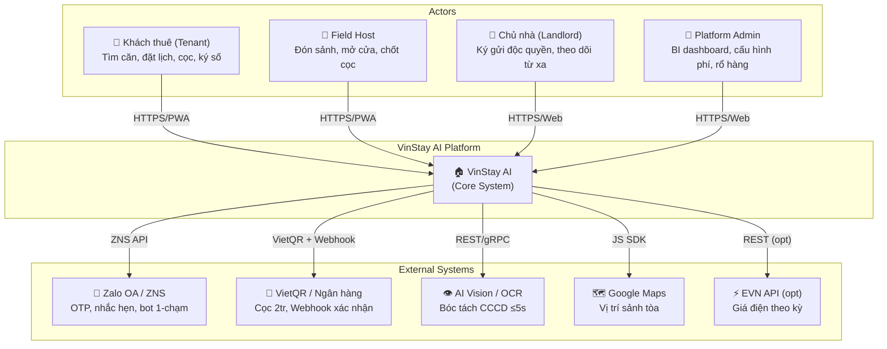

---

## 4. Kiến Trúc Container (C2 — Container)

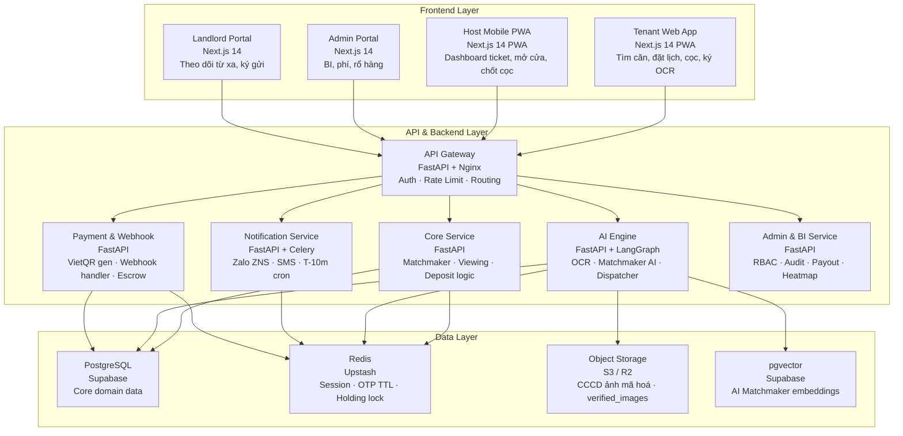

---

## 5. Kiến Trúc Component Chi Tiết (C3 — Component)

### 5.1 Frontend Pages

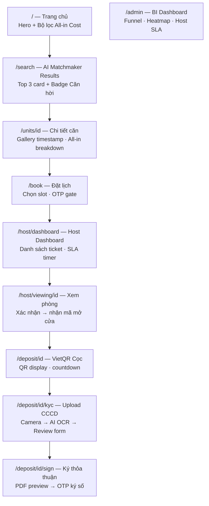

### 5.2 AI Engine — 4 Module

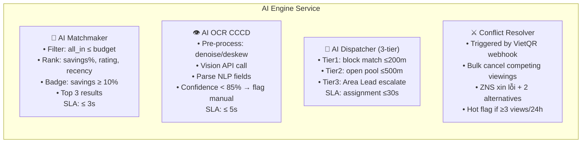

### 5.3 Notification — Loại thông báo

| Trigger | Kênh | Nội dung chính |
|---|---|---|
| OTP đặt lịch | Zalo ZNS / SMS | Mã 4 số, TTL 5 phút |
| Booking confirmed | Zalo ZNS | `booking_ref_code`, Maps link, tên Host |
| **T-10m reminder** | Zalo ZNS (interactive) | Nút `[Tôi đã có mặt]` / `[Đang trên đường]` |
| Host alert T-10m | Push + ZNS | Tên khách, mã căn, tòa |
| No-show T+15m | Zalo ZNS (interactive) | Gia hạn / Hủy |
| Cọc thành công | Zalo ZNS | PDF link, expires_at |
| Lịch bị hủy | Zalo ZNS | Xin lỗi + 2 căn thay thế |
| Chủ nhà: mở cửa | Zalo ZNS | Log timestamp mở cửa |
| OTP ký số | Zalo ZNS / SMS | Mã xác nhận ký thỏa thuận |

---

## 6. Luồng Dữ Liệu End-to-End

### 6.1 Luồng AI Matchmaker

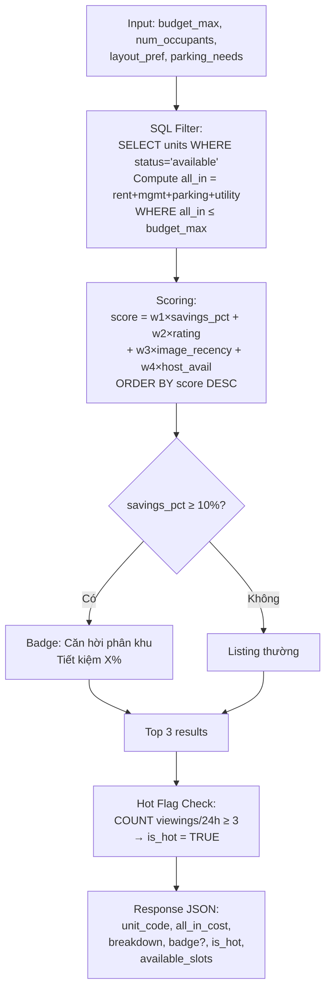

### 6.2 Luồng Đặt Lịch & Dispatch Field Host

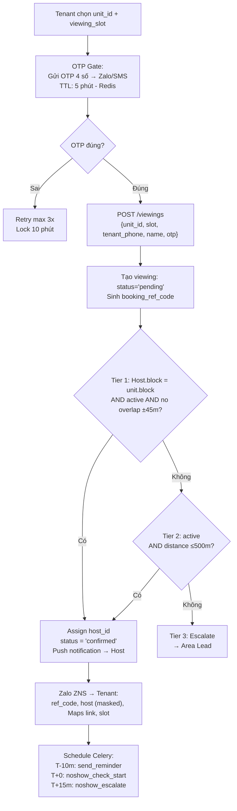

### 6.3 Luồng Chốt Cọc VietQR & AI OCR CCCD

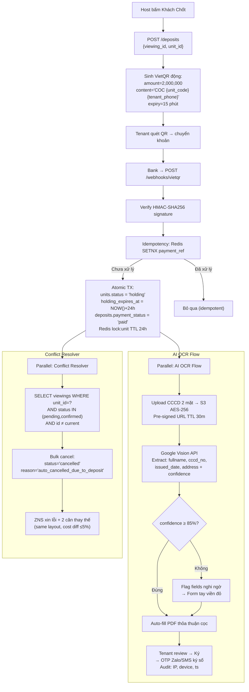

### 6.4 State Machine — Vòng Đời Lịch Hẹn

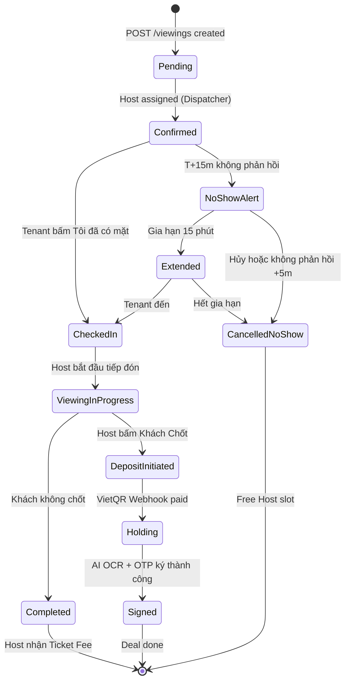

---

## 7. Thiết Kế Database (ERD)

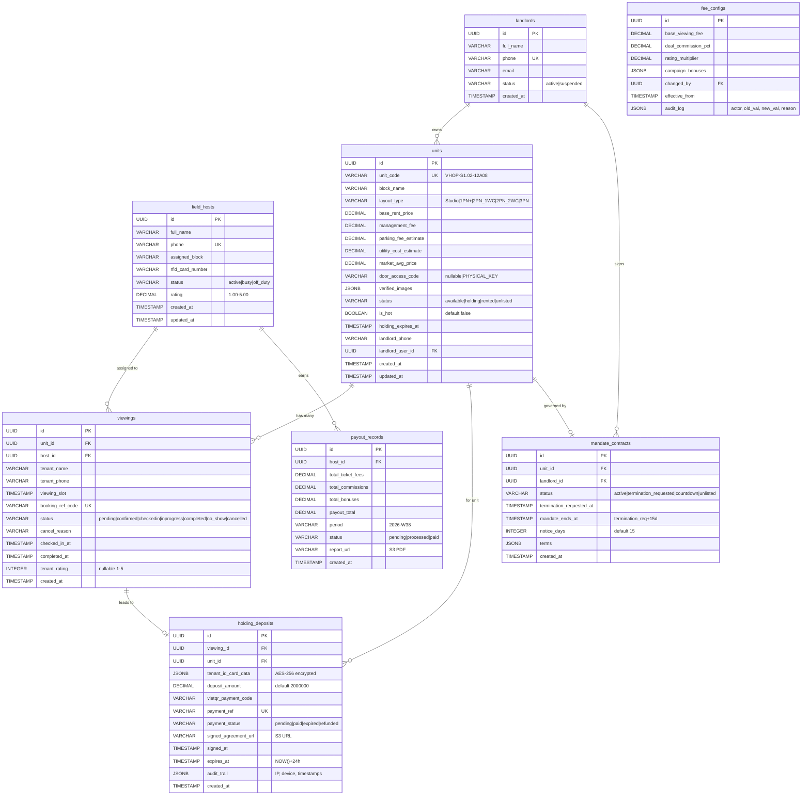

**Indexes quan trọng:**

```sql
-- Matchmaker filter performance
CREATE INDEX idx_units_status_rent ON units(status, base_rent_price);
CREATE INDEX idx_units_block       ON units(block_name);

-- Viewing dispatch
CREATE INDEX idx_viewings_slot_status ON viewings(viewing_slot, status);
CREATE INDEX idx_viewings_unit_id     ON viewings(unit_id);

-- Hot flag computation
CREATE INDEX idx_viewings_unit_slot ON viewings(unit_id, viewing_slot)
    WHERE status IN ('pending','confirmed');

-- Deposit idempotency
CREATE UNIQUE INDEX idx_deposits_payment_ref ON holding_deposits(payment_ref);
```

---

## 8. API Contract

### 8.1 AI Matchmaker

```http
POST /api/v1/ai/matchmaker
Authorization: Bearer {jwt}

Request:
{
  "budget_max": 8500000,
  "num_occupants": 2,
  "layout_pref": "2PN_1WC",
  "parking_needs": { "motorbike": 1, "car": 0 }
}

Response 200:
{
  "query_time_ms": 1240,
  "results": [
    {
      "unit_id": "uuid",
      "unit_code": "VHOP-S1.02-12A08",
      "layout_type": "2PN_1WC",
      "base_rent_price": 6800000,
      "all_in_cost": 8320000,
      "breakdown": {
        "rent": 6800000,
        "management_fee": 570000,
        "parking": 150000,
        "utilities": 600000
      },
      "badge": "BARGAIN",
      "savings_pct": 12.5,
      "is_hot": true,
      "available_slots": ["2026-09-24T08:30", "2026-09-24T14:00"],
      "thumbnail_url": "https://s3.../thumb.jpg"
    }
  ]
}
```

### 8.2 Đặt Lịch Xem Phòng

```http
POST /api/v1/viewings
Authorization: Bearer {jwt}

Request:
{
  "unit_id": "uuid",
  "viewing_slot": "2026-09-24T14:00:00+07:00",
  "tenant_name": "Nguyễn Văn A",
  "tenant_phone": "0912345678",
  "otp_code": "4829"
}

Response 201:
{
  "viewing_id": "uuid",
  "booking_ref_code": "VS-2026-09-24-8X4K",
  "host": {
    "name": "Trần Thị B",
    "phone_masked": "091****678",
    "block": "S1.02"
  },
  "maps_link": "https://maps.google.com/?q=...",
  "reminder_scheduled_at": "2026-09-24T13:50:00+07:00"
}
```

### 8.3 Sinh VietQR & Webhook

```http
POST /api/v1/deposits
Authorization: Bearer {jwt} (host role)

Request:
{
  "viewing_id": "uuid",
  "unit_id": "uuid"
}

Response 201:
{
  "deposit_id": "uuid",
  "amount": 2000000,
  "payment_content": "COC VHOP-S1.02-12A08 0912345678",
  "qr_data": "00020101021238...",
  "expires_in_seconds": 900
}

---

POST /webhooks/vietqr  (from Bank → VinStay)
X-Signature: HMAC-SHA256(secret, body)

Payload:
{
  "payment_ref": "COC-VHOP-S1.02-12A08-0912345678-1727012345",
  "amount": 2000000,
  "status": "SUCCESS",
  "transaction_id": "MB20260924001234",
  "timestamp": "2026-09-24T14:22:10+07:00"
}
```

### 8.4 AI OCR CCCD

```http
POST /api/v1/ai/ocr/cccd
Authorization: Bearer {jwt}
Content-Type: multipart/form-data

Fields:
  deposit_id: "uuid"
  front_image: <binary>
  back_image: <binary>

Response 200:
{
  "processing_time_ms": 3820,
  "confidence": 0.94,
  "extracted": {
    "fullname": "NGUYEN VAN AN",
    "cccd_no": "001234567890",
    "issued_date": "2022-08-15",
    "address": "So 12 Pho Le Loi, Q. Hoan Kiem, Ha Noi"
  },
  "flagged_fields": [],
  "requires_manual_review": false
}
```

---

## 9. Kiến Trúc Bảo Mật

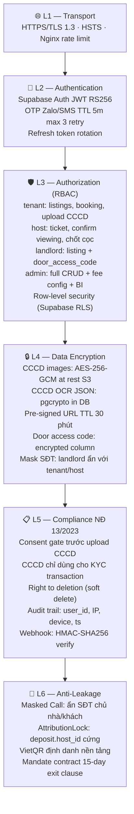

**Tuân thủ Nghị định 13/2023/NĐ-CP:**

| Yêu cầu pháp lý | Cơ chế kỹ thuật |
|---|---|
| Chỉ thu thập dữ liệu cần thiết | CCCD chỉ lấy 4 trường KYC (tên, số, ngày, địa chỉ) |
| Consent của chủ thể dữ liệu | Checkbox + timestamp consent trước upload |
| Bảo vệ dữ liệu cá nhân | AES-256 S3 + pgcrypto DB + pre-signed URL |
| Quyền xóa dữ liệu | Soft delete + purge CCCD sau 90 ngày deal expired |
| Audit trail pháp lý | JSON audit_trail nhúng trong holding_deposits |
| Ký số hợp lệ | OTP ký kèm IP, device, timestamp → PDF Audit Trail |

---

## 10. Hạ Tầng & CI/CD

### 10.1 Infrastructure Diagram

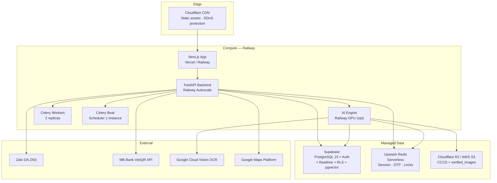

### 10.2 Môi Trường

| Môi trường | URL | Mục đích |
|---|---|---|
| **Local Dev** | `localhost:3000 / :8000` | Phát triển cá nhân |
| **Staging** | `staging.vinstay.ai` | QA, demo nội bộ |
| **Production** | `vinstay.ai` | Pilot Ocean Park |

### 10.3 CI/CD Pipeline

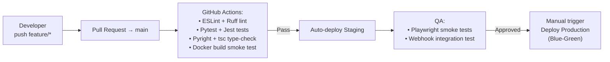

---

## 11. SLA & NFR

| Yêu cầu | Mục tiêu | Cơ chế |
|---|---|---|
| AI Matchmaker latency | ≤ 3s (p95) | Index `status, all_in_cost`; pgvector HNSW |
| AI OCR CCCD | ≤ 5s (p95) | Google Vision API; image pre-processing |
| VietQR Webhook | ≤ 10s | Celery async; Redis atomic SETNX |
| Host Dispatch SLA | ≤ 3 phút nhận ticket | Push + 3-tier escalation fallback |
| API uptime | ≥ 99.5% | Railway autoscale; Supabase managed HA |
| Mobile Responsive | iOS Safari + Android Chrome | PWA; Playwright cross-browser CI |
| CCCD Encryption | AES-256-GCM | S3 SSE-C + pgcrypto |
| OTP TTL | 5 phút; max 3 retry; lockout 10m | Redis EXPIRE + counter |
| Audit trail retention | 12 tháng | PostgreSQL partition by month |
| Holding lock timeout | 24h auto-release | Redis TTL + Supabase pg_cron |

---

## 12. Architecture Decision Records (ADR)

### ADR-001 — Supabase làm Primary Database Platform

**Quyết định:** Dùng Supabase (PostgreSQL 15) thay vì bare PostgreSQL  
**Lý do:**
- Auth (JWT + RLS) built-in → giảm effort bảo mật  
- Supabase Realtime → push trạng thái `holding` tức thì  
- pgvector extension → AI Matchmaker không cần Vector DB riêng  
- Managed HA + backup tự động  

**Đánh đổi:** Nhẹ vendor lock-in; query complexity có giới hạn

---

### ADR-002 — Celery + Redis cho T-10m Notification Scheduling

**Quyết định:** Celery Beat schedule dynamic reminder, không dùng fixed cron  
**Lý do:**
- Viewing slots hoàn toàn động → cần `apply_async(countdown=seconds_until_t10)`  
- Redis đã có sẵn cho OTP và holding lock  
- Retry policy: `max_retries=3, countdown=60`  

**Đánh đổi:** Cần maintain Celery worker infra; crash recovery cần xử lý

---

### ADR-003 — VietQR Idempotency qua Redis SETNX

**Quyết định:** `Redis SETNX payment_ref 1 EX 86400` trước khi xử lý webhook  
**Lý do:**
- Bank webhook có thể gửi duplicate (network retry)  
- Ngăn double `holding` và double payout tuyệt đối  
- Fallback: `UNIQUE constraint` trên `holding_deposits.payment_ref`  

**Đánh đổi:** Nếu Redis restart trước TTL → fallback DB constraint bắt lỗi 409

---

### ADR-004 — S3 Pre-signed URL (TTL 30m) cho CCCD Upload

**Quyết định:** Client upload CCCD thẳng lên S3, không qua backend  
**Lý do:**
- Giảm bandwidth API server (ảnh 2-5MB)  
- File không bao giờ unencrypted trên server disk  
- Pre-signed TTL 30m → exposure window ngắn  

**Đánh đổi:** Client cần handle multipart upload; CORS config S3 bucket cẩn thận

---

### ADR-005 — PWA thay vì Native App cho Field Host

**Quyết định:** Host dùng Next.js PWA thay vì React Native riêng  
**Lý do:**
- MVP: không đủ thời gian App Store review (iOS 7-14 ngày)  
- PWA Add-to-Home-Screen đủ trải nghiệm native  
- Web Push + Zalo ZNS thay thế native push  
- Single codebase, deploy tức thì không qua review  

**Đánh đổi:** iOS Safari camera API có hạn chế nhỏ → fallback `<input type=file>`

---

*SAD này sẽ được cập nhật song song với các sprint phát triển. Mọi thay đổi kiến trúc lớn cần tạo ADR mới và cập nhật sơ đồ tương ứng.*
