# VINSTAY AI — SOFTWARE ARCHITECTURE DOCUMENT (SAD) v2.0 — BẢN GỘP

**Chương trình:** AI20K Build Phase — Cohort 4 · **Team:** T-010 (P-010)
**Phạm vi pilot:** Vinhomes Ocean Park — Sapphire 1 & 2
**Ngày:** 2026-09-24
**Trạng thái:** **Draft v2.0 — chưa phê duyệt.** Gộp SAD.md v1.0 (kiến trúc + quyết định đã chốt) với SAD Enterprise (độ sâu kỹ thuật). Sẵn sàng cho Gate 2 review sau khi đóng các mục ở §19.

### Ký hiệu trạng thái (dùng xuyên suốt tài liệu)

| Ký hiệu | Nghĩa |
|---|---|
| ✅ **CHỐT** | Đã có trong Charter / Gap Analysis / SAD v1.0 |
| 🟡 **TBD** | Chưa quyết định (vendor, chính sách, tham số) |
| 🔵 **ĐỀ XUẤT** | Bổ sung kỹ thuật/tính năng lấy từ bản Enterprise, **ngoài phạm vi Charter** — cần duyệt phạm vi trước khi build |
| ⚖️ **PHÁP LÝ** | Có nội dung pháp lý — **chưa được luật sư/pháp chế xác nhận** |

---

## 0. THAY ĐỔI SO VỚI HAI BẢN NGUỒN

### 0.1 Sửa so với bản Enterprise

| # | Nội dung bản Enterprise | Xử lý trong v2 |
|---|---|---|
| 1 | AI Vision OCR tự xây, "Zero-Storage RAM" | **Thay bằng đối tác eKYC thứ 3 liên kết C06 (vendor TBD)** — §7. Bỏ toàn bộ cam kết "miễn nhiễm trách nhiệm dữ liệu" vì ảnh CCCD nay đi qua vendor |
| 2 | Giữ chỗ 24h (mandate, cọc, worker, Redis TTL) | **7 ngày** xuyên suốt |
| 3 | Mã cửa JIT tự sinh/tự biến mất mỗi lượt | **Mã khóa cố định theo căn**, mã hóa trong Vault, chỉ hiển thị cho Host khi có ticket active, hỗ trợ xoay mã — §8 |
| 4 | RBAC 4 gạch đầu dòng (RLS) | **7 vai trò × ma trận tài nguyên + Authorization Service tập trung**, RLS làm lớp phòng thủ thứ hai — §9 |
| 5 | Dispatcher 3p → 2p → Area Lead; gọi là "AI" | **Rule engine**, SLA đã chốt **5p → 3p (≤500m) → broadcast** (ADR-01) — §6.2 |
| 6 | Webhook VietQR ≤ 3s | **≤ 5s** (mâu thuẫn 5s/10s đã được giải quyết ở Charter) |
| 7 | Trích dẫn điều/khoản luật cụ thể, trích nguyên văn luật, khẳng định "đầy đủ giá trị chứng cứ trước Tòa" | **Gỡ số điều/khoản và đoạn trích nguyên văn**, đánh dấu ⚖️; danh mục cần kiểm ở Phụ lục B |
| 8 | Ngân hàng (MB/Vietinbank), Cloudflare R2, Upstash, FPT/eSMS trình bày như đã chốt | Đánh dấu **🟡 TBD / 🔵 đề xuất** |
| 9 | Trình bày mọi thứ như đã chốt 100% | Thêm bảng chốt tính năng có nhãn trạng thái (§4) và danh sách quyết định còn mở (§19) |
| 10 | Số liệu "thị trường truyền thống" (60–70% tin ảo, 25–35% no-show…) và cột "Dữ liệu kiểm chứng" | Gỡ số liệu không rõ nguồn; giữ KPI Charter (§17.2) |
| 11 | Ví dụ API: giá 6,5tr vs thị trường 8,5tr nhưng badge "tiết kiệm 10%" | **Sửa: tiết kiệm ≈ 24%** — (8,5 − 6,5)/8,5 = 23,5% |
| 12 | Tự động bóc tách chỉ số công tơ EVN, tích hợp EVN | **Ngoài MVP** — Host nhập chỉ số + chụp ảnh (§3, §4) |

### 0.2 Điểm phát hiện thêm khi gộp

1. **Căn cứ pháp lý về dữ liệu cá nhân đã đổi.** Cả hai bản dẫn NĐ 13/2023/NĐ-CP. Theo kết quả tra cứu ngày 24/09/2026 (nguồn thứ cấp: LuatVietnam), **Luật Bảo vệ dữ liệu cá nhân 2025 (91/2025/QH15) và NĐ 356/2025/NĐ-CP có hiệu lực từ 01/01/2026, NĐ 356 thay thế NĐ 13**. v2 dẫn theo khung mới; ⚖️ pháp chế cần xác nhận lại.
2. **Khóa căn 7 ngày bằng Redis `SETNX` là thiết kế rủi ro** (mất khóa khi Redis restart, lệch với DB). v2: **PostgreSQL là nguồn sự thật**, Redis chỉ giữ mutex ngắn hạn — §6.3.
3. **Mâu thuẫn về số điện thoại:** SAD v1 gửi tên/SĐT Host cho khách qua Zalo; Enterprise che SĐT hai chiều. v2 giữ quyết định đã chốt (Host lộ SĐT cho khách), che SĐT khách/chủ nhà với Host, proxy call là 🔵 giai đoạn sau — §15.
4. **Lỗ hổng cả hai bản chưa phủ:** xác minh **chủ nhà và quyền cho thuê căn hộ** (sổ hồng/ủy quyền). Ghi vào §19.
5. **`phone` vừa mã hóa AES vừa `@unique`** không tra cứu được — v2 dùng blind index (`phone_hash`).
6. **Cột `rfc3161_timestamp` trong `audit_logs` (Enterprise) thực chất là `now()`** — dấu thời gian RFC 3161 chỉ áp dụng cho tài liệu ký, không cho từng dòng log.

---

## 1. MỤC ĐÍCH, PHẠM VI & NGUYÊN TẮC KIẾN TRÚC

### 1.1 Mục đích

Mô tả kiến trúc phần mềm mục tiêu cho MVP VinStay AI: thành phần, dữ liệu, luồng nghiệp vụ, bảo mật/phân quyền, quyết định đã chốt và còn mở. Kế thừa Project Charter (mục tiêu, phạm vi, KPI) và Master UI Flow Spec (hành trình người dùng).

**Đối tượng đọc:** Backend/Frontend/AI Engineer, DevOps, Pháp chế/Compliance, Hội đồng AI20K.

### 1.2 Bài toán

VinStay AI số hóa vòng đời thuê căn hộ tại đại đô thị theo mô hình **tinh gọn tài sản (Asset-Light)**: minh bạch chi phí (All-in Cost), xem phòng không ma sát nhờ Field Host nội khu, cọc và ký điện tử, bàn giao có chứng cứ số. Giải quyết: tin ảo/lệch hiện trạng, chi phí ẩn, no-show và chủ nhà phải đi lại, rủi ro cọc/hợp đồng/dữ liệu CCCD, tranh chấp cọc khi trả nhà.

### 1.3 Bảy nguyên tắc thiết kế

| # | Nguyên tắc | Hàm ý kiến trúc |
|---|---|---|
| P1 | **Reliability & Speed** | SLA tại §17; webhook idempotent; khóa căn giao dịch |
| P2 | **Privacy & Legal by design** | Không tự xử lý CCCD; mã hóa AES-256; DPA với vendor; consent rõ ràng |
| P3 | **Operational Lean (0đ CapEx)** | Không IoT, không Lockbox; dùng thẻ cư dân RFID của Host, khóa điện tử/chìa cơ sẵn có |
| P4 | **Anti-disintermediation** | Attribution Lock (`host_id` trong VietQR), Hợp đồng Độc quyền, che SĐT |
| P5 | **Graceful degradation** | Mọi bước tự động có đường lui thủ công (§16) |
| P6 | **Immutability & Audit** | Audit log append-only cho mọi truy cập nhạy cảm và thay đổi cấu hình |
| P7 | **Rule-first, AI khi xứng đáng** | Dispatcher/Conflict Resolver là rule engine (ADR-01). Chỉ Matchmaker có lớp ranking; không quảng bá "AI" cho thứ không phải AI |

---

## 2. BỐI CẢNH HỆ THỐNG (C1)

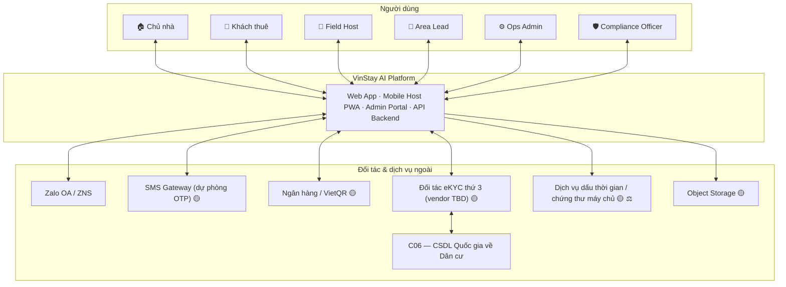

**Nguyên tắc biên hệ thống (✅):** VinStay **không kết nối trực tiếp C06**. Mọi xác thực danh tính đi qua đối tác eKYC được cấp phép; vendor chịu trách nhiệm kết nối C06 và trả kết quả đã đối chiếu.

---

## 3. PHÂN HỆ THEO BÊN LIÊN QUAN

| Bên | Kênh | Năng lực chính |
|---|---|---|
| **Khách thuê** | Web PWA (Next.js) + Zalo | Tìm căn theo All-in Cost; đặt lịch xem (OTP SĐT, không QR); nút Zalo "Tôi đã có mặt tại sảnh"; cọc VietQR; xác thực eKYC; ký thỏa thuận/hợp đồng; nhận bàn giao 10 hạng mục |
| **Chủ nhà** | Web Portal + Zalo OTP | Ký gửi Độc quyền (thẩm định 0đ); **cấu hình mã khóa (ghi, không xem plaintext)**; theo dõi từ xa; duyệt/ký hợp đồng; yêu cầu xoay mã; thoát ủy quyền 15 ngày khi căn `available` |
| **Field Host** | Mobile PWA | Nhận ticket theo tầng SLA; đón sảnh; xem mã khóa **chỉ khi ticket active**; sinh VietQR cọc có Attribution Lock; lập Hộ chiếu Bàn giao; thu nhập biến phí vào ví |
| **Area Lead** | Mobile/Web | Nhận ticket Tầng 3 (broadcast/leo thang), chỉ định nhân sự, hỗ trợ khẩn cấp (chìa dự phòng) |
| **Ops Admin** | Admin Portal | BI/funnel, cấu hình biến phí, giám sát SLA, xử lý ngoại lệ, xoay mã khi cần |
| **Compliance Officer** | Admin Portal (quyền hẹp) | Rà soát thủ công ca eKYC `needs_review`; đối soát pháp lý; mọi truy cập đều có audit |
| **Đối tác** | API | Bank/VietQR, Zalo, eKYC↔C06, dấu thời gian; BQL Vinhomes (ràng buộc vận hành: không QR/tờ rơi ở sảnh, không Lockbox); mạng lưới thợ ngoài (chỉ giới thiệu, 🔵) |

### 3.1 All-in Cost (✅ rule tất định)

```
All-in Cost = base_rent + management_fee + parking_fee_estimate + utility_cost_estimate
```

| Thành phần | Công thức mặc định (tham số cấu hình, ⚠ giá trị lấy từ bản Enterprise — cần xác thực với BQL/nguồn) |
|---|---|
| Phí quản lý | Diện tích thông thủy × 9.500 đ/m² |
| Phí gửi xe | 150.000 đ/xe máy; 1.250.000 đ/ô tô |
| Điện nước ước tính | 300.000 đ/người/tháng |

### 3.2 Biến phí Host (Dynamic Commission) — cấu hình qua Admin, không sửa mã

Tham số (khoảng giá trị đề xuất, 🔵 cần chốt với Ops): `base_viewing_fee` (30–100k), `deal_commission` (200k–1.000k), `rating_multiplier_5star` (1,1–1,5x), `peak_hour_multiplier` (1,1–1,5x), `slow_inventory_bonus` (100–500k), `handover_inspection_fee` (50–100k), `no_show_wait_allowance_pct` (50%), `penalty_late_cancel` (50k). Thay đổi ghi audit (old/new/actor/lý do). 🔵 Maker–Checker cho điều chỉnh > 50 triệu và Financial Simulator: giai đoạn sau pilot.

### 3.3 Hộ chiếu Bàn giao số (✅ 10 hạng mục)

Tường/sơn · sàn · cửa & khóa · điều hòa · tủ lạnh · bếp & thiết bị · thiết bị vệ sinh · sofa & bàn trà · giường/nệm/tủ · chiếu sáng, công tắc, ổ cắm. Mỗi ảnh gắn timestamp ISO 8601, tọa độ GPS trong bán kính ≤ 50m của tòa (tham số), hash SHA-256 ghi vào DB. **Chỉ số công tơ điện/nước: Host nhập tay + ảnh chứng cứ** (không OCR, không tích hợp EVN trong MVP).

**Nguyên tắc phân định hao mòn (⚖️ chính sách cần pháp chế duyệt):** hao mòn tự nhiên không được cấn trừ cọc; hư hại do sử dụng sai và nợ điện nước được cấn trừ theo bảng giá/hóa đơn minh bạch.

---

## 4. BẢNG CHỐT TÍNH NĂNG (FEATURE LOCK-IN)

| # | Tính năng | Quyết định | Trạng thái | Ghi chú |
|---|---|---|---|---|
| 1 | All-in Cost Engine | Rule tất định | ✅ | §3.1 |
| 2 | Matchmaker Top 3 | Lọc cứng + ranking nhẹ; ≤3s tính toán / ≤30s trải nghiệm | ✅ | §6.1 |
| 3 | Xác nhận lịch xem | **Bỏ QR** — Zalo 2 chiều + OTP SĐT | ✅ | Gap Analysis |
| 4 | Dispatcher Field Host | **Rule engine 3 tầng: 5p → 3p (≤500m) → broadcast** | ✅ | Bán kính Tầng 1 (≤200m) và giới hạn 1 ca/45 phút là 🔵 |
| 5 | Mở cửa khi xem phòng | **Mã khóa điện tử cố định / chìa cơ tập trung**, không Lockbox, không IoT | ✅ | §8 |
| 6 | Giữ chỗ (holding) | **7 ngày** kể từ lúc nhận cọc | ✅ | ADR-05 |
| 7 | Xác thực CCCD | **Đối tác eKYC thứ 3 liên kết C06** | ✅ (vendor 🟡) | §7 |
| 8 | Ký thỏa thuận cọc điện tử | Ký OTP, PDF có audit | ✅ ⚖️ | §10 |
| 9 | Hộ chiếu bàn giao số 10 hạng mục | Giữ nguyên | ✅ | §3.3 |
| 10 | Ký gửi Độc quyền + thoát 15 ngày | Chỉ hủy khi căn `available` | ✅ ⚖️ | §10.4 |
| 11 | Khách "chưa ưng" | Host giới thiệu trực tiếp tại chỗ (app tính sẵn căn tương đương) | ✅ | Khác với hủy lịch do căn bị cọc (dòng 20) |
| 12 | Quản lý mã khóa cửa | Vòng đời, Vault, cấp phát có điều kiện, audit | ✅ (mới) | §8 |
| 13 | Phân quyền RBAC | 7 vai trò, ma trận, AuthZ tập trung | ✅ (mới) | §9 |
| 14 | Hardware CapEx | 0 VNĐ | ✅ | |
| 15 | Ký quỹ ba bên (Tripartite Escrow) tại tài khoản định danh của nền tảng | Mô hình dòng tiền cọc | 🔵 🟡 ⚖️ | Charter chỉ nói VietQR/ngân hàng; chính sách hoàn cọc chưa chốt. Cần xác nhận mô hình pháp lý dòng tiền (§19 #8) |
| 16 | Gói chứng cứ pháp lý (Evidence Package), lưu 10 năm | Manifest + hash + dấu thời gian | 🔵 ⚖️ | Thời hạn lưu cần pháp chế xác nhận |
| 17 | Redis + BullMQ (khóa, OTP, worker đếm ngược) | Hạ tầng | 🔵 | Có thể thay bằng cron/pg-boss cho MVP |
| 18 | Proxy Masked Call (tổng đài ảo) | Che SĐT hai chiều khi gọi | 🔵 | Cần vendor viễn thông; sau pilot |
| 19 | Mã hóa cấp trường SĐT (AES-256-GCM) | | ✅ (bảo mật) | Dùng blind index |
| 20 | Auto-cancel lịch trùng + Zalo gợi ý 2 căn khi căn được cọc | Conflict Resolver | ✅ | Chỉ cho lịch bị hủy do cọc |
| 21 | Phát hiện Căn HOT (≥3 lịch/24h) | Cờ + badge | 🔵 | Ngưỡng là tham số |
| 22 | Occupancy Heatmap, Financial Simulator, Maker–Checker | BI nâng cao | 🔵 | Pilot chỉ cần funnel + SLA |
| 23 | PWA offline-tolerant cho Host | | 🔵 | **Tuyệt đối không cache mã khóa** (§8) |
| 24 | Bóc tách công tơ tự động / tích hợp EVN | | ❌ Ngoài MVP | Host nhập tay |
| 25 | Danh bạ thợ giới thiệu (Handyman Referral) | | 🔵 | Không phải trách nhiệm nền tảng |

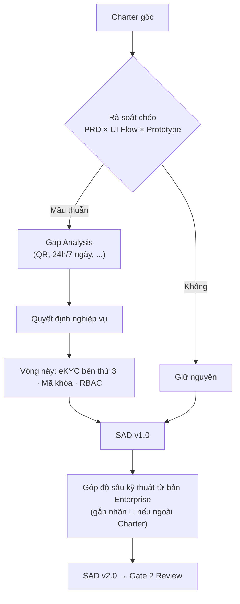

---

## 5. KIẾN TRÚC THÀNH PHẦN (C2 / C3)

**Kiểu triển khai (🔵 đề xuất):** Modular Monolith — các "Service" trong sơ đồ dưới là **module** trong một ứng dụng, không phải microservice. Stack đề xuất: NestJS + Prisma + PostgreSQL (Supabase); Redis/BullMQ 🔵; Object Storage 🟡; Vault/KMS 🟡.

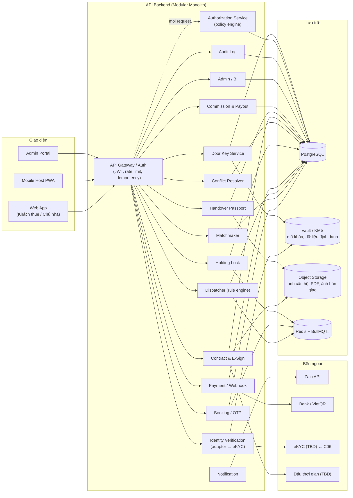

**Ghi chú:**
- Mã khóa cửa và dữ liệu định danh **không nằm dạng plaintext trong Primary DB**; DB chỉ giữ tham chiếu (`vault_secret_ref`), ciphertext ở Vault với khóa quản lý tách biệt.
- `IdentitySvc` là adapter/orchestrator; **không** OCR/Vision trong nội bộ.
- `AuthZ` được Gateway gọi **trước mọi request** tới module nghiệp vụ (§9).

### 5.1 Cấu trúc mã nguồn (🔵 đề xuất)

```
vinstay-backend/src/
├── app.module.ts / main.ts
├── common/
│   ├── guards/            supabase-auth.guard.ts, authz.guard.ts (gọi AuthZ Service)
│   ├── decorators/        @CurrentUser(), @RequirePermission('resource:action'), @Public()
│   ├── interceptors/      idempotency, audit-logging, transform
│   └── filters/
└── modules/
    ├── iam/               Profiles, Roles, Permissions, Supabase Auth hooks
    ├── authz/             Policy engine: role + ownership + ticket state
    ├── property/          Building, Unit, trạng thái available/holding/rented/unlisted
    ├── search/            All-in Cost
    ├── matching/          [Engine 1] Matchmaker
    ├── booking/           Viewing, OTP, xác nhận qua Zalo
    ├── dispatch/          [Engine 2] Dispatcher 3 tầng + worker SLA
    ├── door-key/          Vòng đời mã khóa, reveal, rotate, revoke      (mới)
    ├── payment/           VietQR, webhook, idempotency
    ├── holding/           Khóa căn 7 ngày, hết hạn, UNC tạm 30p
    ├── conflict/          [Engine 3] Hủy lịch trùng, gợi ý căn thay thế
    ├── identity/          [Engine 4] Adapter eKYC, review queue          (thay ocr/)
    ├── contract/          Mandate, thỏa thuận cọc, hợp đồng thuê, ký, niêm phong
    ├── handover/          Hộ chiếu bàn giao, công tơ
    ├── commission/        FeeConfig, host payout
    ├── notification/      Zalo ZNS/OA, SMS dự phòng
    └── admin-bi/          Funnel, SLA, (🔵 heatmap)
```

---

## 6. BỐN ENGINE LÕI

> Chỉ Engine 1 có lớp ranking; các engine còn lại là rule/transactional hoặc vendor. Không gọi tất cả là "AI" trong tài liệu trình Hội đồng.

### 6.1 Engine 1 — Matchmaker & All-in Cost (✅)

1. **Lọc cứng:** loại mọi căn có `All-in Cost > budget_max`; lọc thêm layout, trạng thái `available`, số nhân khẩu/phương tiện.
2. **Ranking & badge:** `Saving Ratio = (market_avg − base_rent) / market_avg`; nếu ≥ 10% gắn `Căn hời phân khu – Tiết kiệm X%`. `Score = w1·Saving + w2·Amenity + w3·Freshness` (🟡 trọng số w1–w3 chưa chốt).
3. Trả **Top 3** kèm bảng bóc tách 4 khoản phí. Mục tiêu ≤ 3s tính toán, ≤ 30s trải nghiệm.

Không dùng vector search/pgvector trừ khi có yêu cầu tìm kiếm ngữ nghĩa được duyệt.

### 6.2 Engine 2 — Dispatcher Field Host (✅ rule engine, ADR-01)

| Tầng | Điều kiện | SLA nhận | Khi hết SLA |
|---|---|---|---|
| **1** | Host online gần nhất (cụm tòa; 🔵 ≤200m), xếp theo SPS | **5 phút** | → Tầng 2 |
| **2** | Host trong phân khu ≤ **500m** | **3 phút** | → Tầng 3 |
| **3** | **Broadcast** toàn bộ Host + cảnh báo **Area Lead** chỉ định/tiếp quản | — | Area Lead xử lý |

- 🔵 Chống ôm lead: mỗi Host tối đa 1 lịch trong khung 45 phút.
- Worker đếm ngược SLA theo từng ticket; ghi `dispatch_tickets(tier, sla_seconds, status)`.
- Hệ thống đẩy ticket cho Host trong ≤ 30 giây sau khi lịch được xác nhận (🔵 chỉ tiêu).
- Sau khi Host nhận: Zalo xác nhận lịch cho khách kèm **tên/SĐT Host**.

### 6.3 Engine 3 — Conflict Resolver & Khóa căn (✅)

**Nguyên tắc: PostgreSQL là nguồn sự thật cho trạng thái căn.**

```sql
BEGIN;
SELECT status FROM units WHERE id = $unit FOR UPDATE;      -- khóa hàng
-- nếu status <> 'AVAILABLE' → ROLLBACK, đánh dấu cọc cần hoàn/xử lý thủ công
INSERT INTO escrow_transactions(... bank_ref_number UNIQUE ...);  -- idempotency
UPDATE units SET status='HOLDING' WHERE id = $unit;
UPDATE holding_deposits SET payment_status='PAID_HOLDING', paid_at=now(),
       expires_at = now() + interval '7 days' WHERE id = $deposit;
COMMIT;
```

- Redis (nếu dùng) chỉ là **mutex ngắn hạn (≈30s)** để giảm tranh chấp khi xử lý webhook — **không** lưu khóa 7 ngày.
- Sau khi commit: quét lịch xem tương lai của căn → `CANCELLED` (`cancel_reason = AUTO_CANCELLED_DUE_TO_DEPOSIT`) → Zalo xin lỗi + gợi ý 2 căn tương đương (cùng layout, ngân sách, phân khu); khách đổi lịch 1 chạm.
- 🔵 Căn HOT: ≥ 3 lịch trong 24h tới → `is_hot`.
- Hết 7 ngày không ký → worker chuyển `available` và mở quy trình hoàn cọc (**🟡 chính sách hoàn/tịch thu chưa chốt**).

### 6.4 Engine 4 — Identity Verification (vendor, không phải AI nội bộ)

Xem §7.

---

## 7. XÁC THỰC DANH TÍNH QUA ĐỐI TÁC eKYC (LIÊN KẾT C06)

### 7.1 Thay đổi so với thiết kế cũ (✅)

Trước: tự chạy OCR, tự chịu độ chính xác/tuân thủ. **Nay:** ủy thác cho đối tác eKYC được cấp phép kết nối C06 — bóc tách, đối chiếu CSDL quốc gia, kiểm tra hiệu lực. VinStay chỉ gửi yêu cầu, nhận kết quả, lưu kết quả đã mã hóa.

### 7.2 Chọn vendor — 🟡 TBD (rủi ro hàng đầu, đóng trước Core Build)

| Tiêu chí | Yêu cầu tối thiểu |
|---|---|
| Pháp lý ⚖️ | Được cấp phép kết nối/đối chiếu C06; có giấy tờ chứng minh |
| Bảo mật | DPA; ISO 27001 hoặc tương đương |
| SLA | Phản hồi ≤ 5–10s |
| Dữ liệu | Máy chủ tại Việt Nam; chính sách xóa ảnh gốc rõ ràng |
| Tích hợp | REST/SDK, webhook callback kết quả |
| Chi phí | Theo lượt xác thực, không phí hạ tầng cố định |

### 7.3 Luồng

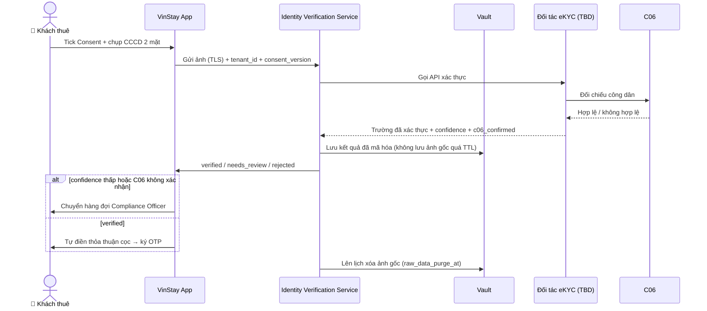

### 7.4 Hợp đồng adapter (để đổi vendor không sửa nghiệp vụ)

```typescript
interface IdentityProvider {
  startVerification(input: {
    subjectId: string; consentVersion: string; images?: Buffer[]; sessionMode: 'RELAY' | 'CLIENT_SDK';
  }): Promise<{ providerRef: string; clientToken?: string }>;
  getResult(providerRef: string): Promise<{
    status: 'VERIFIED' | 'NEEDS_REVIEW' | 'REJECTED';
    confidence: number; c06Confirmed: boolean;
    fields?: { fullName: string; idNumber: string; issueDate: string; permanentAddress: string };
  }>;
}
```

Nếu vendor hỗ trợ SDK phía client (`CLIENT_SDK`), **ảnh không đi qua server VinStay** — ưu tiên phương án này vì giảm phạm vi dữ liệu nhạy cảm. Nếu chỉ hỗ trợ relay: không ghi đĩa, không log payload, xóa ngay sau khi gọi. Nếu vendor chưa sẵn sàng: mock cùng contract.

### 7.5 Nguyên tắc dữ liệu

- Ảnh gốc chỉ tồn tại tạm trong pipeline; `raw_data_purge_at` bắt buộc.
- Kết quả xác thực lưu **mã hóa AES-256** (Vault), không plaintext.
- Chỉ **Compliance Officer** truy cập dữ liệu xác thực đầy đủ; mỗi lần đọc ghi audit.
- Consent: hộp kiểm tách biệt trước khi mở camera/tải ảnh; lưu `consent_at`, `consent_version`. ⚖️ Nội dung consent, thời hạn lưu, đánh giá tác động, nghĩa vụ với bên xử lý (vendor) theo **Luật BVDLCN 2025 + NĐ 356/2025** — pháp chế xác nhận.
- 🟡 Xác minh **chủ nhà** dùng chung `IdentitySvc` (role-agnostic) — chưa quyết (§19).

---

## 8. QUẢN LÝ MÃ KHÓA CỬA (DOOR KEY MANAGEMENT) ✅

### 8.1 Bối cảnh

Charter cấm Lockbox và IoT phức tạp. Dùng khóa điện tử sẵn có (mã số) hoặc chìa cơ tập trung tại quầy phân khu. **Mỗi căn có một mã PIN cố định**, không sinh ngẫu nhiên theo lượt khách, không tự hủy — ưu tiên đơn giản vận hành (ADR-03).

### 8.2 Vòng đời

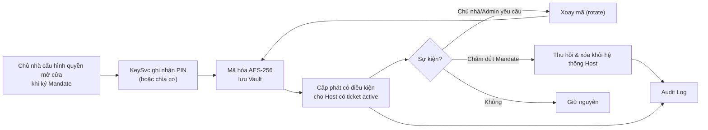

### 8.3 Nguyên tắc

| Nguyên tắc | Chi tiết |
|---|---|
| Lưu trữ | AES-256 trong Vault, tách khỏi Primary DB; DB chỉ giữ `vault_secret_ref` |
| Cấp phát có điều kiện | Host chỉ thấy mã khi có `dispatch_ticket` ở `ACCEPTED`/`CHECKED` **cho đúng căn đó**; hết ticket → mã bị ẩn. 🔵 Có thể thêm cửa sổ thời gian quanh giờ hẹn |
| Chủ nhà | Cấu hình/thu hồi/yêu cầu xoay qua Portal nhưng **không xem lại plaintext** |
| Xoay mã | Theo yêu cầu (nghi lộ, đổi Host phụ trách, chấm dứt Mandate); kiến trúc hỗ trợ sẵn, MVP không bắt buộc theo lịch (🟡 §19) |
| Thu hồi | Khi `mandate_termination_countdown` về 0: vô hiệu hóa, xóa khỏi mọi cache/app Host |
| Hiển thị | ≤ 2 giây sau khi ticket `accepted`; **không cache offline, không lưu localStorage/service worker**, tự ẩn khi rời màn hình/hết ticket |
| Audit | Mọi lần hiển thị ghi: ai, lúc nào, ticket nào, căn nào |
| Thông báo | 🔵 Zalo cho chủ nhà mỗi lượt mở cửa xem phòng (có thể tắt) |
| Chìa cơ | `KeySvc` quản lý trạng thái `AT_DESK` / `WITH_HOST` (đã bàn giao/đã trả), vẫn ghi log; chìa niêm phong tại quầy phân khu |

### 8.4 Luồng reveal

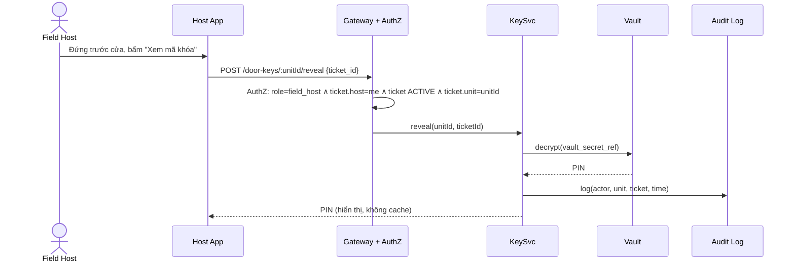

---

## 9. PHÂN QUYỀN HỆ THỐNG (RBAC) ✅

### 9.1 Vai trò

| Vai trò | Mô tả |
|---|---|
| `tenant` | Chỉ thao tác trên dữ liệu của chính mình |
| `field_host` | Sale/CTV nội khu — trong phạm vi ticket được giao |
| `landlord` | Thao tác trên căn hộ mình sở hữu/ủy quyền |
| `area_lead` | Host cấp cao, nhận ticket Tầng 3; không có quyền admin |
| `ops_admin` | Cấu hình biến phí, giám sát SLA, xử lý ngoại lệ |
| `compliance_officer` | Quyền hẹp — truy cập dữ liệu xác thực danh tính để đối soát |
| `system` | Tài khoản dịch vụ nội bộ (Dispatcher, Payment Webhook, Notification…) |

### 9.2 Ma trận quyền theo tài nguyên

| Tài nguyên | tenant | field_host | landlord | area_lead | ops_admin | compliance_officer | system |
|---|---|---|---|---|---|---|---|
| Xem listing công khai | R | R | R (căn của mình) | R | CRUD | – | R |
| Đặt lịch xem (viewings) | C (của mình) | RU (ticket được giao) | R (căn của mình) | RU (ticket broadcast) | CRUD | – | CRUD |
| Nhận/từ chối dispatch ticket | – | RU (ticket của mình) | – | RU | CRUD | – | CRUD |
| Xem mã khóa cửa | – | R (chỉ khi ticket active) | – | R (chỉ khi ticket active) | R (audit bắt buộc) | – | CRUD |
| Cấu hình/xoay mã khóa | – | – | U (yêu cầu xoay) | – | CRUD | – | CRUD |
| Dữ liệu xác thực danh tính (CCCD) | R (của mình) | – | – | – | – | R (audit bắt buộc) | CRUD |
| Cọc giữ chỗ | R (của mình) | RU (ticket của mình) | R (căn của mình) | – | CRUD | – | CRUD |
| Ký thỏa thuận/hợp đồng | CU (của mình) | – | R (căn của mình) | – | R | R (audit) | CRUD |
| Hộ chiếu bàn giao số | R (của mình) | CRU (ticket của mình) | R (căn của mình) | – | R | – | CRUD |
| Cấu hình biến phí Host | – | – | – | – | CRUD | – | R |
| Dashboard BI / Funnel | – | R (số liệu cá nhân) | R (căn của mình) | R (khu vực) | CRUD | – | R |
| Audit log | – | – | – | – | R | R (liên quan compliance) | CRUD |

*C=Create, R=Read, U=Update, D=Delete. "của mình" = ràng buộc theo `owner_id`/`tenant_id` ở tầng policy, không phải quyền toàn cục.*

### 9.3 Cơ chế thực thi

1. **AuthZ Service** (policy engine dạng attribute-based: role + sở hữu tài nguyên + trạng thái ticket) được Gateway gọi **trước mọi request**. Danh mục quyền lưu ở bảng `roles / permissions / role_permissions`; điều kiện sở hữu/trạng thái nằm trong policy code.
2. **Truy cập `door_access_keys` và `identity_verifications` bắt buộc ghi `audit_log`**, kể cả truy cập hợp lệ.
3. **Least privilege:** `compliance_officer` không ghi/sửa nghiệp vụ ngoài đối soát; `ops_admin` **không tự động** xem dữ liệu định danh trừ khi được cấp riêng.
4. 🔵 **RLS PostgreSQL làm lớp phòng thủ thứ hai** (Host chỉ thấy ca được giao; chủ nhà chỉ thấy căn của mình; khách chỉ thấy dữ liệu của mình). Lưu ý kỹ thuật: Prisma kết nối bằng role có thể bypass RLS — nếu dùng RLS phải cấu hình role/`SET LOCAL` theo request; nếu không, coi AuthZ là lớp kiểm soát duy nhất và ghi rõ như vậy.
5. 🟡 Ai giữ vai trò `compliance_officer` trong đội tinh gọn (§19).

---

## 10. KHUNG PHÁP LÝ & KÝ SỐ ⚖️

> **Cảnh báo:** Mục này mô tả **thiết kế kỹ thuật dự kiến**, chưa được luật sư/pháp chế xác nhận. Bản Enterprise trích dẫn số điều/khoản cụ thể và khẳng định hiệu lực pháp lý "tối cao"; v2 **không** lặp lại các khẳng định đó. Các trích dẫn gốc được liệt kê ở Phụ lục B để kiểm chứng. Không dùng tài liệu này như bằng chứng đã có ý kiến pháp lý.

### 10.1 Văn bản pháp luật liên quan (cấp tên văn bản — số điều do pháp chế xác định)

| Chủ đề | Văn bản liên quan | Cần pháp chế xác nhận |
|---|---|---|
| Hợp đồng thuê nhà ở | Luật Nhà ở 2023 | Hình thức hợp đồng, công chứng/chứng thực có bắt buộc không |
| Giao dịch/chữ ký điện tử | Luật Giao dịch điện tử 2023 | Ký tay cảm ứng + OTP có phải "chữ ký điện tử" đáp ứng điều kiện độ tin cậy không; giá trị chứng cứ |
| Dịch vụ môi giới/quản lý BĐS | Luật Kinh doanh Bất động sản 2023 | Tư cách pháp lý của VinStay và Field Host (CTV); yêu cầu chứng chỉ/đăng ký; hình thức hợp đồng ký gửi |
| Đặt cọc, thuê, ủy quyền, dịch vụ | Bộ luật Dân sự 2015 | Quy chế đặt cọc/hoàn/tịch thu; quan hệ ba bên |
| Dữ liệu cá nhân | **Luật BVDLCN 2025 (91/2025/QH15) + NĐ 356/2025/NĐ-CP** (hiệu lực 01/01/2026, thay NĐ 13/2023 — theo tra cứu ngày 24/09/2026) | Consent, đánh giá tác động, hợp đồng xử lý dữ liệu với vendor, thời hạn lưu |
| Dòng tiền cọc | Quy định về thanh toán/trung gian thanh toán, thu hộ–chi hộ | Nền tảng giữ/nhận tiền cọc có cần giấy phép hay phải thông qua cấu trúc ngân hàng? |
| Dịch vụ tin cậy (dấu thời gian, chứng thư) | Luật GDĐT 2023 và văn bản hướng dẫn | Nhà cung cấp TSA/CA được công nhận ở VN |

### 10.2 Ba loại tài liệu ký trên nền tảng

| Tài liệu | Các bên | Phương thức dự kiến |
|---|---|---|
| Hợp đồng Ký gửi Quản lý Độc quyền (Mandate) | Chủ nhà ↔ VinStay | Ký tay cảm ứng + Zalo OTP chủ nhà |
| Thỏa thuận cọc giữ chỗ (7 ngày) | Khách ↔ VinStay ↔ Chủ nhà | VietQR 2.000.000đ + eKYC + Zalo OTP khách |
| Hợp đồng thuê chính thức | Chủ nhà ↔ Khách (VinStay làm chứng/quản lý) | Ký hai đầu từ xa: OTP khách và OTP chủ nhà |

### 10.3 Quy trình ký Hybrid 4 bước (🔵 ⚖️ giá trị pháp lý chờ xác nhận)

1. **Xác thực danh tính** qua eKYC + C06 (§7) — điền tự động các trường đã xác thực vào tài liệu.
2. **Tóm tắt điều khoản cốt lõi** (mã căn, All-in Cost, mức cọc, điều khoản thoát 15 ngày, quy chế BQL) — người ký xem trước khi ký.
3. **Ký:** vẽ chữ ký trên canvas + OTP 6 số qua Zalo ZNS tới SĐT chính chủ (SMS dự phòng).
4. **Niêm phong:** SHA-256 của PDF + dấu thời gian RFC 3161 + chứng thư số máy chủ (🟡 nhà cung cấp TSA/CA chưa chọn); gửi PDF cho các bên qua Zalo OA.

Mỗi lần ký lưu: `signer`, `method`, `otp_verified_at`, IP, user-agent, thời điểm, vector chữ ký.

### 10.4 Thoát ủy quyền 15 ngày (✅)

1. Chủ nhà gửi yêu cầu hủy trên Portal.
2. Hệ thống kiểm tra: căn phải ở `available` (không `holding`, không hợp đồng hiệu lực) **và** chủ nhà báo trước ≥ 15 ngày. Căn đang `holding` → từ chối cho đến khi hết 7 ngày hoặc ký hợp đồng.
3. Worker chạy `mandate_termination_countdown` 15 ngày; các lịch đã hẹn vẫn được phục vụ trừ khi chủ nhà đóng lịch (lịch trong ngày: hoàn tất rồi mới bắt đầu đếm).
4. Hết hạn: căn → `unlisted`, **`KeySvc` thu hồi mã/chìa và xóa khỏi hệ thống Host**, xuất biên bản thanh lý gửi Zalo chủ nhà.

### 10.5 Cọc giữ chỗ 7 ngày & ký quỹ (🔵 🟡 ⚖️)

- Cọc cố định **2.000.000đ**, VietQR động; cú pháp `COC [Mã căn] [SĐT khách]`; nhúng `host_id` (Attribution Lock).
- Khi webhook xác nhận: căn `HOLDING` **7 ngày** (§6.3).
- Khi ký hợp đồng thuê: khoản cọc chuyển thành một phần **Tiền cọc bảo đảm** giữ nguyên suốt kỳ thuê, **không khấu trừ vào tiền thuê tháng đầu** (quy tắc nghiệp vụ đề xuất).
- Hoàn cọc khi thanh lý (đề xuất ≤ 48 giờ sau khi đối soát công tơ/hư hại và chủ nhà duyệt).
- **Chưa chốt:** mô hình tài khoản (ký quỹ ba bên hay cách khác), chính sách hoàn/tịch thu khi hết 7 ngày không ký, tỷ lệ hoàn khi khách hủy. → §19 #2, #8, #14.

### 10.6 Gói chứng cứ pháp lý (🔵 ⚖️)

Với mỗi tài liệu ký, sinh **Evidence Manifest (JSON)**: `document_id`, `document_sha256`, dấu thời gian, danh sách bên ký (tham chiếu kết quả eKYC — không nhúng ảnh CCCD), chữ ký + bằng chứng OTP, `network_audit` (IP, user-agent, thời điểm), tham chiếu giao dịch ngân hàng. Thời hạn lưu: 🟡 pháp chế xác nhận (bản Enterprise ghi 10 năm nhưng chưa dẫn căn cứ đã kiểm chứng).

---

## 11. LUỒNG END-TO-END

### 11.1 Ký gửi Độc quyền & thẩm định 0đ

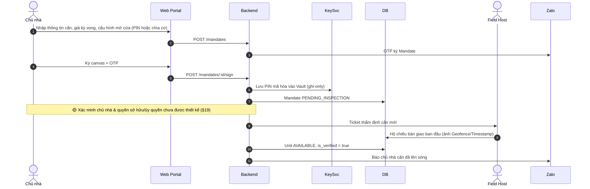

### 11.2 Tìm căn, khớp All-in Cost & đặt lịch

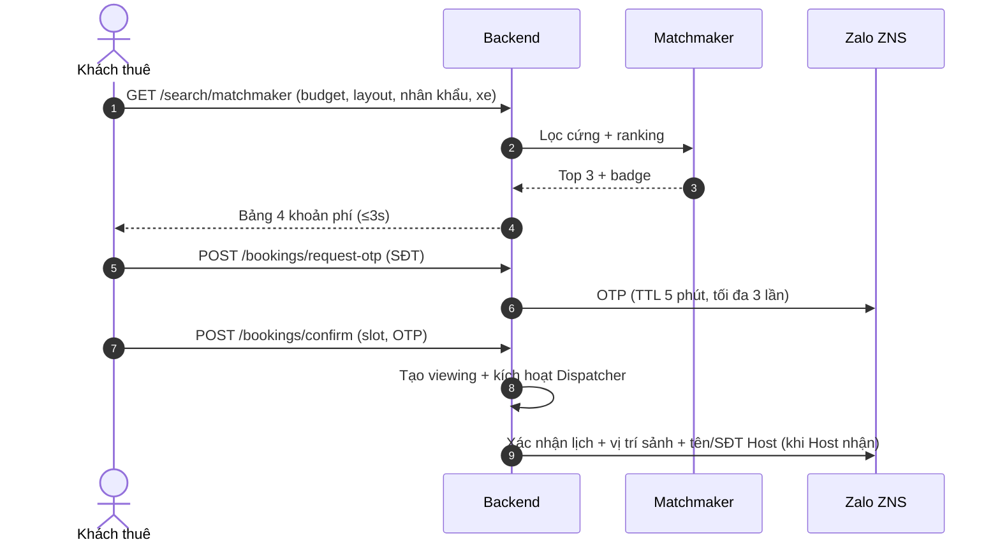

### 11.3 Điều phối, đón sảnh, mở cửa

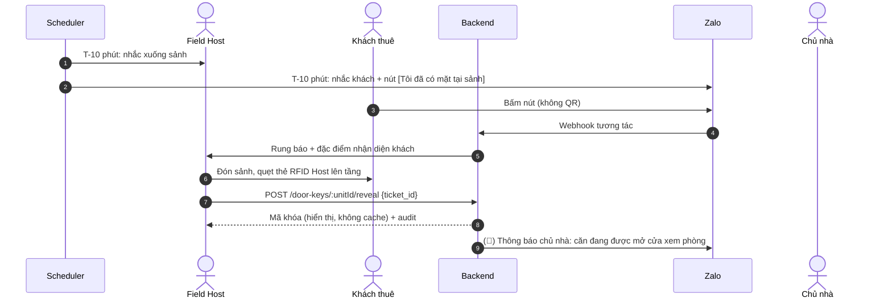

### 11.4 Cọc VietQR, khóa 7 ngày, xác thực eKYC, ký thỏa thuận

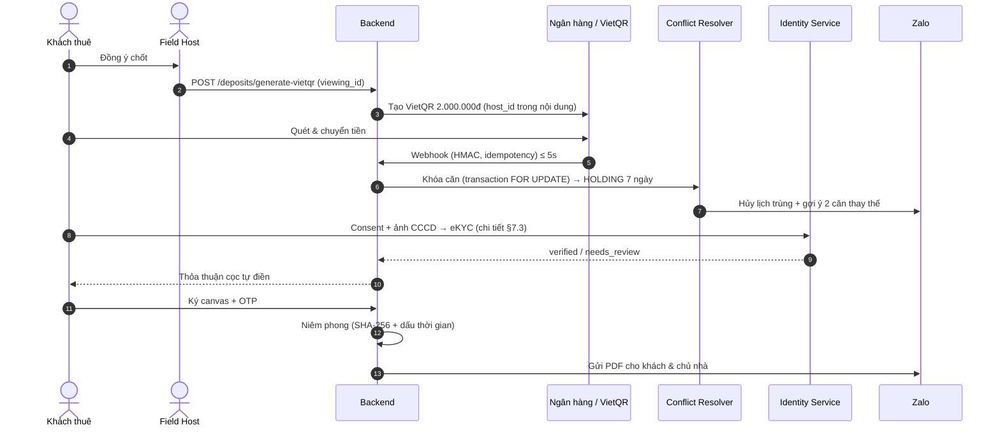

### 11.5 Bàn giao, check-in & thanh lý

```mermaid
sequenceDiagram
    autonumber
    actor T as Khách thuê
    actor H as Field Host
    actor L as Chủ nhà
    participant API as Backend
    participant B as Ngân hàng

    Note over T,H: CHECK-IN
    H->>API: Ảnh 10 hạng mục + chỉ số công tơ (nhập tay + ảnh) — Geofence/Timestamp
    T->>API: Ký xác nhận hiện trạng ban đầu
    Note over T,H: CHECK-OUT
    H->>API: Ảnh đối soát + chỉ số cuối kỳ
    API->>API: Phân định hao mòn tự nhiên; tính công nợ điện nước
    alt Không hư hại, không nợ
        API->>L: Biên bản sạch qua Zalo
        L->>API: Duyệt hoàn cọc
        API->>B: Lệnh hoàn cọc (🟡 mô hình tài khoản)
    else Có hư hại/nợ
        API->>T: Bảng kê cấn trừ minh bạch
        API->>B: Hoàn phần còn lại
    end
```

---

## 12. MÔ HÌNH DỮ LIỆU

### 12.1 ERD

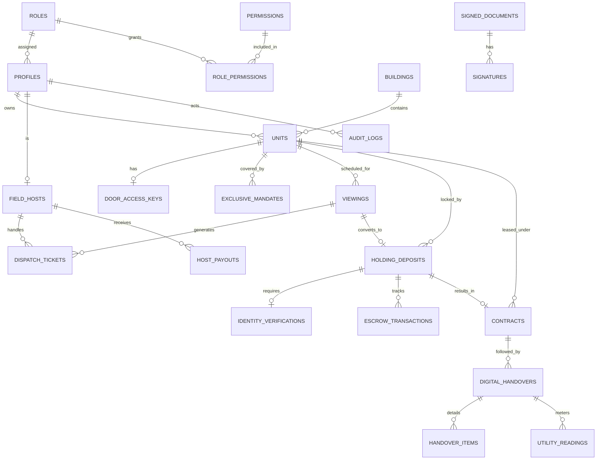

### 12.2 Prisma schema (`prisma/schema.prisma`)

```prisma
datasource db {
  provider  = "postgresql"
  url       = env("DATABASE_URL")
  directUrl = env("DIRECT_URL")
}
generator client { provider = "prisma-client-js" }

// ===== 1. IAM & RBAC =====
model Role {
  id          String           @id @default(uuid()) @db.Uuid
  code        String           @unique @db.VarChar(30) // tenant, field_host, landlord, area_lead, ops_admin, compliance_officer
  description String?
  permissions RolePermission[]
  profiles    Profile[]
  @@map("roles")
}
model Permission {
  id       String           @id @default(uuid()) @db.Uuid
  code     String           @unique @db.VarChar(60) // "door_key:reveal", "identity:read"
  resource String           @db.VarChar(40)
  action   String           @db.VarChar(20)
  roles    RolePermission[]
  @@map("permissions")
}
model RolePermission {
  roleId       String     @map("role_id") @db.Uuid
  permissionId String     @map("permission_id") @db.Uuid
  role         Role       @relation(fields: [roleId], references: [id])
  permission   Permission @relation(fields: [permissionId], references: [id])
  @@id([roleId, permissionId])
  @@map("role_permissions")
}
// `system` là service identity, không phải Profile.
model Profile {
  id              String    @id @db.Uuid                 // = Supabase auth uid
  roleId          String    @map("role_id") @db.Uuid
  fullName        String?   @map("full_name") @db.VarChar(100)
  phoneEnc        String?   @map("phone_enc")             // AES-256-GCM, ciphertext
  phoneHash       String?   @unique @map("phone_hash") @db.VarChar(64) // HMAC-SHA256: blind index để tra cứu/unique
  email           String?   @unique @db.VarChar(100)
  isPhoneVerified Boolean   @default(false) @map("is_phone_verified")
  isActive        Boolean   @default(true) @map("is_active")
  createdAt       DateTime  @default(now()) @map("created_at") @db.Timestamptz
  updatedAt       DateTime  @updatedAt @map("updated_at") @db.Timestamptz

  role            Role      @relation(fields: [roleId], references: [id])
  ownedUnits      Unit[]    @relation("LandlordUnits")
  hostProfile     FieldHost?
  viewings        Viewing[] @relation("TenantViewings")
  identityChecks  IdentityVerification[]
  tenantContracts   Contract[] @relation("TenantContracts")
  landlordContracts Contract[] @relation("LandlordContracts")
  signatures      Signature[]
  auditActions    AuditLog[]
  @@map("profiles")
}

// ===== 2. PROPERTY =====
model Building {
  id             String   @id @default(uuid()) @db.Uuid
  buildingCode   String   @unique @map("building_code") @db.VarChar(20) // S1.01…
  zoneName       String   @map("zone_name") @db.VarChar(50)
  totalFloors    Int      @map("total_floors")
  lobbyLatitude  Decimal  @map("lobby_latitude") @db.Decimal(10, 7)
  lobbyLongitude Decimal  @map("lobby_longitude") @db.Decimal(10, 7)
  units          Unit[]
  @@map("buildings")
}
enum UnitStatus   { AVAILABLE HOLDING RENTED UNLISTED MAINTENANCE }
enum LayoutType   { STUDIO ONE_BED_PLUS TWO_BED_ONE_BATH TWO_BED_TWO_BATH THREE_BED }
enum DoorLockType { ELECTRONIC_PIN PHYSICAL_KEY }

model Unit {
  id                  String       @id @default(uuid()) @db.Uuid
  unitCode            String       @unique @map("unit_code") @db.VarChar(50)
  buildingId          String       @map("building_id") @db.Uuid
  landlordId          String       @map("landlord_id") @db.Uuid
  layoutType          LayoutType   @map("layout_type")
  carpetAreaM2        Decimal      @map("carpet_area_m2") @db.Decimal(6, 2)
  baseRentPrice       Decimal      @map("base_rent_price") @db.Decimal(12, 2)
  managementFee       Decimal      @map("management_fee") @db.Decimal(12, 2)
  parkingFeeEstimate  Decimal      @default(150000) @map("parking_fee_estimate") @db.Decimal(12, 2)
  utilityCostEstimate Decimal      @default(600000) @map("utility_cost_estimate") @db.Decimal(12, 2)
  marketAvgPrice      Decimal      @map("market_avg_price") @db.Decimal(12, 2)
  doorLockType        DoorLockType @map("door_lock_type")
  isVerified          Boolean      @default(false) @map("is_verified")
  status              UnitStatus   @default(AVAILABLE)
  isHot               Boolean      @default(false) @map("is_hot")
  createdAt           DateTime     @default(now()) @map("created_at") @db.Timestamptz
  updatedAt           DateTime     @updatedAt @map("updated_at") @db.Timestamptz

  building    Building   @relation(fields: [buildingId], references: [id])
  landlord    Profile    @relation("LandlordUnits", fields: [landlordId], references: [id])
  doorKey     DoorAccessKey?
  mandates    ExclusiveMandate[]
  viewings    Viewing[]
  deposits    HoldingDeposit[]
  contracts   Contract[]
  @@index([status, buildingId])
  @@index([baseRentPrice])
  @@map("units")
}

// ===== 3. DOOR KEY (mới) =====
enum DoorKeyStatus  { ACTIVE REVOKED }
enum PhysicalKeyState { AT_DESK WITH_HOST }

model DoorAccessKey {
  id               String            @id @default(uuid()) @db.Uuid
  unitId           String            @unique @map("unit_id") @db.Uuid
  keyType          DoorLockType      @map("key_type")
  vaultSecretRef   String?           @map("vault_secret_ref")   // tham chiếu Vault; KHÔNG lưu PIN ở DB
  physicalKeyState PhysicalKeyState? @map("physical_key_state")
  physicalKeyHolderId String?        @map("physical_key_holder_id") @db.Uuid
  status           DoorKeyStatus     @default(ACTIVE)
  issuedAt         DateTime          @default(now()) @map("issued_at") @db.Timestamptz
  lastRotatedAt    DateTime?         @map("last_rotated_at") @db.Timestamptz
  revokedAt        DateTime?         @map("revoked_at") @db.Timestamptz
  unit             Unit              @relation(fields: [unitId], references: [id])
  @@map("door_access_keys")
}

// ===== 4. TÀI LIỆU KÝ & CHỮ KÝ =====
enum DocType { MANDATE DEPOSIT_AGREEMENT LEASE HANDOVER_REPORT }

model SignedDocument {
  id            String   @id @default(uuid()) @db.Uuid
  docType       DocType  @map("doc_type")
  storageKey    String   @map("storage_key")
  sha256        String?  @db.VarChar(64)
  tsaToken      String?  @map("tsa_token")        // RFC 3161 token (🟡 TSA vendor)
  tsaTime       DateTime? @map("tsa_time") @db.Timestamptz
  sealedAt      DateTime? @map("sealed_at") @db.Timestamptz
  createdAt     DateTime @default(now()) @map("created_at") @db.Timestamptz
  signatures    Signature[]
  mandate       ExclusiveMandate?
  deposit       HoldingDeposit?
  contract      Contract?
  @@map("signed_documents")
}
model Signature {
  id            String   @id @default(uuid()) @db.Uuid
  documentId    String   @map("document_id") @db.Uuid
  signerId      String   @map("signer_id") @db.Uuid
  signerRole    String   @map("signer_role") @db.VarChar(30)
  method        String   @db.VarChar(30)          // CANVAS_ZALO_OTP | CANVAS_SMS_OTP
  signatureSvg  String?  @map("signature_svg")
  otpVerifiedAt DateTime @map("otp_verified_at") @db.Timestamptz
  ipAddress     String?  @map("ip_address") @db.VarChar(45)
  userAgent     String?  @map("user_agent")
  signedAt      DateTime @default(now()) @map("signed_at") @db.Timestamptz
  document      SignedDocument @relation(fields: [documentId], references: [id])
  signer        Profile        @relation(fields: [signerId], references: [id])
  @@map("signatures")
}

// ===== 5. MANDATE & THOÁT 15 NGÀY =====
enum MandateStatus { PENDING_INSPECTION ACTIVE EXIT_REQUESTED TERMINATED EXPIRED }

model ExclusiveMandate {
  id                     String        @id @default(uuid()) @db.Uuid
  unitId                 String        @map("unit_id") @db.Uuid
  contractNumber         String        @unique @map("contract_number") @db.VarChar(50)
  documentId             String?       @unique @map("document_id") @db.Uuid
  doorAccessConfig       Json?         @map("door_access_config") // quyền mở cửa chủ nhà cấu hình khi ký
  signedAt               DateTime?     @map("signed_at") @db.Timestamptz
  validUntil             DateTime?     @map("valid_until") @db.Timestamptz
  status                 MandateStatus @default(PENDING_INSPECTION)
  exitRequestedAt        DateTime?     @map("exit_requested_at") @db.Timestamptz
  exitEffectiveAt        DateTime?     @map("exit_effective_at") @db.Timestamptz
  unit                   Unit          @relation(fields: [unitId], references: [id])
  document               SignedDocument? @relation(fields: [documentId], references: [id])
  @@map("exclusive_mandates")
}

// ===== 6. FIELD HOST & DISPATCH =====
enum HostDutyStatus { ONLINE_AVAILABLE BUSY_VIEWING OFF_DUTY }

model FieldHost {
  id               String         @id @default(uuid()) @db.Uuid
  profileId        String         @unique @map("profile_id") @db.Uuid
  assignedZone     String         @map("assigned_zone") @db.VarChar(50)
  rfidCardNumber   String?        @map("rfid_card_number") @db.VarChar(50)
  dutyStatus       HostDutyStatus @default(OFF_DUTY) @map("duty_status")
  currentLatitude  Decimal?       @map("current_latitude") @db.Decimal(10, 7)
  currentLongitude Decimal?       @map("current_longitude") @db.Decimal(10, 7)
  rating           Decimal        @default(5.00) @db.Decimal(3, 2)
  walletBalance    Decimal        @default(0) @map("wallet_balance") @db.Decimal(12, 2)
  profile          Profile        @relation(fields: [profileId], references: [id])
  tickets          DispatchTicket[]
  attributedDeposits HoldingDeposit[]
  payouts          HostPayout[]
  @@map("field_hosts")
}

enum ViewingStatus { PENDING_CONFIRMATION CONFIRMED COMPLETED NO_SHOW CANCELLED }

model Viewing {
  id             String        @id @default(uuid()) @db.Uuid
  bookingRefCode String        @unique @map("booking_ref_code") @db.VarChar(50)
  unitId         String        @map("unit_id") @db.Uuid
  tenantId       String        @map("tenant_id") @db.Uuid
  viewingSlot    DateTime      @map("viewing_slot") @db.Timestamptz
  status         ViewingStatus @default(PENDING_CONFIRMATION)
  cancelReason   String?       @map("cancel_reason") @db.VarChar(60) // USER | AUTO_CANCELLED_DUE_TO_DEPOSIT | ...
  lobbyCheckInAt DateTime?     @map("lobby_check_in_at") @db.Timestamptz
  completedAt    DateTime?     @map("completed_at") @db.Timestamptz
  tenantRating   Int?          @map("tenant_rating")
  createdAt      DateTime      @default(now()) @map("created_at") @db.Timestamptz
  unit           Unit          @relation(fields: [unitId], references: [id])
  tenant         Profile       @relation("TenantViewings", fields: [tenantId], references: [id])
  tickets        DispatchTicket[]
  deposit        HoldingDeposit?
  @@index([viewingSlot, status])
  @@map("viewings")
}

enum TicketStatus { OFFERED ACCEPTED CHECKED COMPLETED EXPIRED ESCALATED CANCELLED }

model DispatchTicket {
  id         String       @id @default(uuid()) @db.Uuid
  viewingId  String       @map("viewing_id") @db.Uuid
  hostId     String?      @map("host_id") @db.Uuid   // null khi broadcast chưa ai nhận
  tier       Int                                     // 1, 2, 3
  slaSeconds Int          @map("sla_seconds")
  status     TicketStatus @default(OFFERED)
  offeredAt  DateTime     @default(now()) @map("offered_at") @db.Timestamptz
  acceptedAt DateTime?    @map("accepted_at") @db.Timestamptz
  viewing    Viewing      @relation(fields: [viewingId], references: [id])
  host       FieldHost?   @relation(fields: [hostId], references: [id])
  @@index([hostId, status])
  @@map("dispatch_tickets")
}

// ===== 7. CỌC GIỮ CHỖ 7 NGÀY =====
enum DepositStatus { PENDING_PAYMENT QR_EXPIRED UNC_PENDING_REVIEW PAID_HOLDING CONVERTED_TO_CONTRACT REFUNDED FORFEITED }

model HoldingDeposit {
  id                String        @id @default(uuid()) @db.Uuid
  depositCode       String        @unique @map("deposit_code") @db.VarChar(50)
  viewingId         String        @unique @map("viewing_id") @db.Uuid
  unitId            String        @map("unit_id") @db.Uuid
  attributedHostId  String?       @map("attributed_host_id") @db.Uuid
  amount            Decimal       @default(2000000) @db.Decimal(12, 2)
  vietqrRef         String        @map("vietqr_ref") @db.VarChar(100)
  paymentStatus     DepositStatus @default(PENDING_PAYMENT) @map("payment_status")
  paidAt            DateTime?     @map("paid_at") @db.Timestamptz
  expiresAt         DateTime?     @map("expires_at") @db.Timestamptz // paidAt + 7 ngày (UNC tạm: +30 phút)
  agreementDocId    String?       @unique @map("agreement_doc_id") @db.Uuid
  viewing           Viewing       @relation(fields: [viewingId], references: [id])
  unit              Unit          @relation(fields: [unitId], references: [id])
  attributedHost    FieldHost?    @relation(fields: [attributedHostId], references: [id])
  agreementDoc      SignedDocument? @relation(fields: [agreementDocId], references: [id])
  identity          IdentityVerification?
  contract          Contract?
  escrowTx          EscrowTransaction[]
  @@index([paymentStatus, expiresAt])
  @@map("holding_deposits")
}

// ===== 8. XÁC THỰC DANH TÍNH (thay OCR) =====
enum IdentityStatus { SUBMITTED VERIFIED NEEDS_REVIEW REJECTED }

model IdentityVerification {
  id                 String         @id @default(uuid()) @db.Uuid
  tenantId           String         @map("tenant_id") @db.Uuid
  depositId          String?        @unique @map("deposit_id") @db.Uuid
  providerName       String         @map("provider_name") @db.VarChar(50)
  providerRefId      String         @map("provider_reference_id") @db.VarChar(100)
  confidenceScore    Float?         @map("confidence_score")
  c06Confirmed       Boolean        @default(false) @map("c06_confirmed")
  status             IdentityStatus @default(SUBMITTED)
  verifiedDataRef    String?        @map("verified_data_ref")  // ciphertext trong Vault
  consentAt          DateTime       @map("consent_at") @db.Timestamptz
  consentVersion     String         @map("consent_version") @db.VarChar(20)
  reviewedById       String?        @map("reviewed_by_id") @db.Uuid
  verifiedAt         DateTime?      @map("verified_at") @db.Timestamptz
  rawDataPurgeAt     DateTime       @map("raw_data_purge_at") @db.Timestamptz
  rawDataPurgedAt    DateTime?      @map("raw_data_purged_at") @db.Timestamptz
  tenant             Profile        @relation(fields: [tenantId], references: [id])
  deposit            HoldingDeposit? @relation(fields: [depositId], references: [id])
  @@map("identity_verifications")
}

// ===== 9. HỢP ĐỒNG THUÊ =====
enum ContractStatus { DRAFT AWAITING_TENANT_SIGN AWAITING_LANDLORD_SIGN ACTIVE TERMINATED_SETTLED DISPUTED }

model Contract {
  id                    String         @id @default(uuid()) @db.Uuid
  contractNumber        String         @unique @map("contract_number") @db.VarChar(50)
  unitId                String         @map("unit_id") @db.Uuid
  holdingDepositId      String         @unique @map("holding_deposit_id") @db.Uuid
  tenantId              String         @map("tenant_id") @db.Uuid
  landlordId            String         @map("landlord_id") @db.Uuid
  documentId            String?        @unique @map("document_id") @db.Uuid
  leaseTermMonths       Int            @default(12) @map("lease_term_months")
  startDate             DateTime       @map("start_date") @db.Date
  endDate               DateTime       @map("end_date") @db.Date
  monthlyRentPrice      Decimal        @map("monthly_rent_price") @db.Decimal(12, 2)
  securityDepositAmount Decimal        @map("security_deposit_amount") @db.Decimal(12, 2)
  status                ContractStatus @default(DRAFT)
  unit                  Unit           @relation(fields: [unitId], references: [id])
  holdingDeposit        HoldingDeposit @relation(fields: [holdingDepositId], references: [id])
  tenant                Profile        @relation("TenantContracts", fields: [tenantId], references: [id])
  landlord              Profile        @relation("LandlordContracts", fields: [landlordId], references: [id])
  document              SignedDocument? @relation(fields: [documentId], references: [id])
  handovers             DigitalHandover[]
  @@map("contracts")
}

// ===== 10. HỘ CHIẾU BÀN GIAO =====
enum HandoverType { CHECK_IN CHECK_OUT }

model DigitalHandover {
  id               String       @id @default(uuid()) @db.Uuid
  contractId       String       @map("contract_id") @db.Uuid
  handoverType     HandoverType @map("handover_type")
  inspectorHostId  String?      @map("inspector_host_id") @db.Uuid
  inspectedAt      DateTime     @default(now()) @map("inspected_at") @db.Timestamptz
  signedByTenantAt DateTime?    @map("signed_by_tenant_at") @db.Timestamptz
  reportSha256     String?      @map("report_sha256") @db.VarChar(64)
  contract         Contract     @relation(fields: [contractId], references: [id])
  items            HandoverItem[]
  utilityReadings  UtilityReading[]
  @@map("digital_handovers")
}
model HandoverItem {
  id            String   @id @default(uuid()) @db.Uuid
  handoverId    String   @map("handover_id") @db.Uuid
  itemCategory  String   @map("item_category") @db.VarChar(50)
  conditionNote String?  @map("condition_note")
  photos        Json     @default("[]")   // [{key, sha256, takenAt, lat, lng}]
  isNormalWear  Boolean  @default(true) @map("is_normal_wear")
  deductionCost Decimal  @default(0) @map("deduction_cost") @db.Decimal(12, 2)
  handover      DigitalHandover @relation(fields: [handoverId], references: [id], onDelete: Cascade)
  @@map("handover_items")
}
model UtilityReading {
  id           String   @id @default(uuid()) @db.Uuid
  handoverId   String   @map("handover_id") @db.Uuid
  utilityType  String   @map("utility_type") @db.VarChar(20)   // ELECTRICITY | WATER
  meterIndex   Decimal  @map("meter_index") @db.Decimal(10, 2) // Host nhập tay
  photoKey     String   @map("photo_key")
  recordedAt   DateTime @default(now()) @map("recorded_at") @db.Timestamptz
  handover     DigitalHandover @relation(fields: [handoverId], references: [id], onDelete: Cascade)
  @@map("utility_readings")
}

// ===== 11. TIỀN, BIẾN PHÍ, AUDIT =====
model EscrowTransaction {           // 🔵 🟡 đổi tên/cấu trúc nếu mô hình ký quỹ thay đổi
  id              String   @id @default(uuid()) @db.Uuid
  depositId       String   @map("deposit_id") @db.Uuid
  transType       String   @map("trans_type") @db.VarChar(50)   // INBOUND_DEPOSIT | REFUND | DEDUCTION
  amount          Decimal  @db.Decimal(12, 2)
  bankRefNumber   String   @unique @map("bank_ref_number") @db.VarChar(100) // idempotency
  executedAt      DateTime @default(now()) @map("executed_at") @db.Timestamptz
  deposit         HoldingDeposit @relation(fields: [depositId], references: [id])
  @@map("escrow_transactions")
}
model HostPayout {
  id           String    @id @default(uuid()) @db.Uuid
  hostId       String    @map("host_id") @db.Uuid
  amount       Decimal   @db.Decimal(12, 2)
  period       String    @db.VarChar(50)
  status       String    @default("PENDING") @db.VarChar(20)
  transRef     String?   @map("trans_ref") @db.VarChar(100)
  settledAt    DateTime? @map("settled_at") @db.Timestamptz
  host         FieldHost @relation(fields: [hostId], references: [id])
  @@map("host_payouts")
}
model FeeConfig {                   // gồm cả holding_duration_days = 7
  id          String   @id @default(uuid()) @db.Uuid
  configKey   String   @unique @map("config_key") @db.VarChar(50)
  paramValue  Decimal  @map("param_value") @db.Decimal(12, 2)
  paramUnit   String   @map("param_unit") @db.VarChar(20)
  updatedBy   String   @map("updated_by") @db.Uuid
  updatedAt   DateTime @updatedAt @map("updated_at") @db.Timestamptz
  @@map("fee_configs")
}
model AuditLog {                    // append-only: trigger chặn UPDATE/DELETE
  id          String   @id @default(uuid()) @db.Uuid
  actorId     String   @map("actor_id") @db.Uuid
  actorRole   String   @map("actor_role") @db.VarChar(30)
  actionType  String   @map("action_type") @db.VarChar(100)  // DOOR_KEY_REVEAL, IDENTITY_READ, FEE_CONFIG_UPDATE…
  entityName  String   @map("entity_name") @db.VarChar(50)
  entityId    String   @map("entity_id") @db.VarChar(100)
  oldValue    Json?    @map("old_value")
  newValue    Json?    @map("new_value")   // gồm ticket_id với DOOR_KEY_REVEAL
  ipAddress   String?  @map("ip_address") @db.VarChar(45)
  userAgent   String?  @map("user_agent")
  createdAt   DateTime @default(now()) @map("created_at") @db.Timestamptz
  actor       Profile  @relation(fields: [actorId], references: [id])
  @@index([actionType, createdAt])
  @@index([entityName, entityId])
  @@map("audit_logs")
}
```

**Ghi chú schema:** (1) không có cột PIN/ảnh CCCD/dữ liệu định danh plaintext; (2) `AuditLog` append-only bằng trigger PostgreSQL, 🔵 có thể thêm hash-chain; (3) `system` actor cần một Profile kỹ thuật riêng nếu muốn ghi `actorId` — hoặc cho phép `actorId` null với `actor_role = 'system'` (🟡).
