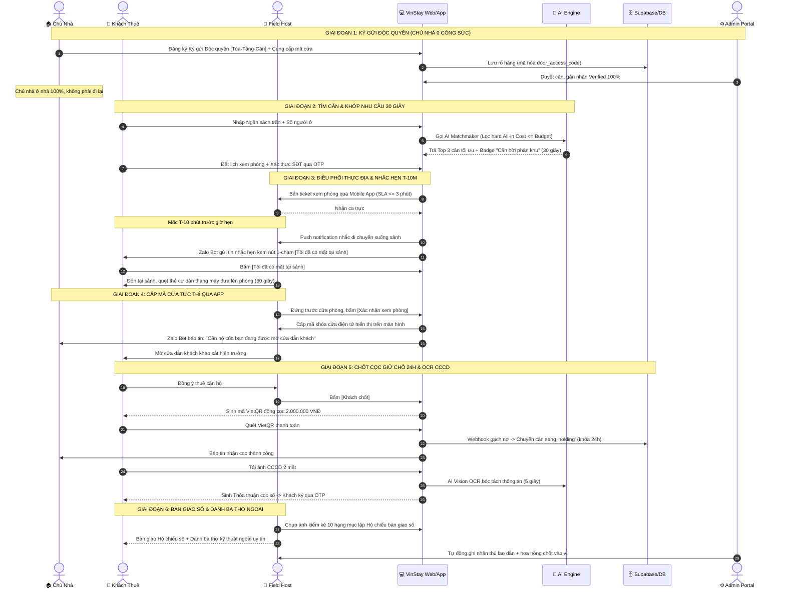

# VINSTAY AI — BẢN ĐẶC TẢ LUỒNG GIAO DIỆN & NGHIỆP VỤ TỔNG THỂ (MASTER UI FLOW SPEC)

> **MỤC ĐÍCH TÀI LIỆU:**  
> Bản đặc tả này đóng vai trò "bản đồ hành trình trực quan" cho toàn bộ đội ngũ phát triển kỹ thuật (Frontend, Backend, AI Engineer) và vận hành thực địa. Tài liệu vạch rõ 4 luồng người dùng độc lập nhưng đan cài mật thiết vào nhau: **(1) Khách thuê**, **(2) Nguồn căn Chủ nhà**, **(3) Field Host nội khu**, và **(4) Quản trị viên Nền tảng**, bám sát 100% các nguyên tắc cốt lõi: **Minh bạch All-in Cost**, **Hình ảnh thật có timestamp**, **Khớp căn 30 giây**, **Chủ nhà vận hành 0 công sức** và **Mô hình Asset-Light**.

---

## 1. SƠ ĐỒ TỔNG THỂ TƯƠNG TÁC ĐA VAI TRÒ (CROSS-ROLE E2E INTERACTION)



---

## 2. CHI TIẾT LUỒNG 1: KHÁCH THUÊ (TENANT UI JOURNEY)

Khách thuê đi qua chuỗi **6 màn hình chuẩn**, tập trung triệt để vào trải nghiệm **Minh bạch chi phí**, **0 tin ảo**, và **không ma sát khi xem phòng**:

```
┌─────────────────────────────────────────────────────────────────────────────────────────┐
│                               LUỒNG GIAO DIỆN KHÁCH THUÊ                                │
│                                                                                         │
│ [MÀN 1: Web Catalog] ──► [MÀN 2: AI Matchmaker] ──► [MÀN 3: Chi tiết & Đặt lịch OTP]   │
│       ▲                                                         │                       │
│       │                                                         ▼                       │
│ [MÀN 6: OCR CCCD & Ký Cọc] ◄── [MÀN 5: VietQR Cọc 2M] ◄── [MÀN 4: Zalo T-10m & Đón Sảnh]│
└─────────────────────────────────────────────────────────────────────────────────────────┘
```

### Màn 1: Web Catalog & Bộ Lọc All-in Cost Thời Gian Thực (`/`)
* **Mục tiêu:** Giúp khách nhìn thấy ngay tổng chi phí thực tế hàng tháng, loại trừ 100% nguy cơ sốc chi phí ẩn.
* **Thành phần giao diện:**
  * **Header:** Logo VinStay AI, hotline khẩn cấp nội khu, nút chọn phân khu (mặc định: *The Sapphire 1 & 2*).
  * **Thanh tìm kiếm All-in Cost:**
    * Dropdown Loại căn: `Studio`, `1PN+`, `2PN_1WC`, `2PN_2WC`, `3PN`.
    * Slider Ngân sách trần: từ 5.000.000 đ $\rightarrow$ 25.000.000 đ/tháng.
    * Bộ chọn thông số phụ: Số xe máy (mặc định 1 xe: 150k), Ô tô (1.250k), Số nhân khẩu (dự toán điện nước 300k/người).
  * **Thẻ căn hộ (Unit Card):**
    * Ảnh thực tế góc rộng có dấu **Watermark số & Timestamp** kiểm định.
    * Mã định danh chuẩn mực: `[Tòa] - [Tầng] - [Mã căn]` (vd: `S1.02 - Tầng 12 - Căn 08`).
    * **Hộp bóc tách All-in Cost:** Giá thuê cơ bản + Phí quản lý (9.5k/m2) + Phí xe + Dự toán điện nước.
    * **Badge động:** Nhãn `[🔥 Căn Hời Phân Khu - Rẻ hơn 12%]` (nếu giá $\le 90\%$ giá TB tòa) hoặc `[🔥 HOT - 4 người đang xem]`.
  * **Nút bấm hành động (CTA):** `[Xem Chi Tiết]` hoặc `[Chat AI Matchmaker]`.

### Màn 2: Hộp Thoại AI Matchmaker Khớp Nhu Cầu 30 Giây (`/matchmaker`)
* **Mục tiêu:** Thay thế 7–14 ngày lướt tin rác bằng 30 giây khớp đúng Top 3 căn hộ tối ưu nhất.
* **Thành phần giao diện:**
  * Khung chat tương tác thông minh với 4 câu hỏi định hình nhanh (Quick Prompts):
    1. Ngân sách All-in tối đa bạn muốn chi trả mỗi tháng là bao nhiêu?
    2. Bạn muốn ở bao nhiêu người và cần loại căn nào?
    3. Bạn dự kiến ngày nào dọn vào ở?
    4. Bạn có gửi ô tô hay yêu cầu đặc biệt về tầng/hướng không?
  * **Khu vực kết quả (Sau $\le 30$ giây):**
    * Thông báo phân tích: *"VinStay AI đã quét 45 căn hộ khả dụng tại Sapphire 1 & 2 và lọc ra 3 căn hoàn toàn nằm dưới ngân sách trần của bạn:"*
    * **Top 3 Thẻ căn hộ đề xuất:** Xếp hạng theo độ khớp và mức độ tiết kiệm chi phí; hiển thị rõ lý do AI đề xuất (vd: *"Căn này giúp bạn tiết kiệm 800k/tháng so với mặt bằng phân khu"*).
  * **Nút bấm hành động (CTA):** `[Đặt Lịch Xem Ngay]`.

### Màn 3: Chi Tiết Căn Hộ & Modal Đặt Lịch Xác Thực OTP (`/units/[id]`)
* **Mục tiêu:** Đặt lịch nhanh gọn, khớp ca trực thực địa của Host và xác thực SĐT thật để loại bỏ 100% môi giới ảo.
* **Thành phần giao diện:**
  * Slide ảnh 10 hạng mục kiểm định thực tế (phòng khách, sofa, bếp, điều hòa, WC, view ban công).
  * Bảng thông số kỹ thuật: Diện tích thông thủy, nội thất bàn giao, tầng cao, hướng mát.
  * **Modal Đặt lịch xem phòng:**
    * Khung chọn ngày: Hôm nay hoặc 2 ngày tới.
    * Khung chọn slot giờ khả dụng (khớp ca trực Field Host): Sáng (08:30, 09:30, 10:30) | Chiều (14:30, 15:30, 16:30, 17:30).
    * Ô nhập Họ tên & Số điện thoại.
    * Ô nhập mã OTP 4 số gửi về Zalo/SMS.
  * **Nút bấm hành động (CTA):** `[Xác Nhận Lịch Hẹn]`.

### Màn 4: Trải Nghiệm Tiếp Đón Sảnh & Zalo Bot Nhắc Hẹn Kép T-10m
* **Mục tiêu:** Chấm dứt cảnh lạc đường và đứng chờ đợi vạ vật tại sảnh đại đô thị.
* **Thành phần giao diện:**
  * **Thông báo Zalo OA xác nhận:** Gửi ngay sau khi đặt lịch kèm mã `booking_ref_code`, link định vị Google Maps sảnh tòa và thông tin Field Host (Họ tên, SĐT, ảnh chân dung).
  * **Mốc T-10 phút trước giờ hẹn:** Zalo Bot kích hoạt thông báo nhắc hẹn kép kèm 2 nút bấm tương tác 1-chạm:
    * Nút 1: `[📍 Tôi đã có mặt tại sảnh]`
    * Nút 2: `[🚗 Đang trên đường - Xin trễ 10p]`
  * **Khi khách bấm "Tôi đã có mặt tại sảnh":** Màn hình hiển thị: *"Host [Nguyễn Văn A] đã nhận thông báo và đang xuống sảnh đón bạn sau 60 giây. Host mặc đồng phục VinStay và đeo thẻ cư dân thang máy."*

### Màn 5: Khảo Sát Hiện Trường & Quét VietQR Cọc Giữ Chỗ 24h
* **Mục tiêu:** Tạo áp lực chốt phòng minh bạch, khóa căn tức thì chống tranh căn mà không sợ bị lừa cọc.
* **Thành phần giao diện:**
  * Khách được Host dẫn lên phòng, kiểm tra không gian thực tế.
  * Khi khách đồng ý giữ phòng: Host bấm `[Khách chốt]` trên Mobile Dashboard.
  * **Màn hình hiển thị mã VietQR động:**
    * Số tiền quy định: **2.000.000 VNĐ**.
    * Nội dung chuyển khoản: `COC [MÃ CĂN] [SĐT KHÁCH]`.
    * Cảnh báo bảo chứng: *"Khoản cọc này chuyển thẳng vào tài khoản định danh nền tảng để khóa căn 24h; khi ký HĐ chính thức sẽ chuyển 100% thành Tiền Cọc Bảo Đảm Nội Thất (Security Deposit)."*
  * **Trạng thái gạch nợ thời gian thực:** Đồng hồ xoay tròn $\le 10$ giây $\rightarrow$ Nảy màn hình xanh ✅: **"Thanh toán thành công! Căn hộ S1.02-12A08 đã được khóa giữ chỗ cho bạn trong 24 giờ tới."**

### Màn 6: AI OCR CCCD & Ký Thỏa Thuận Cọc Điện Tử
* **Mục tiêu:** Ký thỏa thuận số trong 30 giây, tuân thủ Nghị định 13/2023/NĐ-CP, không lộ ảnh CCCD cho môi giới.
* **Thành phần giao diện:**
  * Giao diện chụp ảnh: Khung hướng dẫn chụp rõ nét 2 mặt thẻ CCCD gắn chip.
  * **AI Vision OCR xử lý trong $\le 5$ giây:** Trích xuất tự động: Họ tên, Số CCCD, Ngày cấp, Nơi thường trú.
  * Giao diện điền Thỏa thuận cọc số tự động: Khách đọc lại các điều khoản cam kết và thời hạn 24 giờ.
  * Nút bấm `[Ký Thỏa Thuận]` $\rightarrow$ Nhập mã OTP xác nhận hoàn tất giao dịch.
  * Màn hình bàn giao: Cung cấp bản PDF hợp đồng có chữ ký số + Hướng dẫn nhận nhà và Danh bạ thợ kỹ thuật ngoài uy tín.

---

## 3. CHI TIẾT LUỒNG 2: NGUỒN CĂN CHỦ NHÀ (LANDLORD UI JOURNEY — 0 CÔNG SỨC VẬN HÀNH)

Chủ nhà trải nghiệm quy trình **"ở nhà 100%"**, chỉ cần ủy quyền một lần duy nhất và theo dõi từ xa:

```
┌─────────────────────────────────────────────────────────────────────────────────────────┐
│                               LUỒNG GIAO DIỆN CHỦ NHÀ                                   │
│                                                                                         │
│ [MÀN 1: Đăng Ký Căn Hộ] ──► [MÀN 2: Cấp Mã Cửa & Ký Ủy Quyền Độc Quyền]                 │
│                                           │                                             │
│                                           ▼                                             │
│ [MÀN 4: Yêu Cầu Thoát 15 Ngày] ◄── [MÀN 3: Dashboard Ở Nhà 100% & Báo Mở Cửa]          │
└─────────────────────────────────────────────────────────────────────────────────────────┘
```

### Màn 1: Đăng Ký Căn Hộ Ký Gửi Độc Quyền (`/landlord/consign`)
* **Thành phần:**
  * Chọn Tòa nhà, Tầng, Số căn hộ thực tế tại Ocean Park.
  * Chọn Layout, Diện tích thông thủy, Giá chào thuê mong muốn.
  * Tải lên 5–10 ảnh hiện trạng căn hộ (hoặc tích chọn `[Nhờ Field Host chụp ảnh thẩm định miễn phí]`).
  * Chọn gói dịch vụ: **Ký gửi Quản lý Độc quyền (Exclusive Rental Mandate)** — VinStay AI toàn quyền điều phối giỏ hàng, chi phí kiểm định = 0 VNĐ.

### Màn 2: Cung Cấp Mã Cửa & Ký Hợp Đồng Ủy Quyền (`/landlord/door-setup`)
* **Thành phần:**
  * Chọn hình thức khóa cửa:
    * *Khóa thông minh (có mã số):* Nhập mã mở cửa (mật mã số được mã hóa AES-256 trong Database; chỉ cấp cho Host đúng thời điểm đứng trước cửa phòng).
    * *Khóa cơ:* Xác nhận đăng ký gửi chìa cơ tại quầy nhân sự phân khu Sapphire.
  * Hộp kiểm cam kết pháp lý: Điều khoản thoát ủy quyền linh hoạt (Chủ nhà có quyền hủy ủy quyền bất kỳ lúc nào nếu ngưng cho thuê hoặc tự cho thuê, với điều kiện: **Báo trước 15 ngày kèm trạng thái nhà trống**).
  * Ký số Thỏa thuận Ủy quyền Độc quyền qua mã OTP Zalo/SMS.

### Màn 3: Bảng Điều Khiển Chủ Nhà "Ở Nhà 100%" (`/landlord/dashboard`)
* **Thành phần:**
  * Thẻ trạng thái căn hộ: `available` (đang mở đón khách), `holding` (đã nhận cọc giữ chỗ 24h), `rented` (đang có hợp đồng thuê).
  * **Nhật ký mở cửa & xem phòng (Audit Trail):** Hiển thị rõ: Ngày giờ xem, Tên Field Host phụ trách, Tên khách thuê, Trạng thái xem phòng.
  * **Thông báo Zalo tức thì (Real-time Alert):**
    * Khi Host bấm mở cửa: *"Căn hộ S1.02-12A08 vừa được mở khóa đón khách lúc 10:15 bởi Host Nguyễn Văn A."*
    * Khi có cọc: *"Chúc mừng! Căn hộ của bạn vừa nhận cọc giữ chỗ 2.000.000 VNĐ qua VietQR từ khách thuê Lê Thị B."*
  * Xem hồ sơ Hộ chiếu bàn giao số 10 hạng mục nội thất có timestamp để an tâm 100% về tài sản.

### Màn 4: Yêu Cầu Hủy Ủy Quyền Linh Hoạt 15 Ngày (`/landlord/exit-request`)
* **Thành phần:**
  * Nút bấm: `[Yêu cầu ngừng ủy quyền ký gửi]`.
  * Hệ thống kiểm tra tự động điều kiện:
    * Nếu căn đang có cọc `holding`: Thông báo yêu cầu hoàn tất giao dịch cọc 24h trước.
    * Nếu căn đang trống `available`: Chấp thuận yêu cầu.
  * **Kích hoạt đồng hồ đếm ngược 15 ngày (`mandate_termination_countdown`):** Hiển thị số ngày còn lại (vd: *"Còn 12 ngày ủy quyền"*). Căn hộ vẫn hiển thị khai thác khách trừ khi chủ nhà chủ động ẩn.
  * Hết 15 ngày: Trạng thái căn tự động chuyển sang `unlisted`, toàn bộ mã số cửa bị xóa khỏi hệ thống của mạng lưới Field Host, hoàn tất thủ tục thanh lý ủy quyền.

---

## 4. CHI TIẾT LUỒNG 3: FIELD HOST / SALE NỘI KHU (MOBILE DASHBOARD 1-CHẠM)

Field Host thao tác trên **Mobile Web / PWA cực kỳ tối giản**, thao tác 1-chạm khi đang di chuyển:

```
┌─────────────────────────────────────────────────────────────────────────────────────────┐
│                              LUỒNG MOBILE APP FIELD HOST                                │
│                                                                                         │
│ [MÀN 1: Bắn Ticket & SLA 3m] ──► [MÀN 2: Nhắc Hẹn T-10m & Đón Sảnh]                    │
│                                            │                                            │
│                                            ▼                                            │
│ [MÀN 4: Chốt VietQR 2M & Bàn Giao] ◄── [MÀN 3: Cấp Mã Mở Cửa Trước Phòng]               │
└─────────────────────────────────────────────────────────────────────────────────────────┘
```

### Màn 1: Nhận Ticket Ca Trực & Cơ Chế Auto-Dispatch 3 Tầng (`/host/dispatch`)
* **Thành phần:**
  * Thông báo ticket mới nảy chuông báo: `[Khách: Trần Văn C] - [Căn: S1.02-12A08] - [Giờ: 15:30 Hôm nay]`.
  * Đồng hồ đếm ngược SLA: **3 phút** để bấm `[Nhận Ticket]`.
  * Nếu sau 3 phút không nhận: Ticket tự động chuyển sang Open Pool 500m cho các Host lân cận.

### Màn 2: Nhắc Hẹn Kép T-10m & Đón Sảnh Tòa Nhà (`/host/active/[ticket_id]`)
* **Thành phần:**
  * Mốc T-10 phút: Điện thoại Host rung chuông cảnh báo: *"Còn 10 phút đến giờ hẹn, hãy di chuyển xuống sảnh S1.02!"*
  * Thẻ trạng thái khách thuê:
    * Đang chờ: Icon màu vàng ⏳ *"Khách đang trên đường tới"*.
    * Khi khách bấm nút Zalo: Chuyển sang màu xanh lá 🟢 *"Khách đã có mặt tại sảnh!"*.
  * Host tiến lại chào khách, bấm nút: **`[Bắt đầu tiếp đón]`** $\rightarrow$ Quẹt thẻ cư dân thang máy đưa khách lên tầng.

### Màn 3: Cấp Mã Mở Cửa Tức Thì Ngay Trước Cửa Căn Hộ (`/host/unlock/[ticket_id]`)
* **Thành phần:**
  * Host dẫn khách tới trước cửa phòng căn hộ.
  * Nút bấm to bản chính giữa màn hình: **`[Xác Nhận Xem Phòng]`**.
  * **Hành vi hệ thống:**
    * App kiểm tra trạng thái ticket hợp lệ.
    * Màn hình lập tức hiển thị mã mở khóa: **`MÃ CỬA: 482910#`** (chữ số to, rõ ràng, tự biến mất sau 10 phút) hoặc hướng dẫn mở chìa cơ phân khu.
    * Gửi đồng thời tin báo Zalo tới chủ nhà.
  * Host bấm mã số mở khóa đưa khách vào xem phòng (tuyệt đối không dùng Lockbox).

### Màn 4: Khách Chốt Cọc 2 Triệu & Lập Hộ Chiếu Bàn Giao Số (`/host/deal-closing/[ticket_id]`)
* **Thành phần:**
  * Khi khách ưng ý: Host bấm nút: **`[Khách Chốt Căn Này]`**.
  * Màn hình Host hiển thị mã VietQR động 2.000.000 VNĐ cho khách quét.
  * Khi thanh toán thành công: Màn hình rung chuông chúc mừng; ví hoa hồng của Host nhảy số thù lao lượt dẫn + hoa hồng chốt cọc (theo tỷ lệ Admin cấu hình).
  * Chụp ảnh lập Hộ chiếu bàn giao số: App mở camera có khung định vị 10 hạng mục nội thất (Sofa, Sàn gỗ, Tường, Điều hòa, Bếp, Tủ lạnh...), tự động nhúng timestamp và lưu vào hồ sơ bàn giao.

---

## 5. CHI TIẾT LUỒNG 4: QUẢN TRỊ VIÊN NỀN TẢNG (ADMIN PORTAL UI JOURNEY)

Bảng điều khiển trung tâm giúp Quản trị viên nắm bắt toàn diện dữ liệu, cấu hình biến phí và xử lý ngoại lệ:

```
┌─────────────────────────────────────────────────────────────────────────────────────────┐
│                              LUỒNG GIAO DIỆN ADMIN PORTAL                               │
│                                                                                         │
│ [MÀN 1: Bảng Điều Khiển BI & Phễu] ──► [MÀN 2: Quản Lý Rổ Hàng Ký Gửi Độc Quyền]        │
│                    │                                      │                             │
│                    ▼                                      ▼                             │
│ [MÀN 4: Cấu Hình Biến Phí Động]    ◄── [MÀN 3: Giám Sát Điều Phối SLA Field Host]       │
└─────────────────────────────────────────────────────────────────────────────────────────┘
```

### Màn 1: Bảng Điều Khiển BI & Phễu Chuyển Đổi Thời Gian Thực (`/admin/dashboard`)
* **Thành phần:**
  * **Phễu chuyển đổi 6 giai đoạn:** Lượt truy cập Web $\rightarrow$ Chat AI Matchmaker $\rightarrow$ Đặt lịch OTP $\rightarrow$ Check-in sảnh $\rightarrow$ Quét VietQR cọc 2M $\rightarrow$ Ký Thỏa thuận cọc số.
  * **Bản đồ nhiệt lấp đầy (Occupancy Heatmap):** Tỷ lệ phòng trống theo từng tòa (S1.01, S1.02, S1.03...) tại Sapphire 1 & 2 để định hướng chiến dịch tiếp thị.
  * Tỷ lệ khách bỏ bom (No-show Rate) và Tỷ lệ chuyển đổi Deal thành công.

### Màn 2: Quản Lý Rổ Hàng & Vòng Đời Ký Gửi Độc Quyền (`/admin/inventory`)
* **Thành phần:**
  * Bảng danh sách căn hộ: Bộ lọc theo tòa, trạng thái (`available`, `holding`, `rented`, `unlisted`), loại khóa cửa.
  * Nút duyệt nhanh căn hộ mới ký gửi kèm ảnh thẩm định.
  * **Tab Giám sát Hủy ủy quyền 15 ngày:** Danh sách các căn đang đếm ngược `mandate_termination_countdown`, cảnh báo ngày hết hạn để tự động gỡ mã mở cửa trên hệ thống.

### Màn 3: Giám Sát Điều Phối & SLA Mạng Lưới Field Host (`/admin/dispatch-monitor`)
* **Thành phần:**
  * Danh sách ticket xem phòng trong ngày: Giờ hẹn, Tòa nhà, Host phụ trách, Trạng thái (Chờ nhận, Đã nhận, Đang dẫn, Đã xong).
  * **Bảng cảnh báo vi phạm SLA:** Đánh dấu đỏ các ticket quá 3 phút chưa có Host nhận để Admin can thiệp điều phối thủ công cho Area Lead.
  * Đánh giá sao trung bình và lịch sử lượt dẫn của từng Field Host.

### Màn 4: Cấu Hình Biến Phí Động & Bảng Kê Thanh Toán Tuần (`/admin/commission-engine`)
* **Thành phần:**
  * **Bảng cấu hình 4 tham số biến phí:**
    1. Thù lao dẫn khách mỗi lượt (`base_viewing_fee`): vd 50.000 đ/lượt.
    2. Hoa hồng chốt cọc thành công (`deal_commission`): vd 300.000 đ – 500.000 đ/căn.
    3. Hệ số thưởng đánh giá sao (`rating_multiplier`): nhân x1.2 nếu sao $\ge 4.8$.
    4. Gói thưởng nóng theo chiến dịch (`campaign_bonus`): vd thưởng 200k cho ca trực giờ vàng.
  * Lịch sử Audit Log: Người sửa, ngày giờ, giá trị cũ/mới.
  * **Công cụ xuất Bảng kê thanh toán (Payout Report):** Tự động tổng hợp thu nhập thực nhận của từng Host trong tuần, xuất file đối soát chuyển khoản ngân hàng 1-chạm.

---

## 6. MA TRẬN ĐỒNG BỘ DỮ LIỆU GIỮA 4 LUỒNG (DATA SYNC MATRIX)

| Sự kiện nghiệp vụ phát sinh | Cập nhật Luồng Khách Thuê | Cập nhật Luồng Chủ Nhà | Cập nhật Luồng Field Host | Cập nhật Luồng Admin Portal |
| :--- | :--- | :--- | :--- | :--- |
| **Chủ nhà đăng ký ký gửi độc quyền** | Chưa hiển thị (chờ duyệt) | Trạng thái: `Chờ thẩm định` | Nhận nhiệm vụ chụp ảnh thẩm định | Hiện thông báo duyệt căn mới |
| **Khách bấm [Đặt lịch OTP]** | Nhận mã hẹn & thông tin Host | Chưa nhận báo động | Nhận ticket ca trực (SLA 3m) | Ghi nhận phễu: Tăng số lịch hẹn |
| **Mốc T-10m trước giờ hẹn** | Zalo bot gửi nút 1-chạm [Có mặt] | Chưa nhận báo động | Rung chuông nhắc xuống sảnh | Giám sát SLA tiếp đón đúng giờ |
| **Host bấm [Xác nhận xem phòng]** | Khách cùng Host lên phòng | **Zalo bot báo phòng đang mở cửa** | Màn hình Host hiện mã cửa số | Ghi nhận lượt mở cửa thực tế |
| **Khách quét VietQR cọc 2 triệu** | Khóa căn `holding` 24h, mở form OCR | **Zalo bot báo tin nhận cọc 2 triệu** | App báo thành công, ghi nhận ví hoa hồng | Cập nhật phễu chốt cọc; tự động hủy lịch xem sau |
| **Chủ nhà bấm [Yêu cầu thoát 15 ngày]** | Vẫn hiển thị nếu căn trống | Kích hoạt đồng hồ đếm ngược 15 ngày | Vẫn được dẫn khách nốt trong 15 ngày | Giám sát danh sách sắp thanh lý ủy quyền |

---

> **KẾT LUẬN & ĐỊNH HƯỚNG TRIỂN KHAI:**  
> Bản đặc tả UI Flow này liên kết chặt chẽ toàn bộ 4 vai trò, giải quyết triệt để bài toán thị trường mà không tạo ra bất kỳ điểm nghẽn hay rủi ro phình to chi phí vận hành. Toàn bộ mã nguồn Frontend (Web/PWA) và Backend API trong Tuần 2 sẽ bám sát 100% các màn hình và trạng thái nghiệp vụ được quy định tại văn bản này.
