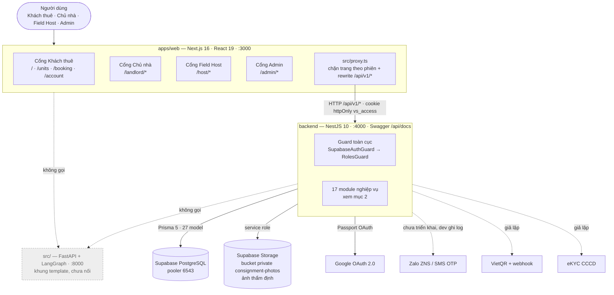
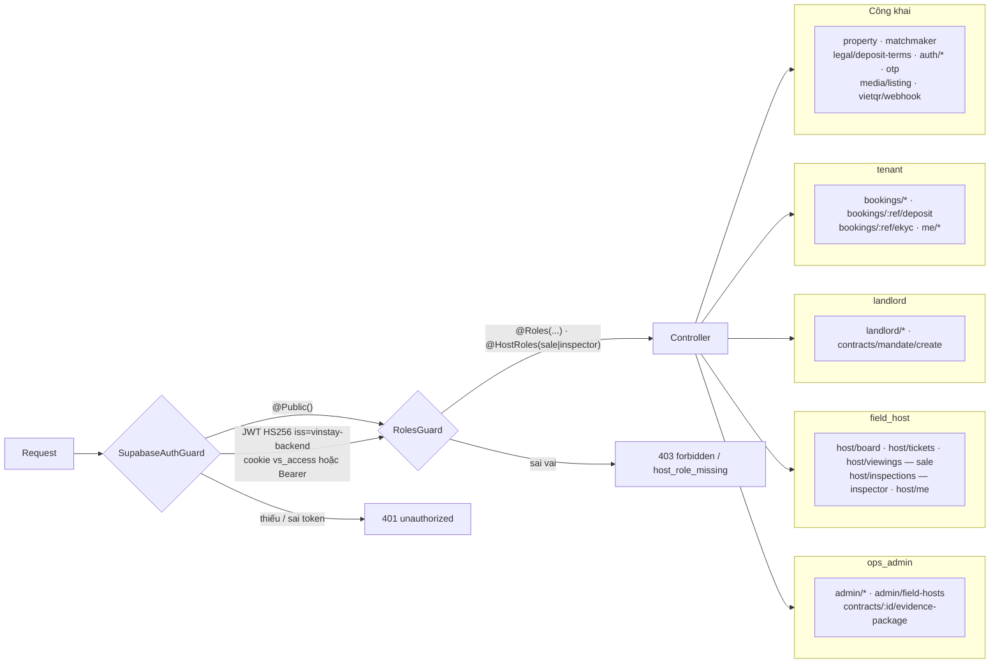
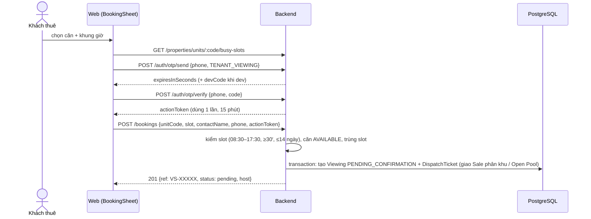
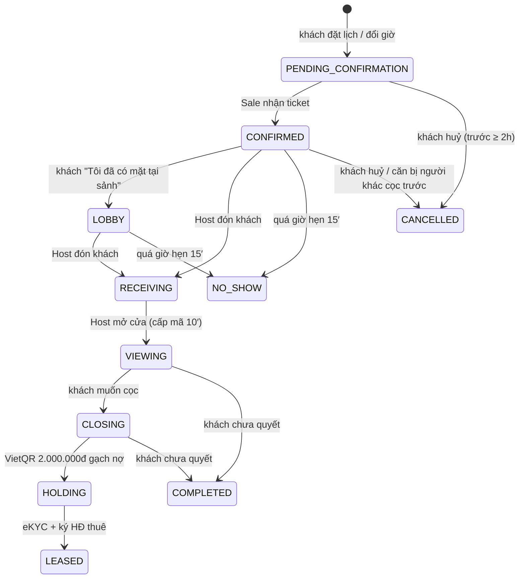
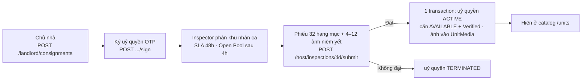

# Architecture Diagram — VinStay AI

Sơ đồ kiến trúc **đúng với mã nguồn hiện tại** (nhánh `main`, 2026-10-04). Kiến trúc mục tiêu và lý do thiết kế nằm ở [`ARCHITECTURE.md`](../ARCHITECTURE.md) và [`docs/SAD_v2.md`](SAD_v2.md); khi hai bên lệch nhau, file này mô tả cái **đã chạy**, hai file kia mô tả cái **định làm**.

Ký hiệu trạng thái dùng trong file: **Thật** = nối dữ liệu thật · **Mô phỏng** = có API nhưng dùng bộ giả lập · **Mock** = dữ liệu cứng trong trình duyệt · **Chưa nối** = có code nhưng không ai gọi.

## 1. Tổng quan hệ thống (container)

| Thành phần | Công nghệ | Trạng thái |
|---|---|---|
| Web 4 cổng | Next.js 16.3, React 19.2, TypeScript, Vitest | Khách thuê, Chủ nhà: **Thật** · Field Host "Lịch & yêu cầu" và "Thẩm định ký gửi": **Thật** · Field Host thu nhập/sổ tay, Admin (trừ `/admin/hosts`): **Mock** |
| Chat "VinStay AI" trang chủ | `interpret()` chạy trong trình duyệt (regex + FAQ soạn sẵn) trên catalog thật | **Mock** — không gọi LLM ([TC-02](qa/TC-02_ai-apartment-qa.md)) |
| Backend API | NestJS 10, Prisma 5, class-validator, Passport, pdfkit | **Thật** |
| Cơ sở dữ liệu | PostgreSQL trên Supabase; nguồn chân lý `backend/prisma/schema.prisma` | **Thật** |
| Lưu ảnh | Supabase Storage (bucket private, link ký 1 giờ) | **Thật** |
| OTP SĐT | `ZaloZnsSender`, `SmsFallbackSender` luôn ném lỗi; `OTP_ECHO_DEV_CODE=true` thì trả `devCode` | **Mô phỏng** (chỉ dev) |
| Cọc VietQR | `VietQrSimulator` + `POST /vietqr/webhook` có header secret | **Mô phỏng** |
| eKYC CCCD | `EkycSimulator` | **Mô phỏng** |
| Redis | Có trong `.env` và `backend/docker-compose.yml` | Khai báo, **code không dùng** |
| AI service | FastAPI + LangGraph (`analyze` → `respond`), `gpt-4o-mini` cấu hình sẵn | **Chưa nối** — node trả chuỗi lặp lại input |

## 2. Backend — module và phân quyền

Module (`backend/src/app.module.ts`): `auth`, `property`, `matchmaker`, `booking`, `dispatch`, `deposit`, `identity`, `contract`, `landlord`, `handover`, `admin`, `account`, `host`, `field-hosts`, `demo`, `host-viewings`, `door`, `inspection` (+ `audit`, `prisma`, `supabase`). Lỗi trả dạng `{success:false, statusCode, code, message, errors}`; thành công bọc `{success:true, statusCode, data}`.

⚠ Đang `@Public` dù tài liệu yêu cầu đăng nhập: `GET /host/earnings`, `GET /handovers/contracts/:id`, `POST /handovers` — xem [BUG-TC04-01](qa/bugs/BUG-TC04-01.md), [BUG-TC04-02](qa/bugs/BUG-TC04-02.md).

## 3. Luồng đặt lịch xem phòng (đã kiểm ở [TC-03](qa/TC-03_booking-e2e.md))

## 4. Vòng đời lịch xem (`ViewingStatus`)

Nguồn: `backend/src/modules/host-viewings/viewing-flow.service.ts`, `booking.service.ts`, `deposit.service.ts`, `identity.service.ts`. `REJECTED` có trong enum nhưng chưa có luồng nào đặt trạng thái này.

Trạng thái căn (`UnitStatus`): `AVAILABLE`, `HOLDING`, `RENTED`, `UNLISTED`, `MAINTENANCE`. Cọc giữ chỗ chuyển 100% vào Tiền cọc bảo đảm khi ký HĐ, không trừ vào tiền thuê tháng đầu (`AGENTS.md`).

## 5. Ký gửi → thẩm định → niêm yết

Không qua bước duyệt Admin; Admin ký gửi (`/admin/inventory`) vẫn là mock.

## 6. Môi trường chạy local

| Tiến trình | Lệnh | Cổng |
|---|---|---|
| Backend | `cd backend && npm run start:dev` | 4000 |
| Web | `cd apps/web && pnpm dev` | 3000 (rewrite `/api/v1/*` → `BACKEND_URL`) |
| AI service (tuỳ chọn) | `make run` | 8000 |

CI (`.github/workflows/ci.yml`) chỉ chạy `ruff` + `pytest` cho `src/`; backend (`npm test`) và web (`pnpm test`) chạy tay.
