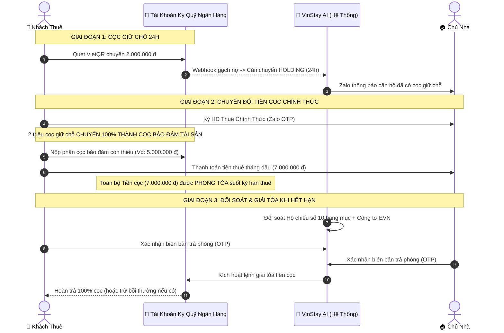

# VINSTAY AI — CHÍNH SÁCH KÝ QUỸ & GIỮ HỘ TIỀN CỌC BẢO ĐẢM TÀI SẢN 3 BÊN (HỢP TÁC NGÂN HÀNG)
*(Số: VSA-POL-ESCROW-2026 • Ban hành theo Nghị định 52/2024/NĐ-CP & Bộ luật Dân sự 2015)*

---

> **MỤC TIÊU CỐT LÕI CỦA CƠ CHẾ KÝ QUỸ 3 BÊN:**  
> VinStay AI thiết lập cơ chế **Ký quỹ Giữ hộ Tiền Cọc Bảo Đảm Tài Sản & Nội Thất (Security Deposit Escrow)** đóng vai trò là "Bên thứ ba trung gian khách quan" (Trustee / Escrow Agent) nhằm:  
> 1. **Triệt tiêu 100% nỗi sợ của Khách thuê:** Không lo bị chủ nhà bắt chẹt, trừ cọc oan vì hao mòn tự nhiên hoặc chây ì không trả lại cọc khi hết hạn.  
> 2. **Bảo vệ toàn vẹn tài sản của Chủ nhà:** Đảm bảo nguồn tiền cọc luôn có sẵn để bù đắp hư hại nội thất hoặc hóa đơn điện nước EVN nợ đọng.  
> 3. **Triệt tiêu 100% động cơ "Cắt cầu" giao dịch ngoài nền tảng:** Buộc mọi giao dịch phải diễn ra trong hệ thống để được hưởng cơ chế bảo chứng tiền cọc.

---

## 1. CĂN CỨ PHÁP LÝ
Chính sách này được xây dựng trên cơ sở tuân thủ nghiêm ngặt các quy định pháp luật Việt Nam hiện hành:
* **Bộ luật Dân sự số 91/2015/QH13:**
  - *Điều 328:* Đặt cọc để bảo đảm giao kết hoặc thực hiện hợp đồng.
  - *Điều 330:* Ký quỹ tại tổ chức tín dụng để bảo đảm thực hiện nghĩa vụ.
  - *Điều 554 – Điều 558:* Hợp đồng gửi giữ tài sản (Xác lập quyền và nghĩa vụ của Bên nhận gửi giữ tài sản).
* **Nghị định số 52/2024/NĐ-CP** ngày 15/05/2024 của Chính phủ về Thanh toán không dùng tiền mặt.
* **Luật các Tổ chức Tín dụng số 32/2024/QH15** (Có hiệu lực từ 01/07/2024).
* **Luật Giao dịch Điện tử số 20/2023/QH15**.

---

## 2. MÔ HÌNH VẬN HÀNH TÀI KHOẢN KÝ QUỸ PHONG TỎA (ESCROW ACCOUNT)

### 2.1. Thiết lập Tài khoản Ký quỹ Định danh Hợp tác Ngân hàng
1. VinStay AI **không lưu giữ tiền cọc trong tài khoản thanh toán chi tiêu thông thường của doanh nghiệp** nhằm tránh rủi ro thuế và vi phạm quy định trung gian thanh toán.
2. Nền tảng hợp tác với Ngân hàng thương mại uy tín (Techcombank / MBBank / BIDV) để mở **Tài khoản Ký quỹ Chuyên dụng Phong tỏa (Dedicated Escrow Custody Account)** mang tên:
   * **Tên tài khoản:** `CONG TY CP CONG NGHE VINSTAY AI - TAI KHOAN KY QUY GIU COC`
   * **Nguyên tắc quản lý:** Tiền trong tài khoản này được tách biệt 100% khỏi dòng tiền vận hành của công ty; ngân hàng chỉ thực hiện lệnh giải tỏa khi có chữ ký số điện tử hợp lệ theo đúng quy trình đã đăng ký.
3. Mỗi căn hộ và hợp đồng thuê được cấp một **Mã định danh tài khoản ảo (Virtual Account Sub-ID)** riêng biệt (Vd: `VSA-ESCROW-S102-12A08`) để tự động gạch nợ và theo dõi số dư tiền cọc độc lập của từng căn.

---

## 3. QUY TRÌNH LUÂN CHUYỂN & CHUYỂN ĐỔI TIỀN CỌC

### 3.1. Chuyển đổi 100% tiền cọc giữ chỗ 24h
* Khoản cọc giữ chỗ **2.000.000 VNĐ** ban đầu chuyển thẳng vào Tài khoản Ký quỹ.
* Khi ký Hợp đồng thuê chính thức, khoản này được **chuyển đổi 100% thành một phần của Tiền Cọc Bảo Đảm Tài Sản & Nội Thất (Security Deposit)**.
* **Quy định tuyệt đối:** Khoản tiền này **KHÔNG ĐƯỢC PHÉP khấu trừ vào tiền thuê tháng đầu tiên**, mà phải giữ nguyên trong quỹ ký quỹ suốt toàn bộ thời hạn thuê.

### 3.2. Nộp phần cọc bảo đảm còn lại
* Trước thời điểm nhận bàn giao nhà, Khách thuê thanh toán nốt phần tiền cọc bảo đảm còn thiếu (thường tương đương 1 tháng tiền thuê - 2 triệu đã cọc) trực tiếp vào Tài khoản Ký quỹ.
* Toàn bộ Tiền Cọc Bảo Đảm Tài Sản (Vd: 7.000.000 VNĐ) được phong tỏa an toàn trong hệ thống ký quỹ của ngân hàng.

---

## 4. QUY CHẾ GIẢI TỎA TIỀN CỌC THÔNG MINH (SMART RELEASE RULES)

Khi Hợp đồng thuê kết thúc hoặc các bên tiến hành thanh lý hợp đồng trước hạn, lệnh giải tỏa tiền cọc từ Tài khoản Ký quỹ chỉ được kích hoạt khi đáp ứng đủ **03 điều kiện bắt buộc**:

### Điều kiện 1: Nghiệm thu Hộ chiếu bàn giao số 10 hạng mục (Timestamp Proof)
* Field Host nội khu cùng Khách thuê thực hiện kiểm tra hiện trạng thực tế 10 hạng mục nội thất đối chiếu với Hộ chiếu bàn giao ban đầu lúc nhận nhà.
* **Nguyên tắc phân định:**
  - *Hao mòn tự nhiên (Chủ nhà chịu):* Các vết mòn thời gian thông thường, sơn ngả màu tự nhiên $\rightarrow$ **Cấm trừ cọc của khách**.
  - *Hư hỏng do bất cẩn (Khách bồi thường):* Rách nệm/sofa, cháy mặt kính bếp, vỡ lavabo, xước sâu sàn gỗ $\rightarrow$ Xác định chi phí sửa chữa/thay thế thực tế.

### Điều kiện 2: Đối soát dứt điểm Hóa đơn Tiền điện nước EVN & Dịch vụ
* Chụp ảnh công tơ điện nước có Timestamp tại thời điểm bàn giao chìa khóa.
* Đối soát dứt điểm hóa đơn tiền điện sinh hoạt EVN bậc thang, tiền nước và phí gửi xe phát sinh.
* Nếu Khách thuê chưa thanh toán, số tiền cước phát sinh sẽ được khấu trừ trực tiếp từ quỹ ký quỹ để thanh toán dứt điểm cho EVN/BQL, đảm bảo **0% nợ cước tồn đọng cho Chủ nhà**.

### Điều kiện 3: Xác thực Chữ ký số OTP kép của Hai Bên
* Hệ thống sinh Bảng Tổng Hợp Quyết Toán Tiền Cọc (Settlement Statement).
* Cả Chủ nhà và Khách thuê cùng bấm nút `[Xác Nhận Quyết Toán]` và nhập mã **Zalo/SMS OTP**.
* Hệ thống tự động kích hoạt API ngân hàng giải tỏa chuyển khoản tức thì trong vòng **60 giây**:
  - Số tiền cọc còn lại chuyển thẳng về tài khoản ngân hàng của Khách thuê.
  - Số tiền bồi thường hư hỏng hoặc tiền điện nước tồn đọng (nếu có) chuyển thẳng vào tài khoản của Chủ nhà/EVN.

---

## 5. CƠ CHẾ TRỌNG TÀI KỸ THUẬT & XỬ LÝ TRANH CHẤP CỌC (DISPUTE SLA)

Nhằm chấm dứt tình trạng tranh chấp kéo dài hoặc một bên chây ì không chịu ký biên bản trả phòng, VinStay AI áp dụng Quy chế Trọng tài Kỹ thuật như sau:

### 5.1. Nguyên tắc Giải tỏa Từng phần (Partial Release Rule)
* Nếu có sự bất đồng về một khoản chi phí bồi thường (Ví dụ: Cọc 7 triệu; Chủ nhà đòi bồi thường 1 triệu vết xước sofa, Khách thuê không đồng ý):
  - **Hệ thống giải tỏa ngay phần không tranh chấp:** 6.000.000 VNĐ lập tức được giải tỏa trả về tài khoản Khách thuê trong 24 giờ.
  - **Phần tranh chấp (1.000.000 VNĐ):** Tiếp tục được phong tỏa tạm thời tại tài khoản ký quỹ trong thời hạn tối đa **15 (mười lăm) ngày** để Hai Bên tiến hành hòa giải.

### 5.2. Trọng tài Kỹ thuật Độc lập của VinStay AI
* Trong thời gian 15 ngày hòa giải, VinStay AI cung cấp hồ sơ giám định kỹ thuật độc lập căn cứ vào:
  - Ảnh góc chụp có mã Hash + Timestamp ban đầu lúc giao nhà.
  - Ảnh hiện trường lúc trả nhà.
  - Khung đơn giá khắc phục tiêu chuẩn của các đơn vị kỹ thuật uy tín tại Ocean Park.
* VinStay AI đưa ra đề xuất hòa giải công tâm dựa trên sự thật khách quan.

### 5.3. Quy tắc Phê duyệt Tự động Quá hạn (Passive Approval SLA - 07 Ngày)
* Để bảo vệ Khách thuê khỏi tình trạng Chủ nhà "im lặng chây ì" không chịu xác nhận trả cọc:
  - Nếu sau **07 (bảy) ngày** kể từ thời điểm Field Host lập Biên bản trả phòng số mà Chủ nhà không có ý kiến phản hồi hoặc không cung cấp được bằng chứng chứng minh hư hại của căn hộ, hệ thống sẽ **tự động kích hoạt cơ chế Giải tỏa cọc cho Khách thuê (Passive Approval)**.

---

## 6. QUẢN TRỊ RỦI RO & BẢO ĐẢM TÀI CHÍNH
1. **Cam kết không trục lợi tài chính:** VinStay AI cam kết không sử dụng quỹ ký quỹ tiền cọc cho bất kỳ hoạt động đầu tư rủi ro, cho vay hoặc chi tiêu nội bộ nào.
2. **Minh bạch sao kê:** Người dùng có quyền tra cứu số dư và trạng thái phong tỏa của khoản tiền cọc của mình thời gian thực 24/7 trên ứng dụng VinStay AI.
3. **Phí quản lý ký quỹ:** Nền tảng miễn phí 100% phí quản trị tài khoản ký quỹ cho cả Chủ nhà và Khách thuê nhằm thúc đẩy giao dịch minh bạch, bền vững.

---

| ĐƠN VỊ ĐIỀU PHỐI NỀN TẢNG | ĐẠI DIỆN KHỐI NGÂN HÀNG KÝ QUỸ |
| :---: | :---: |
| *(Đã ký số điện tử)* | *(Hợp đồng Hợp tác Ký quỹ Quản lý Tài khoản)* |
| **CÔNG TY CỔ PHẦN CÔNG NGHỆ VINSTAY AI** | **NGÂN HÀNG THƯƠNG MẠI ĐỐI TÁC** |
