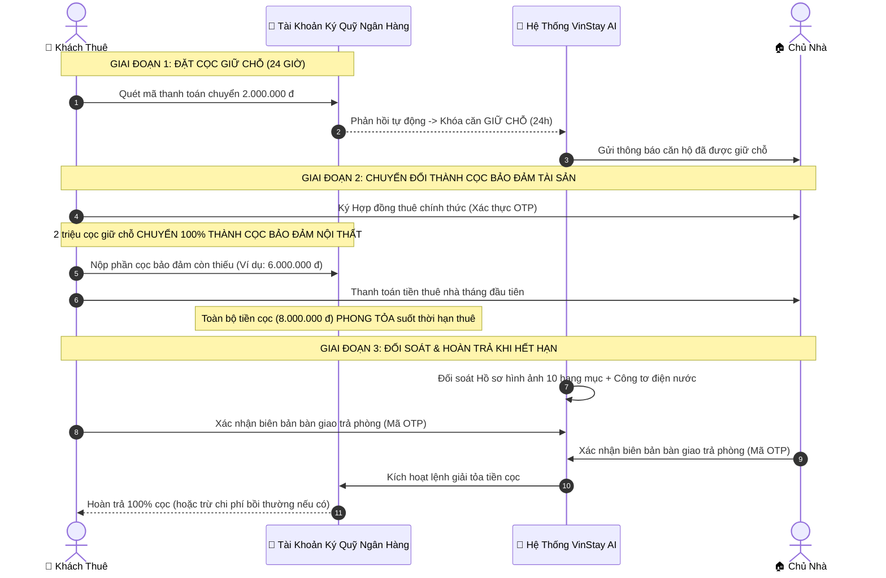

# VINSTAY AI — QUY CHẾ QUẢN LÝ TÀI KHOẢN KÝ QUỸ VÀ GIỮ HỘ TIỀN ĐẶT CỌC BẢO ĐẢM BA BÊN
*(HỢP TÁC CÙNG NGÂN HÀNG THƯƠNG MẠI ĐỐI TÁC)*
*(Số: VSA-POL-ESCROW-2026 • Ban hành căn cứ theo Bộ luật Dân sự 2015 và Nghị định số 52/2024/NĐ-CP)*

---

> **MỤC TIÊU CỐT LÕI CỦA CƠ CHẾ KÝ QUỸ BA BÊN:**  
> VinStay AI thiết lập cơ chế **Ký quỹ giữ hộ tiền đặt cọc bảo đảm tài sản và nội thất** đóng vai trò là tổ chức trung gian khách quan và độc lập nhằm:  
> 1. **Triệt tiêu 100% nỗi sợ của Khách thuê:** Không lo bị chủ nhà ép giá, trừ cọc vô lý đối với các hao mòn tự nhiên, hoặc chậm trễ chây ì hoàn trả tiền cọc khi hết hạn hợp đồng.  
> 2. **Bảo vệ toàn vẹn quyền lợi tài sản của Chủ nhà:** Bảo đảm nguồn tiền cọc luôn sẵn có trong tài khoản phong tỏa để khấu trừ bồi thường hư hại trang thiết bị nội thất hoặc cấn trừ công nợ hóa đơn điện nước phát sinh.  
> 3. **Triệt tiêu hoàn toàn tình trạng giao dịch ngầm ngoài hệ thống:** Ràng buộc mọi giao dịch cho thuê phải thực hiện qua nền tảng để được bảo hộ quyền lợi bằng cơ chế bảo chứng tiền cọc tại ngân hàng.

---

## 1. CĂN CỨ PHÁP LÝ
Quy chế này được ban hành trên cơ sở tuân thủ nghiêm ngặt các quy định pháp luật Việt Nam hiện hành:
* **Bộ luật Dân sự số 91/2015/QH13:**
  - *Điều 328:* Đặt cọc nhằm bảo đảm việc giao kết hoặc thực hiện hợp đồng.
  - *Điều 330:* Ký quỹ tại tổ chức tín dụng để bảo đảm thực hiện nghĩa vụ dân sự.
  - *Điều 554 đến Điều 558:* Hợp đồng gửi giữ tài sản (Xác lập quyền, nghĩa vụ và trách nhiệm bảo quản của bên nhận gửi giữ).
* **Nghị định số 52/2024/NĐ-CP** ngày 15/05/2024 của Chính phủ quy định về thanh toán không dùng tiền mặt.
* **Luật Các tổ chức tín dụng số 32/2024/QH15** (Có hiệu lực thi hành từ ngày 01/07/2024).
* **Luật Giao dịch Điện tử số 20/2023/QH15** ngày 22/06/2023.

---

## 2. MÔ HÌNH VẬN HÀNH TÀI KHOẢN KÝ QUỸ PHONG TỎA TẠI NGÂN HÀNG

### 2.1. Thiết lập Tài khoản Ký quỹ Chuyên dụng
1. VinStay AI **tuyệt đối không lưu giữ tiền đặt cọc trong tài khoản thanh toán chi tiêu thông thường của doanh nghiệp**, nhằm loại trừ rủi ro về thuế và tuân thủ quy định quản lý trung gian thanh toán.
2. Nền tảng hợp tác cùng Ngân hàng thương mại đối tác uy tín để mở **Tài khoản Ký quỹ Chuyên dụng Phong tỏa** với thông tin pháp lý cụ thể:
   * **Tên chủ tài khoản:** `CONG TY CP CONG NGHE VINSTAY AI - TAI KHOAN KY QUY GIU COC`
   * **Nguyên tắc quản lý:** Toàn bộ số tiền trong tài khoản này được tách biệt 100% khỏi dòng tiền hoạt động của doanh nghiệp; phía Ngân hàng chỉ thực hiện lệnh chuyển khoản giải tỏa khi có đầy đủ xác thực chữ ký điện tử hợp lệ của Các Bên theo đúng quy trình đã đăng ký.
3. Mỗi căn hộ và hợp đồng thuê được hệ thống cấp một **Mã định danh tài khoản con chuyên biệt** *(Ví dụ: `VSA-ESCROW-S102-12A08`)* nhằm tự động hạch toán đối soát và quản lý riêng biệt số dư tiền đặt cọc của từng căn hộ.

---

## 3. QUY TRÌNH LUÂN CHUYỂN VÀ CHUYỂN ĐỔI TIỀN ĐẶT CỌC

### 3.1. Chuyển đổi toàn bộ tiền đặt cọc giữ chỗ 24 giờ
* Khoản tiền cọc giữ chỗ ban đầu là **2.000.000 VNĐ (Hai triệu đồng)** được chuyển thẳng vào Tài khoản ký quỹ phong tỏa tại ngân hàng.
* Khi Các Bên tiến hành ký kết Hợp đồng thuê căn hộ chính thức, khoản tiền này được **chuyển đổi 100% thành một phần của Tiền đặt cọc bảo đảm tài sản và trang thiết bị nội thất**.
* **Quy tắc bắt buộc:** Khoản tiền này **TUYỆT ĐỐI KHÔNG ĐƯỢC KHẤU TRỪ vào tiền thuê nhà tháng đầu tiên**, mà phải được lưu giữ nguyên vẹn trong quỹ ký quỹ suốt toàn bộ thời gian thuê.

### 3.2. Nộp bổ sung phần tiền cọc bảo đảm còn lại
* Trước thời điểm chính thức nhận bàn giao căn hộ, Khách thuê có nghĩa vụ nộp đủ phần tiền đặt cọc bảo đảm còn thiếu (thông thường tương đương 01 tháng tiền thuê trừ đi 2 triệu đồng đã cọc giữ chỗ) trực tiếp vào Tài khoản ký quỹ ngân hàng.
* Toàn bộ Tiền đặt cọc bảo đảm tài sản được ngân hàng phong tỏa tuyệt đối an toàn trong suốt thời gian có hiệu lực của hợp đồng thuê.

---

## 4. QUY TRÌNH TỰ ĐỘNG GIẢI TỎA VÀ HOÀN TRẢ TIỀN CỌC KÝ QUỸ

Khi Hợp đồng thuê căn hộ kết thúc thời hạn hoặc Các Bên thỏa thuận chấm dứt hợp đồng trước hạn, lệnh giải tỏa tiền đặt cọc từ Tài khoản ký quỹ chỉ được kích hoạt khi đáp ứng đầy đủ **03 điều kiện bắt buộc**:

### Điều kiện 1: Nghiệm thu Hồ sơ bàn giao hiện trạng 10 hạng mục có dấu thời gian
* Nhân sự tiếp đón nội khu cùng Khách thuê tiến hành kiểm tra thực tế hiện trạng 10 hạng mục trang thiết bị nội thất đối chiếu trực tiếp với Hồ sơ bàn giao số hóa đã lập lúc nhận nhà.
* **Nguyên tắc phân định trách nhiệm tài chính:**
  - *Hao mòn tự nhiên (Chủ nhà chịu trách nhiệm):* Các dấu hiệu phai màu sơn tự nhiên, hao mòn sử dụng thông thường theo thời gian $\rightarrow$ **Nghiêm cấm khấu trừ tiền cọc của khách thuê**.
  - *Hư hại do lỗi bất cẩn hoặc sử dụng sai quy cách (Khách thuê bồi thường):* Rách nệm, hỏng sofa, vỡ mặt kính bếp, nứt vỡ sứ vệ sinh, trầy xước sâu sàn gỗ $\rightarrow$ Xác định chính xác chi phí sửa chữa hoặc thay mới theo thực tế.

### Điều kiện 2: Đối soát dứt điểm Hóa đơn tiền điện, nước sinh hoạt và phí dịch vụ
* Chụp ảnh chỉ số công tơ điện và đồng hồ nước sinh hoạt có gắn dấu thời gian điện tử tại thời điểm khách thuê bàn giao lại chìa khóa.
* Đối soát dứt điểm hóa đơn tiền điện sinh hoạt bậc thang EVN, tiền nước và phí gửi phương tiện phát sinh trong kỳ sử dụng cuối cùng.
* Trường hợp Khách thuê chưa thanh toán, các khoản cước phí dịch vụ này sẽ được khấu trừ trực tiếp từ quỹ tiền cọc ký quỹ để thanh toán dứt điểm cho đơn vị cung cấp, bảo đảm **Chủ nhà hoàn toàn không bị nợ cước tồn đọng (0% nợ đọng)**.

### Điều kiện 3: Xác thực Chữ ký điện tử hai bên bằng mã xác thực một lần (OTP)
* Hệ thống tự động tạo lập **Bảng tổng hợp quyết toán và thanh lý tiền cọc**.
* Cả Chủ nhà và Khách thuê cùng kiểm tra nội dung, bấm xác nhận và nhập mã xác thực một lần (OTP) gửi về số điện thoại chính chủ.
* Hệ thống tự động gửi lệnh giải tỏa đến ngân hàng đối tác thực hiện chuyển khoản tự động trong vòng **60 giây**:
  - Số tiền cọc còn lại được chuyển hoàn trả thẳng về tài khoản ngân hàng của Khách thuê.
  - Số tiền bồi thường hư hại hoặc cấn trừ tiền cước dịch vụ (nếu có) được chuyển thẳng vào tài khoản của Chủ nhà hoặc đơn vị cung cấp dịch vụ.

---

## 5. CƠ CHẾ TRỌNG TÀI KỸ THUẬT VÀ THỜI HẠN GIẢI QUYẾT TRANH CHẤP TIỀN CỌC

Nhằm tránh việc phát sinh tranh chấp kéo dài hoặc một bên chây ì cố tình không ký biên bản bàn giao trả phòng, VinStay AI áp dụng Quy chế trọng tài kỹ thuật như sau:

### 5.1. Nguyên tắc Giải tỏa từng phần đối với số tiền không có tranh chấp
* Trường hợp phát sinh bất đồng về một khoản chi phí bồi thường cụ thể *(Ví dụ: Tổng tiền cọc là 8 triệu đồng; Chủ nhà yêu cầu bồi thường 1 triệu đồng cho vết xước bàn, Khách thuê không đồng ý)*:
  - **Giải tỏa ngay phần tiền không có tranh chấp:** Số tiền 7.000.000 VNĐ lập tức được giải tỏa hoàn trả về tài khoản Khách thuê trong vòng 24 giờ.
  - **Khoản tiền đang có bất đồng (1.000.000 VNĐ):** Tiếp tục được phong tỏa tạm thời tại tài khoản ký quỹ trong thời hạn tối đa **15 (mười lăm) ngày** để Các Bên tiến hành hòa giải thương lượng.

### 5.2. Vai trò Trọng tài Kỹ thuật Độc lập của VinStay AI
* Trong thời hạn 15 ngày hòa giải, VinStay AI cung cấp hồ sơ kiểm định kỹ thuật khách quan căn cứ vào:
  - Hình ảnh góc chụp có mã băm bảo mật và dấu thời gian điện tử lúc nhận nhà ban đầu.
  - Hình ảnh hiện trường thực tế lúc trả phòng.
  - Khung đơn giá sửa chữa tiêu chuẩn từ danh bạ thợ kỹ thuật uy tín tại Khu đô thị Vinhomes Ocean Park.
* VinStay AI đưa ra biên bản đánh giá trung thực làm cơ sở để Hai Bên thống nhất dứt điểm.

### 5.3. Quy tắc Phê duyệt mặc định tự động sau 07 ngày làm việc
* Để bảo vệ quyền lợi Khách thuê trước tình trạng Chủ nhà không phản hồi hoặc chậm trễ giải quyết trả cọc:
  - Nếu sau thời hạn **07 (bảy) ngày làm việc** kể từ thời điểm nhân sự tiếp đón lập Biên bản bàn giao trả phòng mà Bên A không có ý kiến phản hồi bằng văn bản hoặc không cung cấp được chứng cứ chứng minh thiệt hại thực tế của căn hộ, hệ thống sẽ **tự động phê duyệt giải tỏa toàn bộ số tiền cọc hoàn trả cho Khách thuê**.

---

## 6. QUẢN TRỊ RỦI RO VÀ NGUYÊN TẮC MINH BẠCH TÀI CHÍNH
1. **Cam kết không sử dụng quỹ ký quỹ sai mục đích:** VinStay AI cam kết tuyệt đối không sử dụng số dư tiền cọc ký quỹ cho bất kỳ mục đích kinh doanh, đầu tư sinh lời, cho vay hoặc chi tiêu nội bộ nào của doanh nghiệp.
2. **Minh bạch sao kê biến động:** Chủ nhà và Khách thuê có quyền tra cứu số dư và trạng thái phong tỏa của khoản tiền cọc của mình theo thời gian thực 24/7 trực tiếp trên ứng dụng của VinStay AI.
3. **Miễn phí quản lý tài khoản ký quỹ:** VinStay AI miễn phí 100% phí quản lý và duy trì tài khoản ký quỹ cho cả Chủ nhà và Khách thuê nhằm xây dựng môi trường giao dịch văn minh, tin cậy và bền vững.

---

| ĐƠN VỊ VẬN HÀNH NỀN TẢNG | ĐẠI DIỆN NGÂN HÀNG THƯƠNG MẠI ĐỐI TÁC |
| :---: | :---: |
| *(Đã xác thực chữ ký số điện tử)* | *(Hợp đồng Hợp tác Dịch vụ Ký quỹ Tài khoản)* |
| **CÔNG TY CỔ PHẦN CÔNG NGHỆ VINSTAY AI** | **NGÂN HÀNG THƯƠNG MẠI ĐỐI TÁC** |
