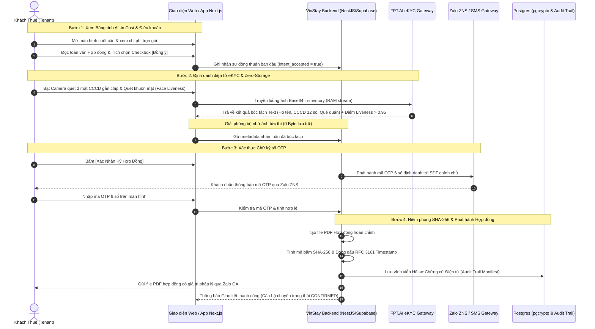

# ĐẶC TẢ QUY TRÌNH GIAO KẾT ĐIỆN TỬ & CẤU TRÚC GÓI CHỨNG CỨ SỐ
### (ELECTRONIC FORMATION WORKFLOW & EVIDENCE MANIFEST SPECIFICATION)
*Mã tài liệu: VSA-TECH-EVIDENCE-2026 • Phiên bản: 2.0 (Dynamic Deposit & Zero-Storage Standard)*  
*Dành cho: Kỹ sư Phần mềm (Fullstack/DevOps), Kiểm toán viên Hệ thống, Quản trị viên (Admin) và Cố vấn Pháp lý*

---

## 1. TỔNG QUAN KIẾN TRÚC KỸ THUẬT - PHÁP LÝ (LEGAL-TECH STACK)
Hệ thống giao kết hợp đồng điện tử của VinStay AI được thiết kế theo mô hình **Zero-Storage Sovereign Evidence Architecture**:
* **Lớp Ứng dụng Giao diện (Frontend Layer):** Next.js 14 App Router, tối ưu hóa giao diện di động (Mobile-First) và tích hợp Zalo Mini App SDK.
* **Lớp Xử lý Định danh (Identity Layer):** FPT.AI eKYC API (FPT Smart Cloud) bóc tách dữ liệu CCCD gắn chip kết hợp Face Liveness Detection cấp độ ngân hàng; cơ chế luân chuyển dữ liệu in-memory trên RAM (0 byte ảnh lưu trên ổ đĩa).
* **Lớp Xác thực OTP (Authentication Layer):** Zalo Notification Service (Zalo ZNS) / SMS Brandname qua đối tác viễn thông được cấp phép.
* **Lớp Lưu trữ Chứng cứ (Evidence Storage Layer):** Supabase PostgreSQL với mã hóa `pgcrypto` AES-256 cho dữ liệu văn bản nhạy cảm, mã băm SHA-256 và nhãn thời gian RFC 3161 Timestamp.
* **Lớp Quản trị Đầu vào (Admin Control Layer):** Admin Portal cho phép Quản trị viên phê duyệt niêm yết căn hộ và thiết lập **Mức cọc giữ chỗ linh hoạt (Dynamic Holding Deposit)** phù hợp với từng layout và phân khu.

---

## 2. QUẢN TRỊ MỨC CỌC GIỮ CHỖ LINH HOẠT TRÊN TRANG DỮ LIỆU CĂN HỘ ĐẦU VÀO

> [!IMPORTANT]
> **THIẾT KẾ CSDL & NGHIỆP VỤ: DYNAMIC HOLDING DEPOSIT DO ADMIN QUẢN LÝ**

Để không bị gò bó bởi một con số cố định và thích ứng linh hoạt với đa dạng loại hình bất động sản tại Ocean Park (từ căn hộ Studio tối giản đến căn 3PN cao cấp tại The Zenpark hay Masteri Waterfront), hệ thống thiết kế trường dữ liệu cấu hình cọc tại bảng `units`:

### 2.1. Cấu trúc trường dữ liệu bảng `units` (PostgreSQL / Prisma Schema):
```sql
ALTER TABLE units ADD COLUMN IF NOT EXISTS holding_deposit_amount NUMERIC(12, 2) DEFAULT 2000000;
ALTER TABLE units ADD COLUMN IF NOT EXISTS holding_deposit_policy VARCHAR(50) DEFAULT 'DYNAMIC_ADMIN_CONTROLLED';
ALTER TABLE units ADD COLUMN IF NOT EXISTS admin_approved_by UUID REFERENCES auth.users(id);
ALTER TABLE units ADD COLUMN IF NOT EXISTS admin_approved_at TIMESTAMPTZ;
```

### 2.2. Khung mức cọc tham chiếu chuẩn hóa được Admin phê duyệt:
| Phân khu & Quy chuẩn Layout | Mức Cọc Giữ Chỗ Mặc Định (`holding_deposit_amount`) | Mức Biến Thiên Cho Phép (Admin Cấu Hình) | Tỷ lệ Cọc Bảo Đảm Tài Sản (Security Deposit) |
| :--- | :---: | :---: | :---: |
| **Sapphire (Studio / 1PN+)** | **2.000.000 VNĐ** | 1.500.000 – 2.500.000 VNĐ | 01 tháng tiền thuê cơ bản |
| **Sapphire (2PN_1WC / 2PN_2WC)** | **2.500.000 VNĐ** | 2.000.000 – 3.500.000 VNĐ | 01 tháng tiền thuê cơ bản |
| **Sapphire (3PN) / The Pavilion** | **3.000.000 VNĐ** | 2.500.000 – 4.000.000 VNĐ | 01 – 02 tháng tiền thuê cơ bản |
| **The Zenpark / The Tonkin (Ruby)** | **3.500.000 VNĐ** | 3.000.000 – 5.000.000 VNĐ | 02 tháng tiền thuê cơ bản |
| **Masteri Waterfront (Cao cấp)** | **5.000.000 VNĐ** | 4.000.000 – 10.000.000 VNĐ | 02 tháng tiền thuê cơ bản |

* **Luồng vận hành Admin:**
  1. Khi tiếp nhận căn hộ ký gửi, hệ thống tự động gợi ý mức cọc theo bảng chuẩn trên.
  2. Quản trị viên (Admin) xem xét giá trị nội thất thực tế trên hệ thống và có quyền điều chỉnh mức cọc `holding_deposit_amount` trong phạm vi cho phép trước khi bấm nút *"Phê duyệt Niêm Yết"*.
  3. Giá trị `holding_deposit_amount` sau khi được Admin phê duyệt sẽ được nạp tự động vào mã VietQR động NAPAS 247 và tự động điền vào Điều 5 của Hợp đồng điện tử.

---

## 3. ĐẶC TẢ LUỒNG GIAO KẾT 4 BƯỚC TRÊN GIAO DIỆN NGƯỜI DÙNG (UX/UI FLOW)



---

## 4. CẤU TRÚC JSON CHUẨN CỦA GÓI CHỨNG CỨ SỐ (EVIDENCE MANIFEST)

Hồ sơ chứng cứ điện tử được lưu trữ trong bảng `signing_audit_trails` của cơ sở dữ liệu. Dưới đây là cấu trúc JSON Payload chuẩn mực đáp ứng yêu cầu thẩm định của Tòa án:

```json
{
  "$schema": "https://vinstay.ai/schemas/legal-evidence-manifest-v2.json",
  "contract_id": "VSA-LEASE-S102-12A08-2026",
  "master_terms_version": "2.0-DYNAMIC-DEPOSIT",
  "generated_at": "2026-09-26T12:30:00.125+07:00",
  "unit_metadata": {
    "unit_id": "u-s102-12a08",
    "building": "S1.02",
    "floor": 12,
    "room_number": "12A08",
    "subdivision": "The Sapphire 1",
    "project": "Vinhomes Ocean Park, Gia Lâm, Hà Nội",
    "base_rent_monthly": 8500000,
    "holding_deposit_amount": 2500000,
    "holding_deposit_policy": "DYNAMIC_ADMIN_CONTROLLED",
    "admin_approved_by": "adm-0912-duynk",
    "admin_approved_at": "2026-09-25T14:20:00+07:00"
  },
  "parties": {
    "landlord": {
      "full_name": "NGUYỄN VĂN AN",
      "id_masked": "00108500****",
      "phone_masked": "0983***123",
      "mandate_ref": "VSA-MANDATE-S102-12A08",
      "signing_method": "EXCLUSIVE_MANDATE_DIGITAL_OTP",
      "verified_at": "2026-09-20T09:15:22+07:00"
    },
    "tenant": {
      "ekyc_verification": {
        "provider": "FPT.AI Smart Cloud",
        "ekyc_transaction_id": "fpt-ekyc-tx-9948271038",
        "full_name": "TRẦN THỊ HỒNG NHUNG",
        "id_card_number": "038198005432",
        "date_of_birth": "1998-05-14",
        "gender": "NỮ",
        "permanent_address": "Xã Đa Tốn, Huyện Gia Lâm, TP. Hà Nội",
        "issue_date": "2022-08-10",
        "issue_place": "Cục Cảnh sát QLHC về TTXH",
        "liveness_check_passed": true,
        "liveness_score": 0.9842,
        "face_match_score": 0.9615,
        "zero_storage_compliance": "CONFIRMED_0_BYTE_IMAGE_STORED"
      },
      "clickwrap_acceptance": {
        "checkbox_id": "chk_agree_master_terms",
        "checkbox_label_hash": "a1f94d93c1537233898126b89e7e7b6d5f7d23a41e976694ec1741df74a0129f",
        "user_clicked_at": "2026-09-26T12:28:45.312+07:00"
      },
      "otp_signature": {
        "channel": "ZALO_ZNS",
        "message_id": "zns-msg-882736192",
        "phone_hash": "e9b282c0926d2e617d5267b0b2e8e3d6f1a8e9b282c0926d2e617d5267b0b2e8",
        "phone_display": "0912 *** 678",
        "otp_issued_at": "2026-09-26T12:28:50.000+07:00",
        "otp_verified_at": "2026-09-26T12:29:18.420+07:00",
        "attempt_count": 1,
        "status": "VERIFIED_SUCCESS"
      }
    }
  },
  "technical_audit_trail": {
    "client_ip_address": "113.190.234.82",
    "ip_location_lookup": "Hà Nội, Vietnam",
    "client_user_agent": "Mozilla/5.0 (iPhone; CPU iPhone OS 17_5 like Mac OS X) AppleWebKit/605.1.15 (KHTML, like Gecko) Mobile/15E148 ZaloTheme/Light Zalo/24.05.01",
    "device_fingerprint": "dev-fp-8a7c6b5d4e3f2a1b",
    "gps_geofence": {
      "latitude": 20.993412,
      "longitude": 105.942187,
      "accuracy_meters": 12.5,
      "verified_within_ocean_park": true
    }
  },
  "cryptographic_sealing": {
    "pdf_file_name": "VSA_LEASE_S102_12A08_SIGNED.pdf",
    "pdf_sha256_hash": "c48b299e5250493bc6fb05d911c00e12d53ef6f7bb63473f85e492b4506300a8",
    "rfc3161_timestamp_token": "MIAGCSqGSIb3DQEHAqCAMACAQExDzANBglghkgBZQMEAgEFAD...",
    "tsa_authority": "VNPT-CA / Viettel Timestamp Authority",
    "integrity_status": "SEALED_TAMPER_PROOF"
  }
}
```

---

## 5. CODE MẪU KIỂM TRA TÍNH TOÀN VẸN CHỨNG CỨ (INTEGRITY VERIFICATION SCRIPT)

Đoạn mã mẫu viết bằng Node.js / TypeScript cho phép Đội ngũ Kỹ thuật hoặc Kiểm toán viên độc lập xác minh tính toàn vẹn của tệp Hợp đồng PDF so với mã băm niêm phong lưu trong cơ sở dữ liệu:

```typescript
import * as crypto from "crypto";
import * as fs from "fs";

/**
 * Hàm xác minh tính toàn vẹn của Hợp đồng điện tử VinStay AI
 * @param filePath Đường dẫn file PDF hợp đồng tải về
 * @param expectedHash Chuỗi băm SHA-256 lưu trong Gói chứng cứ điện tử
 * @returns boolean Kết quả khớp hoàn toàn (true) hay đã bị can thiệp sửa đổi (false)
 */
export function verifyContractIntegrity(filePath: string, expectedHash: string): boolean {
  if (!fs.existsSync(filePath)) {
    throw new Error(`Tệp hợp đồng không tồn tại tại đường dẫn: ${filePath}`);
  }

  const fileBuffer = fs.readFileSync(filePath);
  const hashSum = crypto.createHash("sha256");
  hashSum.update(fileBuffer);
  const actualHash = hashSum.digest("hex").toLowerCase();

  const isMatch = actualHash === expectedHash.toLowerCase();

  console.log("--------------------------------------------------");
  console.log("KẾT QUẢ KIỂM ĐỊNH TOÀN VẸN CHỨNG CỨ ĐIỆN TỬ:");
  console.log(`• Tệp kiểm tra:     ${filePath}`);
  console.log(`• Mã băm thực tế:   ${actualHash}`);
  console.log(`• Mã băm niêm phong: ${expectedHash}`);
  console.log(`• Trạng thái:       ${isMatch ? "✅ HỢP LỆ — NGUYÊN BẢN TUYỆT ĐỐI" : "❌ CẢNH BÁO — DỮ LIỆU ĐÃ BỊ SỬA ĐỔI"}`);
  console.log("--------------------------------------------------");

  return isMatch;
}
```

---

## 6. HƯỚNG DẪN TÍCH HỢP CHO LẬP TRÌNH VIÊN (DEVELOPER INTEGRATION GUIDE)
1. **Frontend (`apps/web`):**
   * Sử dụng component `BookingSheet.tsx` hoặc `ContractWizard.tsx` để render giao diện tích chọn Checkbox Điều khoản.
   * Checkbox bắt buộc đặt cờ `required: true`; người dùng không thể bấm tiếp tục nếu chưa cuộn xem hoặc chưa tích chọn.
2. **Backend API (`apps/api` hoặc Supabase Edge Functions):**
   * Endpoint `POST /api/v1/leases/initiate`: Khởi tạo luồng giao kết, nạp `holding_deposit_amount` từ bảng `units`.
   * Endpoint `POST /api/v1/leases/verify-ekyc`: Tiếp nhận payload OCR từ FPT.AI, bóc tách text và hủy ngay buffer ảnh.
   * Endpoint `POST /api/v1/leases/submit-otp`: Xác thực OTP, sinh file PDF, đóng dấu băm SHA-256 và lưu JSON Audit Trail.
