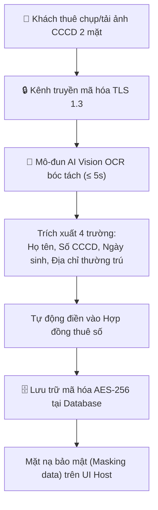

# VINSTAY AI — CHÍNH SÁCH BẢO VỆ DỮ LIỆU CÁ NHÂN & ĐỒNG THUẬN BÓC TÁCH AI VISION OCR CCCD
*(DÀNH CHO KHÁCH THUÊ • BƯỚC 3 TRONG KHUNG PHÁP LÝ KHÁCH HÀNG)*
*(Số: VSA-TENANT-03-PRIVACY-2026 • Tuân thủ Nghị định 13/2023/NĐ-CP & Luật Căn cước 2023)*

---

## 1. MỤC ĐÍCH & CĂN CỨ PHÁP LÝ
Văn bản này quy định chi tiết về việc thu thập, bóc tách, mã hóa và bảo vệ dữ liệu Căn cước công dân (CCCD) gắn chip của **Khách Thuê** thông qua công nghệ trí tuệ nhân tạo (AI Vision OCR) trên nền tảng VinStay AI nhằm bảo đảm an toàn thông tin tuyệt đối và tuân thủ nghiêm ngặt các văn bản pháp luật:
* **Nghị định số 13/2023/NĐ-CP** ngày 17/04/2023 của Chính phủ về Bảo vệ Dữ liệu Cá nhân;
* **Luật Căn cước số 26/2023/QH15** (Có hiệu lực từ 01/07/2024);
* **Luật Giao dịch Điện tử số 20/2023/QH15**;
* **Luật An ninh Mạng số 24/2018/QH14**.

---

## 2. NGUY CƠ THỰC TẾ CỦA KHÁCH THUÊ & CAM KẾT BẢO VỆ CỦA VINSTAY AI

### 2.1. Nỗi sợ thực tế của người đi thuê nhà
Khách thuê trên thị trường truyền thống thường xuyên phải gửi ảnh CCCD qua Zalo cho môi giới tự do và đối mặt với các nguy cơ:
* Bị rò rỉ ảnh CCCD 2 mặt sang các nhóm mua bán data ngầm.
* Bị kẻ xấu lợi dụng thông tin CCCD gắn chip để đăng ký vay tiền qua app tín dụng đen, mở tài khoản ngân hàng "rác", hoặc đăng ký sim không chính chủ.
* Bị môi giới spam cuộc gọi chào mời bất động sản dồn dập.

### 2.2. Cam kết pháp lý bảo vệ của VinStay AI
1. **Cam kết không trung chuyển qua môi giới tự do:** Ảnh CCCD của Khách thuê tải lên ứng dụng VinStay AI đi thẳng vào cổng xử lý bảo mật; Field Host nội khu **không được phép lưu trữ ảnh CCCD trên điện thoại cá nhân**.
2. **Cam kết không chia sẻ cho bên thứ ba:** VinStay AI cam kết **tuyệt đối không bán, không cho thuê, không chia sẻ** dữ liệu CCCD và số điện thoại của Khách thuê cho bất kỳ đơn vị quảng cáo, môi giới bên ngoài hay bên thứ ba nào khi chưa có sự đồng thuận bằng văn bản của Khách thuê.

---

## 3. QUY TRÌNH BÓC TÁCH AI VISION OCR TRONG BỘ NHỚ BẢO MẬT



### 3.1. Các trường dữ liệu được trích xuất
Mô-đun AI Vision OCR chỉ tiến hành bóc tách đúng **04 trường thông tin cơ bản** phục vụ xác lập hợp đồng:
1. **Họ và tên:** Viết in hoa có dấu (Vd: `TRẦN ANH QUÂN`).
2. **Số định danh cá nhân (Số CCCD):** Chuỗi 12 chữ số.
3. **Ngày sinh & Giới tính:** Phục vụ thẩm định năng lực hành vi dân sự.
4. **Nơi thường trú:** Ghi nhận địa chỉ cư trú hợp pháp của Khách thuê.

### 3.2. Tiêu chuẩn mã hóa cấp độ doanh nghiệp (AES-256 + TLS 1.3)
1. **Dữ liệu truyền tải (Data in Transit):** Toàn bộ hình ảnh truyền từ thiết bị của Khách thuê lên máy chủ bắt buộc qua giao thức mã hóa đường truyền an toàn **HTTPS/TLS 1.3**.
2. **Dữ liệu lưu trữ (Data at Rest):** Ảnh gốc CCCD và số CCCD được mã hóa bằng chuẩn mật mã học **AES-256** tại cơ sở dữ liệu Supabase/PostgreSQL. Khóa giải mã (Encryption Key) được quản lý độc lập tại máy chủ an ninh Key Management Service (KMS).
3. **Mặt nạ dữ liệu hiển thị (Data Masking):** Trên màn hình ứng dụng của Field Host và trang thông tin chung, số CCCD được ẩn 6 số giữa (Vd: `001095******`), số điện thoại ẩn 4 số giữa (Vd: `0912***678`).

---

## 4. GIỚI HẠN MỤC ĐÍCH XỬ LÝ DỮ LIỆU (PURPOSE LIMITATION)
VinStay AI chỉ sử dụng thông tin CCCD của Khách thuê cho đúng **02 mục đích hợp pháp duy nhất**:
1. **Mục đích 1:** Tự động điền thông tin nhân thân vào Thỏa thuận đặt cọc giữ chỗ và Hợp đồng thuê căn hộ số hóa, bảo đảm tính xác thực của chủ thể ký kết hợp đồng theo Luật Giao dịch Điện tử 2023.
2. **Mục đích 2:** Hỗ trợ Chủ nhà và Khách thuê thực hiện thủ tục khai báo **Đăng ký tạm trú trực tuyến** trên Cổng Dịch vụ công Quản lý Cư trú của Bộ Công an theo đúng quy định tại Luật Cư trú 2020.

---

## 5. CÁC QUYỀN HỢP PHÁP CỦA KHÁCH THUÊ ĐỐI VỚI DỮ LIỆU CÁ NHÂN
Căn cứ Điều 9 Nghị định 13/2023/NĐ-CP, Khách thuê tại VinStay AI được bảo đảm toàn vẹn các quyền sau:

1. **Quyền được biết & Quyền đồng thuận:** Được thông báo rõ ràng trước khi tải ảnh và có quyền chủ động bấm đồng ý hoặc từ chối cung cấp.
2. **Quyền truy cập & Chỉnh sửa:** Khách thuê có quyền xem lại và hiệu chỉnh thông tin nếu AI OCR bóc tách có sai lệch ký tự trước khi bấm ký số hợp đồng.
3. **Quyền yêu cầu Xóa bỏ Dữ liệu (Right to Erasure / Quyền được lãng quên):**
   * Sau khi Hợp đồng thuê nhà kết thúc và Các Bên hoàn tất thủ tục bàn giao, thanh lý cọc và quyết toán dứt điểm công nợ:
   * Khách thuê có quyền bấm nút **`[Yêu Cầu Xóa Ảnh CCCD]`** trên ứng dụng. VinStay AI có trách nhiệm xóa vĩnh viễn tệp ảnh gốc CCCD khỏi hệ thống lưu trữ điện toán đám mây trong vòng **03 (ba) ngày làm việc** (chỉ lưu trữ bản ghi số hóa của Hợp đồng đã ký theo thời hạn lưu trữ hồ sơ kế toán/pháp lý quy định của pháp luật).

---

## 6. ĐỒNG THUẬN ĐIỆN TỬ CỦA KHÁCH THUÊ (EXPLICIT USER CONSENT)
Trước khi máy ảnh/khung tải ảnh CCCD được kích hoạt trên ứng dụng VinStay AI, màn hình hiển thị hộp thoại đồng thuận với nội dung:

```
┌─────────────────────────────────────────────────────────────────────────────────────────┐
│                    ĐỒNG THUẬN XỬ LÝ DỮ LIỆU CÁ NHÂN THEO NĐ 13/2023/NĐ-CP                │
│                                                                                         │
│ [x] Tôi xác nhận đã đọc, hiểu rõ và tự nguyện đồng ý cho VinStay AI sử dụng công nghệ   │
│     AI Vision OCR để bóc tách thông tin từ ảnh CCCD gắn chip 2 mặt của tôi nhằm mục đích│
│     lập Hợp đồng thuê căn hộ và đăng ký tạm trú.                                        │
│                                                                                         │
│ [x] Tôi hiểu rằng ảnh CCCD của tôi được mã hóa an toàn AES-256 và tuyệt đối không bị     │
│     chia sẻ cho bất kỳ môi giới tự do bên ngoài nào.                                    │
│                                                                                         │
│                       [TIẾP TỤC CHỤP ẢNH CCCD]   [HỦY BỎ]                               │
└─────────────────────────────────────────────────────────────────────────────────────────┘
```
*Hành động tích chọn đồng thuận và nhập mã xác thực OTP Zalo/SMS được ghi nhận thành bản ghi chứng thực điện tử (Consent Audit Trail) có lưu địa chỉ IP và dấu vết thời gian Timestamp.*
