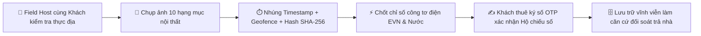
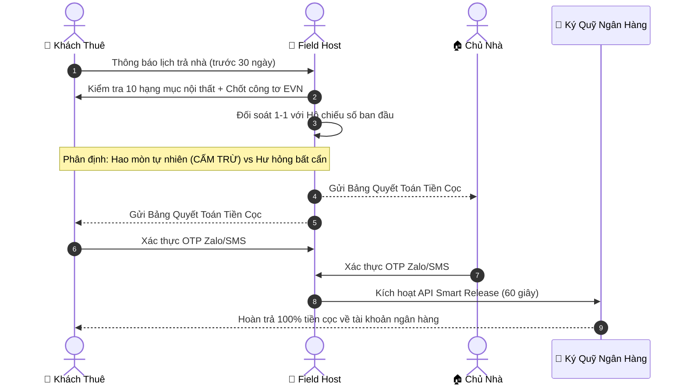

# VINSTAY AI — QUY TRÌNH BÀN GIAO, QUẢN LÝ LƯU TRÚ & QUYẾT TOÁN HOÀN CỌC
*(DÀNH CHO KHÁCH THUÊ • BƯỚC 6 TRONG KHUNG PHÁP LÝ KHÁCH HÀNG)*
*(Số: VSA-TENANT-06-SETTLEMENT-2026 • Căn cứ Điều 479, 482 Bộ luật Dân sự 2015 & Nội quy BQL Vinhomes)*

---

## 1. MỤC ĐÍCH & PHẠM VI ÁP DỤNG
Quy chế này quy định toàn bộ chu trình thực địa và đối soát pháp lý từ thời điểm **Khách Thuê nhận bàn giao căn hộ (Check-in)**, **quá trình sinh sống tuân thủ nội quy đô thị (In-stay)**, cho đến khi **trả nhà, đối soát Hộ chiếu số và giải tỏa hoàn tiền cọc ký quỹ (Check-out)** tại Đại đô thị Vinhomes Ocean Park.

---

## 2. GIAI ĐOẠN 1: NHẬN NHÀ & LẬP HỘ CHIẾU BÀN GIAO SỐ (DIGITAL HANDOVER PASSPORT)

### 2.1. Danh mục 10 hạng mục kiểm định trọng yếu
Tại thời điểm giao nhận chìa khóa/mã mở cửa, Field Host nội khu cùng Khách thuê kiểm tra chi tiết và chụp ảnh định danh 10 hạng mục:
1. **Sơn tường:** Tình trạng tường các phòng (sạch sẽ, không bong tróc, không vết ố).
2. **Sàn gỗ & Sàn gạch:** Độ phẳng, không phồng rộp do ngấm nước, không xước sâu.
3. **Sofa & Bàn trà phòng khách:** Chất liệu da/nỉ nguyên vẹn, không rách, không lún sụt khung.
4. **Hệ thống Điều hòa (Daikin/Multi):** Hoạt động làm mát sâu, điều khiển nhạy, không rỉ nước.
5. **Hệ thống Bếp & Hút mùi:** Mặt kính bếp từ không nứt vỡ, máy hút mùi hoạt động êm ái.
6. **Thiết bị vệ sinh (Kohler/Toto):** Bồn cầu, lavabo, vòi sen hoạt động tốt, không rò rỉ nước.
7. **Tủ lạnh & Thiết bị điện gia dụng:** Làm lạnh tốt, sạch sẽ, không mùi hôi.
8. **Giường, Nệm & Tủ quần áo:** Khung giường chắc chắn, nệm có bọc bảo vệ, cánh tủ trơn tru.
9. **Hệ thống Rèm cửa:** Rèm 2 lớp sạch sẽ, thanh ray kéo nhẹ nhàng.
10. **Chỉ số công tơ điện nước ban đầu:** Ảnh chụp rõ nét chỉ số điện tử EVN và đồng hồ nước sinh hoạt.

### 2.2. Giá trị pháp lý của Hộ chiếu bàn giao số
1. Toàn bộ hình ảnh kiểm định được hệ thống nhúng **Timestamp (Thời gian thực) + Geofence (Tọa độ vệ tinh tại tòa nhà)** và mã hóa băm an ninh **SHA-256**.
2. Khách thuê có **24 giờ** kể từ khi nhận nhà để kiểm tra thêm và yêu cầu bổ sung các chi tiết nhỏ (nếu có). Sau 24 giờ, Hộ chiếu bàn giao số được khóa niêm phong và trở thành **bằng chứng pháp lý duy nhất** để đối soát khi thanh lý hợp đồng.

---

## 3. GIAI ĐOẠN 2: QUẢN LÝ LƯU TRÚ & TUÂN THỦ NỘI QUY ĐÔ THỊ (IN-STAY)

### 3.1. Tuân thủ Nội quy Ban Quản lý (BQL) Vinhomes Ocean Park
Khách thuê có nghĩa vụ tôn trọng nếp sống văn minh đô thị và tuân thủ các quy tắc cốt lõi:
* **Khung giờ yên tĩnh:** Giữ trật tự từ **22:00 đêm đến 06:00 sáng hôm sau**; không mở nhạc công suất lớn, không tụ tập gây ồn ào.
* **Quản lý Thú cưng:** Chó/mèo ra nơi công cộng bắt buộc phải xích, rọ mõm và tự dọn dẹp vệ sinh chất thải ngay lập tức.
* **An toàn PCCC & Mỹ quan:** Không đốt vàng mã ngoài khu vực quy định; không để rác và giày dép cản trở hành lang chung; tuyệt đối không treo hộp Lockbox lên tay nắm cửa.

### 3.2. Cơ chế Khấu trừ Tiền phạt BQL vào Tiền Cọc Bảo Đảm Tài Sản
* Mọi hành vi vi phạm của Khách thuê dẫn đến việc BQL Vinhomes lập biên bản vi phạm và phạt tiền căn hộ:
  - Số tiền phạt sẽ **tự động khấu trừ trực tiếp vào Tiền Cọc Bảo Đảm Tài Sản (Security Deposit)** đang lưu giữ tại Tài khoản Ký quỹ Ngân hàng.
  - Khách thuê có nghĩa vụ nộp bù phần tiền cọc đã bị khấu trừ trong vòng **03 (ba) ngày làm việc**.

### 3.3. Dịch vụ Sửa chữa Kỹ thuật Ngoài Asset-Light
* Để giải phóng Chủ nhà ở xa khỏi các cuộc gọi phiền phức lúc nửa đêm:
  - Khách thuê được cấp quyền truy cập **Danh bạ Thợ kỹ thuật ngoài uy tín tại Ocean Park** (thợ điều hòa, điện nước, khóa thông minh).
  - Đối với các hư hỏng vặt do sử dụng thường xuyên (thay bóng đèn, thay pin khóa thông minh, vệ sinh màng lọc điều hòa, thông tắc vặt), Khách thuê chủ động liên hệ thợ ngoài để tự thỏa thuận chi phí và xử lý kịp thời.

---

## 4. GIAI ĐOẠN 3: TRẢ NHÀ, ĐỐI SOÁT & QUYẾT TOÁN HOÀN CỌC (CHECK-OUT & ESCROW SETTLEMENT)

### 4.1. Quy trình Nghiệm thu Thực địa 1-1
Trước ngày hết hạn hợp đồng, Field Host cùng Khách thuê tiến hành đối soát hiện trường:
1. Chụp lại ảnh 10 hạng mục nội thất theo đúng các góc chụp ban đầu trong Hộ chiếu số.
2. Chụp chỉ số công tơ điện tử EVN và đồng hồ nước tại thời điểm trả chìa khóa.

### 4.2. Ranh giới Pháp lý Bắt buộc: Hao Mòn Tự Nhiên vs Hư Hỏng Bất Cẩn
Căn cứ Điều 482 Bộ luật Dân sự 2015, nguyên tắc phân định chi phí bồi thường được áp dụng nghiêm ngặt:

| Tiêu Chí Phân Loại | Hiện Trạng Thực Tế Cụ Thể | Trách Nhiệm Chi Phí | Chế Tài Tiền Cọc |
| :--- | :--- | :--- | :--- |
| **Hao mòn tự nhiên (Natural Wear & Tear)** | Sơn tường phai màu nhẹ theo thời gian; ron gạch ố tự nhiên; vết mờ chân bàn ghế thông thường; thiết bị điện tử hết niên hạn khấu hao. | **Chủ nhà chịu 100%** | **NGHIÊM CẤM trừ tiền cọc của Khách thuê** |
| **Hư hỏng do bất cẩn (Negligent Damage)** | Rách sofa da; nứt vỡ mặt kính bếp từ; làm vỡ thiết bị sứ vệ sinh; xước sâu sàn gỗ do kéo lê vật nhọn; làm cháy rèm cửa; làm mất chìa/thẻ thang máy. | **Khách thuê chịu 100%** | Khấu trừ theo hóa đơn sửa chữa/thay thế thực tế |

### 4.3. Đối soát dứt điểm Hóa đơn Tiền điện nước EVN (0% Nợ cước cho Chủ nhà)
1. Căn cứ chỉ số công tơ điện nước lúc nhận nhà và lúc trả nhà, hệ thống tự động tính toán chính xác tiền điện sinh hoạt theo bậc thang EVN và tiền nước.
2. Khách thuê có thể chọn thanh toán trực tiếp qua app ngân hàng hoặc ủy quyền khấu trừ trực tiếp từ tiền cọc ký quỹ để quyết toán dứt điểm trước khi rời đi.

---

## 5. CƠ CHẾ GIẢI TỎA CỌC KÝ QUỸ THÔNG MINH (SMART ESCROW RELEASE)

### 5.1. Lệnh Giải tỏa Chuyển khoản Tức thì trong 60 Giây
1. Sau khi hoàn tất đối soát 10 hạng mục và công tơ EVN, hệ thống sinh **Bảng Quyết Toán Hoàn Cọc (Settlement Statement)**.
2. Cả Chủ nhà và Khách thuê cùng bấm nút xác nhận qua mã **Zalo/SMS OTP**.
3. Ngân hàng ký quỹ tự động thực hiện lệnh chuyển khoản qua cổng Open API:
   * **100% tiền cọc còn lại** được chuyển khoản thẳng về số tài khoản ngân hàng của Khách thuê trong vòng **60 giây**.
   * Phần bồi thường hư hỏng hoặc tiền điện nước tồn đọng (nếu có) được chuyển thẳng cho Chủ nhà / EVN.

### 5.2. Bảo vệ Khách thuê: Giải tỏa Từng phần & Cơ chế Quá hạn 07 Ngày
1. **Giải tỏa từng phần (Partial Release):** Nếu hai bên có tranh chấp nhỏ về chi phí bồi thường (Vd: Tranh chấp 500k tiền vết bẩn sofa trên tổng cọc 7 triệu):
   - **Khoản không tranh chấp (6.500.000 VNĐ) lập tức được giải tỏa hoàn trả cho Khách thuê trong vòng 24 giờ.**
   - Khoản 500.000 VNĐ tranh chấp tiếp tục được giữ lại hòa giải trong tối đa 15 ngày.
2. **Quy tắc Tự động Phê duyệt Quá hạn (Passive Approval SLA - 07 Ngày):**
   - Nếu Field Host đã gửi Biên bản trả phòng số mà sau **07 (bảy) ngày liên tục** Chủ nhà không bấm xác nhận và không đưa ra được bằng chứng thiệt hại hợp lệ, hệ thống sẽ **tự động giải tỏa hoàn trả 100% tiền cọc cho Khách thuê**, chấm dứt vĩnh viễn tình trạng Chủ nhà chây ì giữ cọc.

---

## 6. HOÀN TẤT NGHĨA VỤ CƯ TRÚ
Sau khi giải tỏa cọc, VinStay AI gửi văn bản xác nhận chấm dứt thuê căn hộ tới Chủ nhà và Khách thuê, đồng thời hỗ trợ thông báo kết thúc tạm trú theo quy định của Luật Cư trú 2020.
